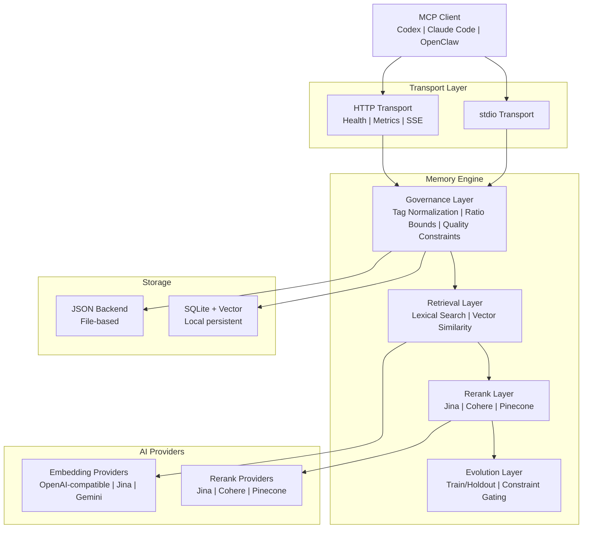

# PRX-Memory

**PRX-Memory**는 코딩 에이전트를 위한 로컬 우선 시맨틱 메모리 엔진입니다. 임베딩 기반 검색, 리랭킹, 거버넌스 제어, 측정 가능한 진화를 단일 MCP 호환 컴포넌트로 결합합니다. PRX-Memory는 stdio 또는 HTTP를 통해 통신하는 독립 실행형 데몬(`prx-memoryd`)으로 제공되어 Codex, Claude Code, OpenClaw, OpenPRX 및 기타 MCP 클라이언트와 호환됩니다.

PRX-Memory는 원시 로그가 아닌 **재사용 가능한 엔지니어링 지식**에 집중합니다. 시스템은 태그, 범위, 중요도 점수가 있는 구조화된 메모리를 저장하고, 어휘 검색, 벡터 유사도, 선택적 리랭킹의 조합을 사용하여 검색합니다 -- 모두 품질 및 안전 제약 조건에 의해 관리됩니다.

## PRX-Memory를 선택하는 이유

대부분의 코딩 에이전트는 메모리를 부차적인 것으로 취급합니다 -- 플랫 파일, 비구조화 로그, 또는 벤더 종속 클라우드 서비스. PRX-Memory는 다른 접근 방식을 취합니다:

- **로컬 우선.** 모든 데이터가 사용자 시스템에 유지됩니다. 클라우드 종속성 없음, 원격 측정 없음, 네트워크 외부로 데이터 유출 없음.
- **구조화되고 관리됨.** 모든 메모리 항목은 태그, 범위, 카테고리, 품질 제약 조건을 갖춘 표준화된 형식을 따릅니다. 태그 정규화 및 비율 한도로 드리프트를 방지합니다.
- **시맨틱 검색.** 어휘 매칭과 벡터 유사도, 선택적 리랭킹을 결합하여 주어진 컨텍스트에 가장 관련성 높은 메모리를 찾습니다.
- **측정 가능한 진화.** `memory_evolve` 도구는 훈련/홀드아웃 분할과 제약 게이팅을 사용하여 후보 개선 사항을 수락하거나 거부합니다 -- 추측 없이.
- **MCP 네이티브.** stdio 및 HTTP 전송을 통해 Model Context Protocol을 우선 지원하며, 리소스 템플릿, 스킬 매니페스트, 스트리밍 세션을 제공합니다.

## 주요 기능

- **멀티 프로바이더 임베딩** -- 통합 어댑터 인터페이스를 통해 OpenAI 호환, Jina, Gemini 임베딩 프로바이더를 지원합니다. 환경 변수 하나만 변경하여 프로바이더를 전환합니다.

- **리랭킹 파이프라인** -- 원시 벡터 유사도를 넘어 검색 정밀도를 향상시키기 위해 Jina, Cohere 또는 Pinecone 리랭커를 사용한 선택적 2단계 리랭킹.

- **거버넌스 제어** -- 태그 정규화, 비율 한도, 주기적 유지 관리, 품질 제약 조건을 갖춘 구조화된 메모리 형식으로 시간이 지나도 메모리 품질을 높게 유지합니다.

- **메모리 진화** -- `memory_evolve` 도구는 훈련/홀드아웃 수락 테스트와 제약 게이팅을 사용하여 후보 변경 사항을 평가하고 측정 가능한 개선 보장을 제공합니다.

- **이중 전송 MCP 서버** -- 직접 통합을 위한 stdio 서버 또는 헬스 체크, Prometheus 메트릭, 스트리밍 세션이 있는 HTTP 서버로 실행합니다.

- **스킬 배포** -- MCP 리소스 및 도구 프로토콜을 통해 검색 가능한 내장 거버넌스 스킬 패키지, 표준화된 메모리 작업을 위한 페이로드 템플릿.

- **관찰 가능성** -- Prometheus 메트릭 엔드포인트, Grafana 대시보드 템플릿, 설정 가능한 알림 임계값, 프로덕션 배포를 위한 카디널리티 제어.

## 아키텍처



## 빠른 시작

메모리 데몬을 빌드하고 실행합니다:

```bash
cargo build -p prx-memory-mcp --bin prx-memoryd

PRX_MEMORYD_TRANSPORT=stdio \
PRX_MEMORY_DB=./data/memory-db.json \
./target/debug/prx-memoryd
```

또는 Cargo로 설치합니다:

```bash
cargo install prx-memory-mcp
```

모든 방법 및 설정 옵션은 [설치 가이드](./getting-started/installation)를 참조하세요.

## 워크스페이스 크레이트

| 크레이트 | 설명 |
|---------|------|
| `prx-memory-core` | 핵심 점수 및 진화 도메인 프리미티브 |
| `prx-memory-embed` | 임베딩 프로바이더 추상화 및 어댑터 |
| `prx-memory-rerank` | 리랭크 프로바이더 추상화 및 어댑터 |
| `prx-memory-ai` | 임베딩 및 리랭크를 위한 통합 프로바이더 추상화 |
| `prx-memory-skill` | 내장 거버넌스 스킬 페이로드 |
| `prx-memory-storage` | 로컬 영구 스토리지 엔진 (JSON, SQLite, LanceDB) |
| `prx-memory-mcp` | stdio 및 HTTP 전송을 갖춘 MCP 서버 서페이스 |

## 문서 섹션

| 섹션 | 설명 |
|------|------|
| [설치](./getting-started/installation) | 소스에서 빌드 또는 Cargo로 설치 |
| [빠른 시작](./getting-started/quickstart) | 5분 만에 PRX-Memory 실행 |
| [임베딩 엔진](./embedding/) | 임베딩 프로바이더 및 배치 처리 |
| [지원 모델](./embedding/models) | OpenAI 호환, Jina, Gemini 모델 |
| [리랭킹 엔진](./reranking/) | 2단계 리랭킹 파이프라인 |
| [스토리지 백엔드](./storage/) | JSON, SQLite, 벡터 검색 |
| [MCP 통합](./mcp/) | MCP 프로토콜, 도구, 리소스, 템플릿 |
| [Rust API 레퍼런스](./api/) | PRX-Memory를 Rust 프로젝트에 임베딩하기 위한 라이브러리 API |
| [설정](./configuration/) | 모든 환경 변수 및 프로파일 |
| [문제 해결](./troubleshooting/) | 일반적인 문제 및 해결책 |

## 프로젝트 정보

- **라이선스:** MIT OR Apache-2.0
- **언어:** Rust (2024 edition)
- **저장소:** [github.com/openprx/prx-memory](https://github.com/openprx/prx-memory)
- **최소 Rust:** stable 툴체인
- **전송:** stdio, HTTP
