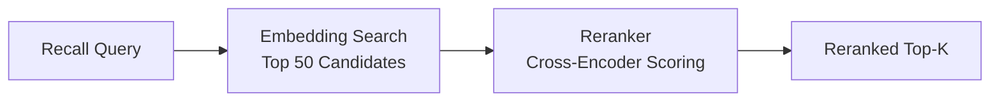

# 리랭킹 엔진

리랭킹은 전용 크로스 인코더 모델을 사용하여 후보 결과를 재정렬하는 선택적 2단계 검색 단계입니다. 임베딩 기반 검색은 빠르지만 세밀한 관련성을 포착하지 못할 수 있는 사전 계산된 벡터에서 작동합니다. 리랭킹은 더 작은 후보 세트에 더 강력한 모델을 적용하여 정밀도를 크게 향상시킵니다.

## 동작 방식

1. **1단계 (검색):** 벡터 유사도 검색이 광범위한 후보 세트를 반환합니다 (예: 상위 50개).
2. **2단계 (리랭킹):** 크로스 인코더 모델이 각 후보를 쿼리에 대해 점수를 매겨 정제된 랭킹을 생성합니다.
3. **최종 결과:** 상위 k개의 리랭크된 결과가 호출자에게 반환됩니다.



## 리랭킹이 중요한 이유

| 지표 | 리랭킹 없이 | 리랭킹 있을 때 |
|------|------------|--------------|
| 회상 커버리지 | 높음 (광범위한 검색) | 동일 (변경 없음) |
| 상위 5개 정밀도 | 중간 | 크게 향상 |
| 지연 시간 | 낮음 (~50ms) | 높음 (~150ms 추가) |
| API 비용 | 임베딩만 | 임베딩 + 리랭킹 |

리랭킹은 다음 경우에 가장 가치 있습니다:

- 메모리 데이터베이스가 크거나 (1000개 이상).
- 쿼리가 모호하거나 자연어일 때.
- 지연 시간보다 결과 목록 상위의 정밀도가 더 중요할 때.

## 지원 프로바이더

| 프로바이더 | 설정 값 | 설명 |
|-----------|--------|------|
| Jina | `PRX_RERANK_PROVIDER=jina` | Jina AI 리랭커 모델 |
| Cohere | `PRX_RERANK_PROVIDER=cohere` | Cohere 리랭크 API |
| Pinecone | `PRX_RERANK_PROVIDER=pinecone` | Pinecone 리랭크 서비스 |
| Pinecone 호환 | `PRX_RERANK_PROVIDER=pinecone-compatible` | 커스텀 Pinecone 호환 엔드포인트 |
| 없음 | `PRX_RERANK_PROVIDER=none` | 리랭킹 비활성화 |

## 설정

```bash
PRX_RERANK_PROVIDER=cohere
PRX_RERANK_API_KEY=your_cohere_key
PRX_RERANK_MODEL=rerank-v3.5
```

::: tip 프로바이더 폴백 키
`PRX_RERANK_API_KEY`가 설정되지 않으면 시스템은 프로바이더별 키로 폴백합니다:
- Jina: `JINA_API_KEY`
- Cohere: `COHERE_API_KEY`
- Pinecone: `PINECONE_API_KEY`
:::

## 리랭킹 비활성화

리랭킹 없이 실행하려면 `PRX_RERANK_PROVIDER` 변수를 생략하거나 명시적으로 설정합니다:

```bash
PRX_RERANK_PROVIDER=none
```

회상은 리랭킹 단계 없이 어휘 매칭과 벡터 유사도를 사용하여 계속 작동합니다.

## 다음 단계

- [리랭킹 모델](./models) -- 상세 모델 비교
- [임베딩 엔진](../embedding/) -- 1단계 검색
- [설정 레퍼런스](../configuration/) -- 모든 환경 변수
