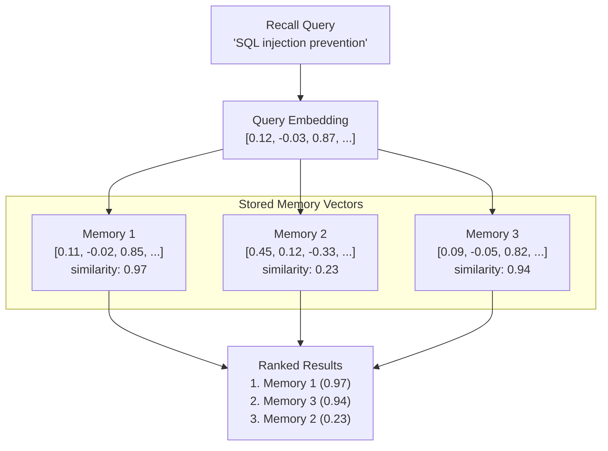

# 벡터 검색

벡터 검색은 PRX-Memory에서 시맨틱 메모리 검색을 가능하게 하는 핵심 메커니즘입니다. 키워드를 매칭하는 대신 벡터 검색은 쿼리와 메모리 임베딩 간의 수학적 유사도를 비교하여 개념적으로 관련된 결과를 찾습니다.

## 동작 방식

1. **쿼리 임베딩:** 회상 쿼리가 설정된 임베딩 프로바이더로 전송되어 벡터를 생성합니다.
2. **유사도 계산:** 쿼리 벡터가 코사인 유사도를 사용하여 저장된 모든 메모리 벡터와 비교됩니다.
3. **점수 산정:** 각 메모리는 -1.0에서 1.0 사이의 유사도 점수를 받습니다 (높을수록 유사).
4. **랭킹:** 결과는 점수순으로 정렬되고 다른 신호(어휘 매칭, 중요도, 최신성)와 결합됩니다.



## 코사인 유사도

PRX-Memory는 거리 메트릭으로 코사인 유사도를 사용합니다. 코사인 유사도는 크기를 무시하고 두 벡터 사이의 각도를 측정합니다:

```
similarity(A, B) = (A . B) / (|A| * |B|)
```

| 점수 | 의미 |
|------|------|
| 0.95--1.0 | 거의 동일한 의미 |
| 0.80--0.95 | 매우 관련됨 |
| 0.60--0.80 | 어느 정도 관련됨 |
| < 0.60 | 관련 없을 가능성 높음 |

## 결합 랭킹

벡터 유사도는 PRX-Memory의 다중 신호 랭킹에서 하나의 신호입니다. 최종 점수는 다음을 결합합니다:

| 신호 | 가중치 | 설명 |
|------|--------|------|
| 벡터 유사도 | 높음 | 임베딩 비교에서 시맨틱 관련성 |
| 어휘 매칭 | 중간 | 쿼리와 메모리 텍스트 간 키워드 중복 |
| 중요도 점수 | 중간 | 사용자 할당 또는 시스템 계산 중요도 |
| 최신성 | 낮음 | 더 최근의 메모리가 작은 부스트를 받음 |

정확한 가중치는 회상 설정과 임베딩 및 리랭킹이 활성화되어 있는지에 따라 다릅니다.

## 성능

10만 항목 벤치마크 결과:

| 지표 | 값 |
|------|-----|
| 데이터셋 크기 | 100,000개 항목 |
| p95 지연 시간 | 122.683ms |
| 임계값 | < 300ms |
| 방법 | 어휘 + 중요도 + 최신성 (네트워크 호출 없이) |

::: info
이 벤치마크는 네트워크 임베딩이나 리랭크 호출 없이 검색 랭킹 경로만 측정합니다. 엔드투엔드 지연 시간은 프로바이더 응답 시간에 따라 다릅니다.
:::

## 스케일링 고려 사항

| 데이터셋 크기 | 권장 방법 |
|------------|---------|
| < 10,000개 | 브루트 포스 코사인 유사도 (JSON 또는 SQLite 백엔드) |
| 10,000--100,000개 | 인메모리 벡터 스캔이 있는 SQLite |
| > 100,000개 | ANN 인덱싱이 있는 LanceDB |

100,000개 이상의 항목 데이터셋의 경우 서브 선형 쿼리 시간을 제공하는 근사 최근접 이웃(ANN) 검색을 위해 LanceDB 백엔드를 활성화합니다.

## 다음 단계

- [임베딩 엔진](../embedding/) -- 벡터가 생성되는 방법
- [리랭킹](../reranking/) -- 2단계 정밀도 향상
- [스토리지 백엔드](./index) -- 올바른 스토리지 백엔드 선택
