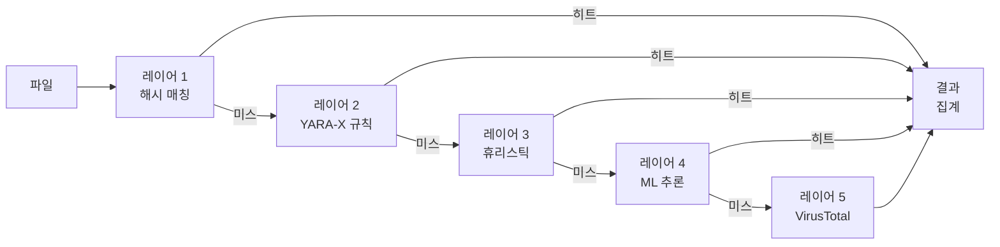

# 탐지 엔진

PRX-SD는 악성코드를 식별하기 위해 다층 탐지 파이프라인을 사용합니다. 각 레이어는 서로 다른 기술을 사용하며 가장 빠른 것부터 가장 철저한 것까지 순서대로 실행됩니다. 이 심층 방어 접근 방식은 한 레이어가 위협을 놓치더라도 이후 레이어가 잡을 수 있도록 보장합니다.

## 파이프라인 개요

탐지 파이프라인은 각 파일을 최대 다섯 레이어로 처리합니다:



## 레이어 요약

| 레이어 | 엔진 | 속도 | 커버리지 | 필수 여부 |
|-------|--------|-------|----------|----------|
| **레이어 1** | LMDB 해시 매칭 | ~1마이크로초/파일 | 알려진 악성코드 (정확한 매치) | 예 (기본값) |
| **레이어 2** | YARA-X 규칙 스캔 | ~0.3ms/파일 | 패턴 기반 (38,800개 이상의 규칙) | 예 (기본값) |
| **레이어 3** | 휴리스틱 분석 | ~1-5ms/파일 | 파일 유형별 행동 지표 | 예 (기본값) |
| **레이어 4** | ONNX ML 추론 | ~10-50ms/파일 | 신규/다형성 악성코드 | 선택사항 (`--features ml`) |
| **레이어 5** | VirusTotal API | ~200-500ms/파일 | 70개 이상 벤더 합의 | 선택사항 (`--features virustotal`) |

## 레이어 1: 해시 매칭

가장 빠른 레이어. PRX-SD는 각 파일의 SHA-256 해시를 계산하고 알려진 악성 해시가 포함된 LMDB 데이터베이스에서 조회합니다. LMDB는 메모리 매핑 I/O로 O(1) 조회 시간을 제공하여 이 레이어를 성능 면에서 거의 무료로 만듭니다.

**데이터 소스:**
- abuse.ch MalwareBazaar (최근 48시간, 5분마다 업데이트)
- abuse.ch URLhaus (시간별 업데이트)
- abuse.ch Feodo Tracker (Emotet/Dridex/TrickBot, 5분마다)
- abuse.ch ThreatFox (IOC 공유 플랫폼)
- VirusShare (20M+ MD5 해시, 선택적 `--full` 업데이트)
- 내장 블록리스트 (EICAR, WannaCry, NotPetya, Emotet 등)

해시 매치는 즉각적인 `MALICIOUS` 판정을 낳습니다. 해당 파일에 대해 나머지 레이어는 건너뜁니다.

자세한 내용은 [해시 매칭](./hash-matching)을 참조하세요.

## 레이어 2: YARA-X 규칙

해시 매치가 없으면 파일이 YARA-X 엔진(YARA의 차세대 Rust 재작성)을 사용하여 38,800개 이상의 YARA 규칙에 대해 스캔됩니다. 규칙은 파일 내용의 바이트 패턴, 문자열, 구조적 조건을 매칭하여 악성코드를 탐지합니다.

**규칙 소스:**
- 64개의 내장 규칙 (랜섬웨어, 트로이목마, 백도어, 루트킷, 마이너, 웹셸)
- Yara-Rules/rules (커뮤니티 유지, GitHub)
- Neo23x0/signature-base (고품질 APT 및 일반 악성코드 규칙)
- ReversingLabs YARA (상업용 수준의 오픈소스 규칙)
- ESET IOC (고급 지속적 위협 추적)
- InQuest (문서 악성코드: OLE, DDE, 악성 매크로)

YARA 규칙 매치는 보고서에 규칙 이름이 포함된 `MALICIOUS` 판정을 낳습니다.

자세한 내용은 [YARA 규칙](./yara-rules)을 참조하세요.

## 레이어 3: 휴리스틱 분석

해시 및 YARA 검사를 통과한 파일은 파일 유형별 휴리스틱을 사용하여 분석됩니다. PRX-SD는 매직 넘버 탐지로 파일 유형을 식별하고 타겟팅된 검사를 적용합니다:

| 파일 유형 | 휴리스틱 검사 |
|-----------|-----------------|
| PE (Windows) | 섹션 엔트로피, 의심스러운 API 임포트, 패커 탐지, 타임스탬프 이상 |
| ELF (Linux) | 섹션 엔트로피, LD_PRELOAD 참조, cron/systemd 지속성, SSH 백도어 패턴 |
| Mach-O (macOS) | 섹션 엔트로피, dylib 주입, LaunchAgent 지속성, Keychain 접근 |
| Office (docx/xlsx) | VBA 매크로, DDE 필드, 외부 템플릿 링크, 자동 실행 트리거 |
| PDF | 임베드된 JavaScript, Launch 액션, URI 액션, 난독화된 스트림 |

각 검사는 누적 점수에 기여합니다:

| 점수 | 판정 |
|-------|---------|
| 0 - 29 | **Clean** |
| 30 - 59 | **Suspicious** -- 수동 검토 권장 |
| 60 - 100 | **Malicious** -- 높은 신뢰도의 위협 |

자세한 내용은 [휴리스틱 분석](./heuristics)을 참조하세요.

## 레이어 4: ML 추론 (선택사항)

`ml` 기능으로 컴파일하면 PRX-SD는 수백만 개의 악성코드 샘플로 학습된 ONNX 머신러닝 모델을 통해 파일을 실행할 수 있습니다. 이 레이어는 시그니처 기반 탐지를 회피하는 신규 및 다형성 악성코드를 탐지하는 데 특히 효과적입니다.

```bash
# ML 지원으로 빌드
cargo build --release --features ml
```

ML 모델은 ONNX Runtime을 사용하여 로컬로 실행됩니다. 클라우드 연결이 필요하지 않습니다.

::: tip ML 사용 시기
ML 추론은 파일당 지연 시간을 추가합니다(~10-50ms). 처음 세 레이어로 충분한 커버리지를 제공하는 전체 디스크 스캔보다는 의심스러운 파일이나 디렉토리의 타겟 스캔에 활성화하세요.
:::

## 레이어 5: VirusTotal (선택사항)

`virustotal` 기능으로 컴파일하고 API 키로 설정하면 PRX-SD가 70개 이상의 안티바이러스 벤더로부터 합의를 얻기 위해 파일 해시를 VirusTotal에 제출할 수 있습니다.

```bash
# VirusTotal 지원으로 빌드
cargo build --release --features virustotal

# API 키 설정
sd config set virustotal.api_key "YOUR_API_KEY"
```

::: warning 속도 제한
무료 VirusTotal API는 분당 4회, 하루 500회의 요청을 허용합니다. PRX-SD는 이러한 제한을 자동으로 준수합니다. 이 레이어는 대량 스캔이 아닌 최종 확인 단계로 사용하는 것이 가장 좋습니다.
:::

## 결과 집계

파일이 여러 레이어를 통해 스캔될 때 최종 판정은 모든 레이어에서 발견된 **가장 높은 심각도**에 의해 결정됩니다:

```
MALICIOUS > SUSPICIOUS > CLEAN
```

레이어 1이 `MALICIOUS`를 반환하면 다른 레이어가 무엇을 말하든 파일은 악성으로 보고됩니다. 레이어 3이 `SUSPICIOUS`를 반환하고 다른 레이어가 `MALICIOUS`를 반환하지 않으면 파일은 의심스러운 것으로 보고됩니다.

스캔 보고서에는 발견 사항이 있는 모든 레이어의 세부 정보가 포함되어 분석가에게 전체 컨텍스트를 제공합니다.

## 레이어 비활성화

특수 사용 사례의 경우 개별 레이어를 비활성화할 수 있습니다:

```bash
# 해시 전용 스캔 (가장 빠름, 알려진 위협만)
sd scan /path --no-yara --no-heuristics

# 휴리스틱 건너뜀 (해시 + YARA만)
sd scan /path --no-heuristics
```

## 다음 단계

- [해시 매칭](./hash-matching) -- LMDB 해시 데이터베이스 심층 분석
- [YARA 규칙](./yara-rules) -- 규칙 소스 및 사용자 정의 규칙 관리
- [휴리스틱 분석](./heuristics) -- 파일 유형별 행동 검사
- [지원 파일 유형](./file-types) -- 파일 형식 매트릭스 및 매직 탐지
