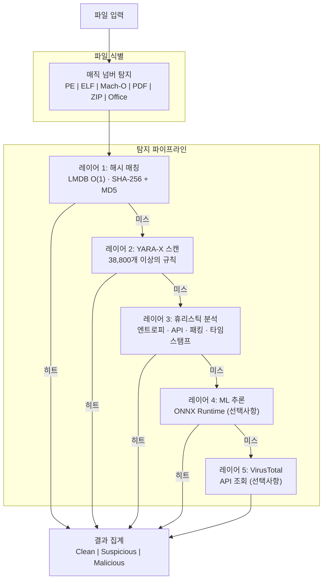

# PRX-SD

**PRX-SD**는 Rust로 작성된 고성능 오픈소스 안티바이러스 엔진입니다. 해시 기반 시그니처 매칭, 38,800개 이상의 YARA 규칙, 파일 유형별 휴리스틱 분석, 선택적 ML 추론을 하나의 다층 탐지 파이프라인으로 결합합니다. PRX-SD는 커맨드라인 도구(`sd`), 실시간 보호를 위한 시스템 데몬, Tauri + Vue 3 데스크톱 GUI로 제공됩니다.

PRX-SD는 수백만 개의 파일을 스캔하고, 디렉토리를 실시간으로 모니터링하며, 루트킷을 탐지하고, 외부 위협 인텔리전스 피드와 통합할 수 있는 빠르고 투명하며 확장 가능한 악성코드 탐지 엔진이 필요한 보안 엔지니어, 시스템 관리자, 인시던트 대응자를 위해 설계되었습니다. 모든 것이 불투명한 상용 블랙박스에 의존하지 않습니다.

## PRX-SD를 선택해야 하는 이유

기존 안티바이러스 제품은 클로즈드소스이고 자원을 많이 소비하며 커스터마이징이 어렵습니다. PRX-SD는 다른 접근 방식을 취합니다:

- **오픈소스 및 감사 가능.** 모든 탐지 규칙, 휴리스틱 검사, 점수 임계값이 소스 코드에서 확인 가능합니다. 숨겨진 텔레메트리나 클라우드 의존성이 없습니다.
- **다층 방어.** 다섯 개의 독립적인 탐지 레이어가 하나의 방법이 위협을 놓치더라도 다음 레이어가 잡을 수 있도록 보장합니다.
- **Rust 우선 성능.** 제로 카피 I/O, LMDB O(1) 해시 조회, 병렬 스캐닝으로 일반 하드웨어에서 상용 엔진에 필적하는 처리량을 제공합니다.
- **설계에 의한 확장성.** WASM 플러그인, 사용자 정의 YARA 규칙, 모듈식 아키텍처로 PRX-SD를 특수 환경에 쉽게 적용할 수 있습니다.

## 주요 기능

<div class="vp-features">

- **다층 탐지 파이프라인** -- 해시 매칭, YARA-X 규칙, 휴리스틱 분석, 선택적 ML 추론, 선택적 VirusTotal 통합이 순서대로 작동하여 탐지율을 극대화합니다.

- **실시간 보호** -- `sd monitor` 데몬이 inotify(Linux) / FSEvents(macOS)를 사용하여 디렉토리를 감시하고 새로 생성되거나 수정된 파일을 즉시 스캔합니다.

- **랜섬웨어 방어** -- 전용 YARA 규칙과 휴리스틱이 WannaCry, LockBit, Conti, REvil, BlackCat 등 랜섬웨어 패밀리를 탐지합니다.

- **38,800개 이상의 YARA 규칙** -- Yara-Rules, Neo23x0 signature-base, ReversingLabs, ESET IOC, InQuest, 64개의 내장 규칙 등 8개의 커뮤니티 및 상업용 수준의 소스에서 집계됩니다.

- **LMDB 해시 데이터베이스** -- abuse.ch MalwareBazaar, URLhaus, Feodo Tracker, ThreatFox, VirusShare(20M+), 내장 블록리스트의 SHA-256 및 MD5 해시가 O(1) 조회를 위해 LMDB에 저장됩니다.

- **크로스플랫폼** -- Linux(x86_64, aarch64), macOS(Apple Silicon, Intel), Windows(WSL2). PE, ELF, Mach-O, PDF, Office, 아카이브 형식에 대한 네이티브 파일 유형 탐지.

- **WASM 플러그인 시스템** -- WebAssembly 플러그인을 통해 탐지 로직을 확장하거나 사용자 정의 스캐너를 추가하거나 전용 위협 피드와 통합할 수 있습니다.

</div>

## 아키텍처



## 빠른 설치

```bash
curl -fsSL https://openprx.dev/install-sd.sh | bash
```

또는 Cargo를 통해 설치:

```bash
cargo install prx-sd
```

그런 다음 시그니처 데이터베이스를 업데이트합니다:

```bash
sd update
```

Docker 및 소스 빌드를 포함한 모든 방법은 [설치 가이드](./getting-started/installation)를 참조하세요.

## 문서 섹션

| 섹션 | 설명 |
|---------|-------------|
| [설치](./getting-started/installation) | Linux, macOS 또는 Windows WSL2에 PRX-SD 설치 |
| [빠른 시작](./getting-started/quickstart) | 5분 안에 PRX-SD 스캔 시작 |
| [파일 및 디렉토리 스캔](./scanning/file-scan) | `sd scan` 명령어 전체 레퍼런스 |
| [메모리 스캔](./scanning/memory-scan) | 위협에 대한 실행 중인 프로세스 메모리 스캔 |
| [루트킷 탐지](./scanning/rootkit) | 커널 및 사용자 공간 루트킷 탐지 |
| [USB 스캔](./scanning/usb-scan) | 이동식 미디어 자동 스캔 |
| [탐지 엔진](./detection/) | 다층 파이프라인 작동 방식 |
| [해시 매칭](./detection/hash-matching) | LMDB 해시 데이터베이스 및 데이터 소스 |
| [YARA 규칙](./detection/yara-rules) | 8개 소스의 38,800개 이상의 규칙 |
| [휴리스틱 분석](./detection/heuristics) | 파일 유형별 행동 분석 |
| [지원 파일 유형](./detection/file-types) | 파일 형식 매트릭스 및 매직 탐지 |

## 프로젝트 정보

- **라이선스:** MIT OR Apache-2.0
- **언어:** Rust (2024 에디션)
- **저장소:** [github.com/openprx/prx-sd](https://github.com/openprx/prx-sd)
- **최소 Rust 버전:** 1.85.0
- **GUI:** Tauri 2 + Vue 3
