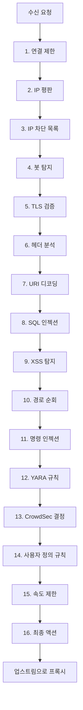

# PRX-WAF

PRX-WAF는 [Pingora](https://github.com/cloudflare/pingora)(클라우드플레어의 Rust HTTP 프록시 라이브러리)를 기반으로 구축된 오픈소스 **웹 애플리케이션 방화벽(WAF)**입니다. SQL 인젝션, XSS, 경로 순회, 알려진 CVE 공격, 봇 트래픽에 대한 프로덕션급 보호를 제공합니다.

## 주요 기능

- **16단계 탐지 파이프라인** — IP 평판에서 YARA 패턴 매칭까지
- **398개 내장 규칙** — OWASP CRS 310개, ModSecurity 46개, CVE 패치 39개, 내장 검사기
- **YAML 규칙 엔진** — 간단한 구문으로 사용자 정의 규칙 작성
- **Rhai 스크립팅** — 복잡한 탐지 로직을 위한 내장 스크립팅
- **CrowdSec 통합** — Bouncer 모드, AppSec 모드, 로그 푸셔
- **클러스터 모드** — mTLS가 포함된 QUIC 기반 노드 간 통신
- **관리자 UI** — Vue 3 + Tailwind CSS 대시보드 (JWT + TOTP 인증)
- **HTTP/1.1, HTTP/2, HTTP/3 (QUIC)** — 완전한 프로토콜 지원

## 탐지 파이프라인



## 아키텍처

PRX-WAF는 7개의 크레이트로 구성된 Cargo 워크스페이스로 구성됩니다:

| 크레이트 | 역할 |
|--------|------|
| `prx-waf` | CLI 진입점 |
| `prx-waf-core` | 핵심 WAF 엔진 및 파이프라인 |
| `prx-waf-rules` | 규칙 파서, YAML 스키마, 내장 규칙 |
| `prx-waf-gateway` | Pingora 리버스 프록시 레이어 |
| `prx-waf-cluster` | QUIC 기반 클러스터 통신 |
| `prx-waf-crowdsec` | CrowdSec LAPI 클라이언트 및 통합 |
| `prx-waf-admin` | Axum 기반 관리 REST API |

## 빠른 시작

가장 빠른 시작 방법은 Docker Compose를 사용하는 것입니다:

```bash
git clone https://github.com/openprx/prx-waf
cd prx-waf
docker compose up -d
```

서비스:
- **WAF**: `http://localhost:8080` (프록시 진입점)
- **관리자 UI**: `http://localhost:9527` (대시보드)
- **PostgreSQL**: `localhost:5432` (내부)

자세한 설정 지침은 [설치 가이드](./getting-started/installation)를 참조하세요.

## 다음 단계

- [설치](./getting-started/installation) — Docker, Cargo, 소스 빌드 옵션
- [빠른 시작](./getting-started/quickstart) — 6단계로 첫 번째 앱 보호
- [규칙 엔진](./rules/) — 규칙 작동 방식 이해
- [설정 레퍼런스](./configuration/reference) — 모든 설정 키
