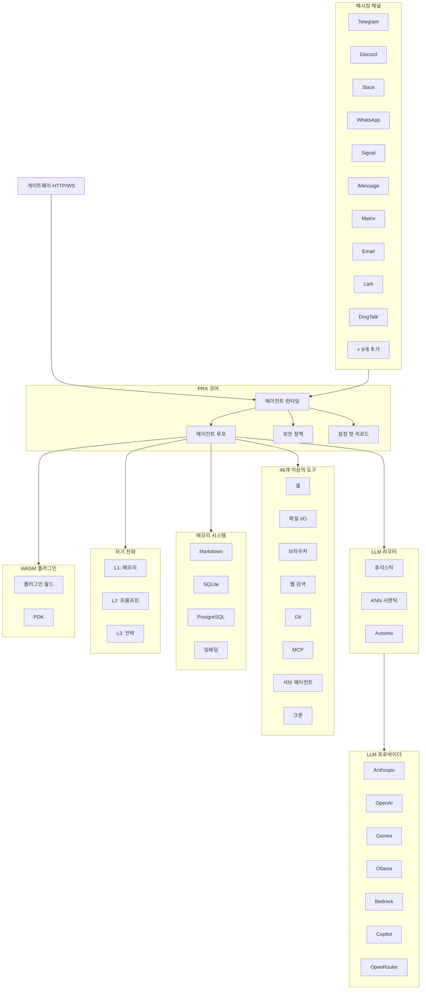

# PRX

**PRX**는 Rust로 작성된 고성능 자기 진화형 AI 에이전트 런타임입니다. 대규모 언어 모델을 19개 메시징 플랫폼에 연결하고, 46개 이상의 내장 도구를 제공하며, WASM 플러그인 확장을 지원하고, 3계층 자기 진화 시스템을 통해 자율적으로 동작을 개선합니다.

PRX는 Telegram, Discord, Slack, WhatsApp, Signal, iMessage, DingTalk, Lark 등 사용하는 모든 메시징 플랫폼에서 작동하는 단일 통합 에이전트가 필요한 개발자와 팀을 위해 설계되었으며, 프로덕션 수준의 보안, 관측성, 신뢰성을 유지합니다.

## PRX를 선택하는 이유

대부분의 AI 에이전트 프레임워크는 단일 통합 지점에 집중하거나 다양한 서비스를 연결하기 위해 광범위한 글루 코드를 필요로 합니다. PRX는 다른 접근 방식을 취합니다:

- **하나의 바이너리로 모든 채널을 지원합니다.** 단일 `prx` 바이너리가 19개 메시징 플랫폼에 동시에 연결됩니다. 별도의 봇이나 마이크로서비스 확산이 없습니다.
- **자기 진화합니다.** PRX는 상호작용 피드백을 기반으로 메모리, 프롬프트, 전략을 자율적으로 개선하며, 모든 계층에서 안전 롤백을 지원합니다.
- **Rust 우선 성능.** 177K 줄의 Rust 코드가 낮은 지연시간, 최소 메모리 사용량, 제로 GC 일시 정지를 제공합니다. 데몬은 Raspberry Pi에서도 원활하게 실행됩니다.
- **확장 가능한 설계.** WASM 플러그인, MCP 도구 통합, 트레이트 기반 아키텍처로 포크 없이도 PRX를 쉽게 확장할 수 있습니다.

## 주요 기능

<div class="vp-features">

- **19개 메시징 채널** -- Telegram, Discord, Slack, WhatsApp, Signal, iMessage, Matrix, Email, Lark, DingTalk, QQ, IRC, Mattermost, Nextcloud Talk, LINQ, CLI 등을 지원합니다.

- **9개 LLM 프로바이더** -- Anthropic Claude, OpenAI, Google Gemini, GitHub Copilot, Ollama, AWS Bedrock, GLM (Zhipu), OpenAI Codex, OpenRouter와 OpenAI 호환 엔드포인트를 지원합니다.

- **46개 이상의 내장 도구** -- 셸 실행, 파일 I/O, 브라우저 자동화, 웹 검색, HTTP 요청, git 작업, 메모리 관리, 크론 스케줄링, MCP 통합, 서브 에이전트 등을 제공합니다.

- **3계층 자기 진화** -- L1 메모리 진화, L2 프롬프트 진화, L3 전략 진화로 구성되며, 각 계층에 안전 경계와 자동 롤백이 포함됩니다.

- **WASM 플러그인 시스템** -- 6개 플러그인 월드(도구, 미들웨어, 훅, 크론, 프로바이더, 스토리지)에 걸쳐 WebAssembly 컴포넌트로 PRX를 확장합니다. 47개 호스트 함수를 포함한 완전한 PDK를 제공합니다.

- **LLM 라우터** -- 휴리스틱 스코어링(능력, Elo, 비용, 지연시간), KNN 의미 라우팅, Automix 신뢰도 기반 에스컬레이션을 통한 지능형 모델 선택 기능입니다.

- **프로덕션 보안** -- 4단계 자율성 제어, 정책 엔진, 샌드박스 격리(Docker/Firejail/Bubblewrap/Landlock), ChaCha20 시크릿 스토어, 페어링 인증을 제공합니다.

- **관측성** -- OpenTelemetry 추적, Prometheus 메트릭, 구조화된 로깅, 내장 웹 콘솔을 제공합니다.

</div>

## 아키텍처



## 빠른 설치

```bash
curl -fsSL https://openprx.dev/install.sh | bash
```

또는 Cargo로 설치:

```bash
cargo install openprx
```

그런 다음 온보딩 마법사를 실행합니다:

```bash
prx onboard
```

Docker 및 소스 빌드를 포함한 모든 설치 방법은 [설치 가이드](./getting-started/installation)를 참조하세요.

## 문서 섹션

| 섹션 | 설명 |
|------|------|
| [설치](./getting-started/installation) | Linux, macOS 또는 Windows WSL2에 PRX 설치 |
| [빠른 시작](./getting-started/quickstart) | 5분 만에 PRX 실행하기 |
| [온보딩 마법사](./getting-started/onboarding) | LLM 프로바이더 및 초기 설정 구성 |
| [채널](./channels/) | Telegram, Discord, Slack 및 16개 이상의 플랫폼 연결 |
| [프로바이더](./providers/) | Anthropic, OpenAI, Gemini, Ollama 등 구성 |
| [도구](./tools/) | 셸, 브라우저, git, 메모리 등 46개 이상의 내장 도구 |
| [자기 진화](./self-evolution/) | L1/L2/L3 자율 개선 시스템 |
| [플러그인 (WASM)](./plugins/) | WebAssembly 컴포넌트로 PRX 확장 |
| [설정](./config/) | 전체 설정 레퍼런스 및 핫 리로드 |
| [보안](./security/) | 정책 엔진, 샌드박스, 시크릿, 위협 모델 |
| [CLI 레퍼런스](./cli/) | `prx` 바이너리의 전체 명령어 레퍼런스 |

## 프로젝트 정보

- **라이선스:** MIT OR Apache-2.0
- **언어:** Rust (2024 에디션)
- **저장소:** [github.com/openprx/prx](https://github.com/openprx/prx)
- **최소 Rust 버전:** 1.92.0
