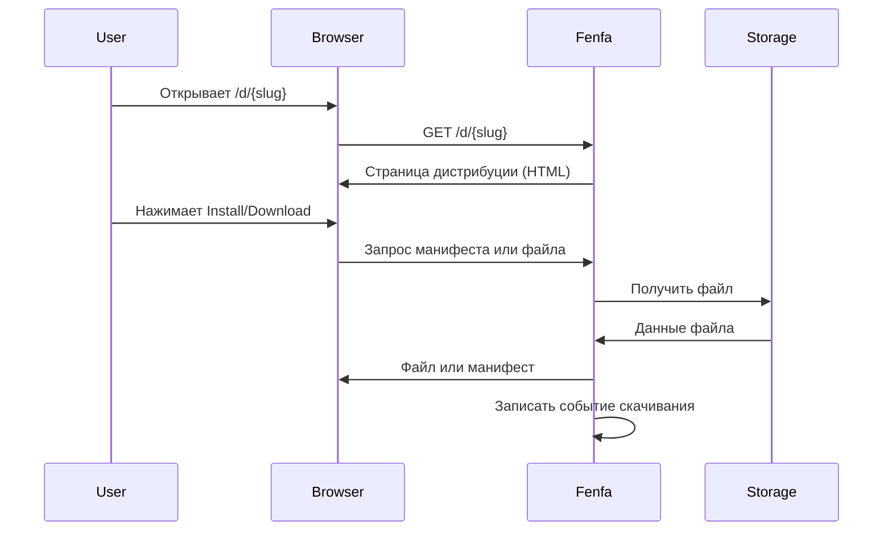

# Дистрибуция

Fenfa предоставляет публичные страницы дистрибуции, с которых конечные пользователи могут скачивать и устанавливать приложения. Поведение дистрибуции зависит от платформы.

## Публичная страница дистрибуции

Каждый продукт имеет публичную страницу по адресу:

```
https://dist.example.com/d/{slug}
```

На этой странице отображаются все активные варианты и их последние активные релизы. Пользователи видят кнопки установки или скачивания, соответствующие их платформе.

## Поток дистрибуции



## Поведение по платформам

| Платформа | Поведение при нажатии кнопки |
|-----------|------------------------------|
| iOS | Открывает `itms-services://` — iOS запускает OTA установку |
| Android | Прямое скачивание APK |
| macOS | Прямое скачивание файла (DMG/PKG/ZIP) |
| Windows | Прямое скачивание файла (EXE/MSI/ZIP) |
| Linux | Прямое скачивание файла (DEB/RPM/AppImage) |

## Отслеживание событий

Fenfa автоматически записывает события скачивания для каждого релиза. Доступно через API администратора:

```bash
curl https://dist.example.com/admin/api/releases/{release_id}/events \
  -H "X-Auth-Token: YOUR_ADMIN_TOKEN"
```

Каждое событие содержит:
- Временную метку скачивания
- User-Agent (тип устройства/браузера)
- IP-адрес (опционально, в зависимости от настроек приватности)

## Счётчики скачиваний

Счётчик `downloads` релиза увеличивается при каждом обращении к файлу. Просматривайте счётчики через Admin API или панель управления.

```bash
curl https://dist.example.com/admin/api/variants/1/releases \
  -H "X-Auth-Token: YOUR_ADMIN_TOKEN"
# В ответе: "downloads": 142
```

## Следующие шаги

- [Дистрибуция iOS](./ios) — OTA установка и привязка UDID
- [Дистрибуция Android](./android) — скачивание APK
- [Дистрибуция Desktop](./desktop) — macOS, Windows, Linux
