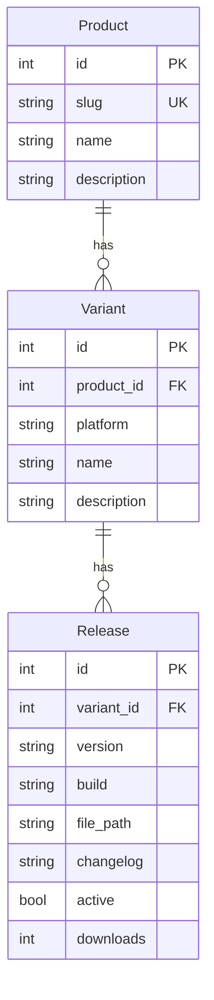

# Fenfa — Дистрибуция приложений

Fenfa — это самохостируемая платформа дистрибуции приложений, созданная для команд, которым нужно распространять мобильные и десктопные приложения без зависимости от публичных магазинов. Поддерживаются iOS OTA (Over-The-Air), Android APK, macOS DMG, Windows EXE/MSI и Linux-пакеты.

## Ключевые возможности

- **iOS OTA** — распространение IPA-файлов через `itms-services://` без App Store
- **Android** — прямая раздача APK с поддержкой умного извлечения метаданных
- **Desktop** — macOS, Windows и Linux с единой точкой управления
- **Привязка UDID** — регистрация тестовых устройств iOS и синхронизация с Apple Developer API
- **Управление релизами** — продукты → варианты → релизы с историей и аналитикой
- **REST API** — полный API для автоматизации CI/CD
- **Единый бинарник** — Go-бэкенд со встроенным фронтендом, работает с одного бинарника

## Модель данных

**Продукт** — верхний уровень (например, «Моё приложение»). **Вариант** — конкретная платформа или флейвор (iOS, Android, macOS). **Релиз** — конкретный файл с версией и билдом.

## Разделы документации

| Раздел | Описание |
|--------|----------|
| [Установка](./getting-started/installation) | Docker и сборка из исходников |
| [Быстрый старт](./getting-started/quickstart) | Первая загрузка за 5 минут |
| [Продукты](./products/) | Управление продуктами и вариантами |
| [Дистрибуция](./distribution/) | iOS OTA, Android, Desktop |
| [API](./api/) | REST API и аутентификация |
| [Конфигурация](./configuration/) | Все настройки |
| [Деплой](./deployment/) | Docker и продакшн-окружение |
| [Устранение неполадок](./troubleshooting/) | Часто встречающиеся проблемы |

## Технологический стек

| Компонент | Технология |
|-----------|------------|
| Бэкенд | Go + Gin |
| База данных | SQLite (через GORM) |
| Хранилище файлов | Локальная файловая система или S3-совместимое |
| Фронтенд | Vue 3 (встроен в бинарник) |
| Контейнеризация | Docker, multi-arch (amd64/arm64) |

## Следующие шаги

- [Установка](./getting-started/installation) — запуск Fenfa
- [Быстрый старт](./getting-started/quickstart) — первая загрузка приложения
- [REST API](./api/) — интеграция с CI/CD
