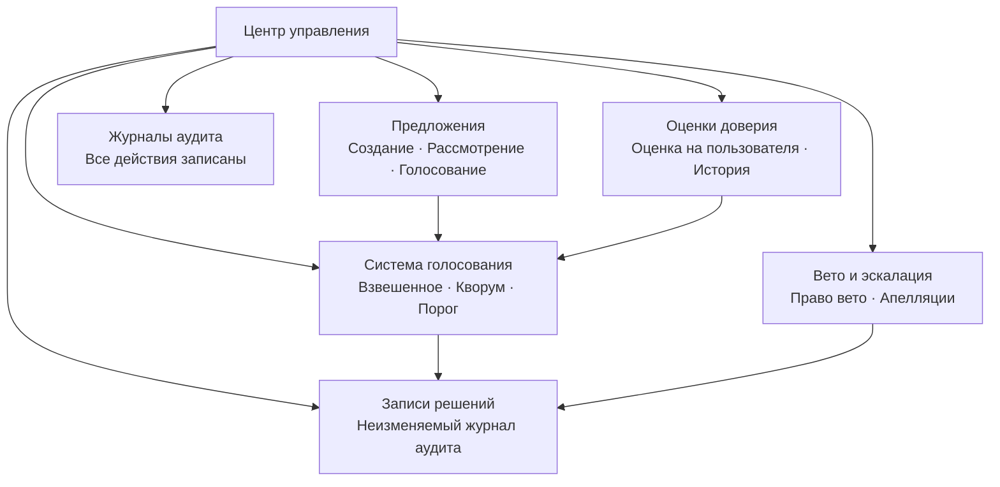

# Центр управления

Центр управления — это ключевой модуль в OpenPR, обеспечивающий прозрачное структурированное принятие решений в управлении проектами. Он предоставляет предложения, голосование, записи решений, оценки доверия, механизмы вето и полные журналы аудита.

## Зачем нужно управление?

Традиционные инструменты управления проектами сосредоточены на отслеживании задач, но оставляют процесс принятия решений неструктурированным. Центр управления OpenPR обеспечивает:

- **Документирование решений.** Каждое предложение, голос и решение записывается с полными журналами аудита.
- **Прозрачность процессов.** Пороги голосования, правила кворума и оценки доверия видны всем участникам.
- **Распределение власти.** Механизмы вето и пути эскалации предотвращают односторонние решения.
- **Сохранение истории.** Записи решений создают неизменяемый журнал того, что было решено, кем и почему.

## Модули управления

| Модуль | Описание |
|--------|----------|
| [Предложения](./proposals) | Создание, рассмотрение и голосование по предложениям |
| [Голосование и решения](./voting) | Взвешенное голосование с правилами кворума и порогами |
| [Оценки доверия](./trust-scores) | Оценка репутации на пользователя с историей |
| Вето и эскалация | Право вето с эскалационным голосованием и апелляциями |
| Домены решений | Категоризация решений по домену |
| Оценка влияния | Оценка влияния предложения с метриками |
| Журналы аудита | Полная запись всех действий по управлению |

## Схема базы данных

Модуль управления использует 20 выделенных таблиц:

| Таблица | Назначение |
|---------|-----------|
| `proposals` | Записи предложений |
| `proposal_templates` | Многоразовые шаблоны предложений |
| `proposal_comments` | Обсуждение предложений |
| `proposal_issue_links` | Связь предложений со связанными задачами |
| `votes` | Записи отдельных голосов |
| `decisions` | Финализированные записи решений |
| `decision_domains` | Домены категоризации решений |
| `decision_audit_reports` | Отчёты аудита решений |
| `governance_configs` | Настройки управления рабочего пространства |
| `governance_audit_logs` | Журналы всех действий по управлению |
| `vetoers` | Пользователи с правом вето |
| `veto_events` | Записи действий вето |
| `appeals` | Апелляции против решений или вето |
| `trust_scores` | Текущие оценки доверия на пользователя |
| `trust_score_logs` | История изменений оценки доверия |
| `impact_reviews` | Оценки влияния предложений |
| `impact_metrics` | Количественные показатели влияния |
| `review_participants` | Записи назначений рецензентов |
| `feedback_loop_links` | Связи обратной петли |

## API-эндпоинты

| Категория | Базовый путь | Операции |
|-----------|------------|---------|
| Предложения | `/api/proposals/*` | Создание, голосование, отправка, архивирование |
| Управление | `/api/governance/*` | Конфигурация, журналы аудита |
| Решения | `/api/decisions/*` | Записи решений |
| Оценки доверия | `/api/trust-scores/*` | Оценки, история, апелляции |
| Вето | `/api/veto/*` | Вето, эскалация, голосование |

## MCP-инструменты

| Инструмент | Параметры | Описание |
|----------|---------|----------|
| `proposals.list` | `project_id` | Список предложений с опциональным фильтром по статусу |
| `proposals.get` | `proposal_id` | Получить детали предложения |
| `proposals.create` | `project_id`, `title`, `description` | Создать предложение по управлению |

## Следующие шаги

- [Предложения](./proposals) — создание и управление предложениями по управлению
- [Голосование и решения](./voting) — настройка правил голосования и просмотр решений
- [Оценки доверия](./trust-scores) — понимание механизма оценки доверия
