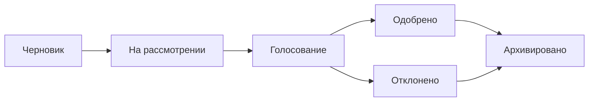

# Предложения

Предложения — это точка входа для решений по управлению в OpenPR. Предложение описывает изменение, улучшение или решение, требующее участия команды, и следует структурированному жизненному циклу от создания через голосование до финального решения.

## Жизненный цикл предложения



1. **Черновик** — Автор создаёт предложение с заголовком, описанием и контекстом.
2. **На рассмотрении** — Участники команды обсуждают и оставляют отзывы через комментарии.
3. **Голосование** — Открывается период голосования. Участники голосуют согласно правилам управления.
4. **Одобрено/Отклонено** — Голосование закрывается. Результат определяется порогом и кворумом.
5. **Архивировано** — Решение записывается и предложение архивируется.

## Создание предложения

### Через веб-интерфейс

1. Перейдите в ваш проект.
2. Перейдите в **Governance** > **Proposals**.
3. Нажмите **New Proposal**.
4. Заполните заголовок, описание и связанные задачи.
5. Нажмите **Create**.

### Через API

```bash
curl -X POST http://localhost:8080/api/proposals \
  -H "Content-Type: application/json" \
  -H "Authorization: Bearer <token>" \
  -d '{
    "project_id": "<project_uuid>",
    "title": "Adopt TypeScript for frontend modules",
    "description": "Proposal to migrate frontend modules from JavaScript to TypeScript for better type safety."
  }'
```

### Через MCP

```json
{
  "method": "tools/call",
  "params": {
    "name": "proposals.create",
    "arguments": {
      "project_id": "<project_uuid>",
      "title": "Adopt TypeScript for frontend modules",
      "description": "Proposal to migrate frontend modules from JavaScript to TypeScript."
    }
  }
}
```

## Шаблоны предложений

Администраторы рабочего пространства могут создавать шаблоны предложений для стандартизации формата предложений. Шаблоны определяют:

- Паттерн заголовка
- Обязательные разделы в описании
- Параметры голосования по умолчанию

Шаблоны управляются в **Workspace Settings** > **Governance** > **Templates**.

## Связывание предложений с задачами

Предложения можно связать со связанными задачами через таблицу `proposal_issue_links`. Это создаёт двунаправленную ссылку:

- Из предложения можно видеть, какие задачи затронуты.
- Из задачи можно видеть, какие предложения ссылаются на неё.

## Комментарии к предложениям

Каждое предложение имеет собственный тред обсуждения, отдельный от комментариев к задачам. Комментарии к предложениям поддерживают форматирование markdown и видны всем участникам рабочего пространства.

## MCP-инструменты

| Инструмент | Параметры | Описание |
|----------|---------|----------|
| `proposals.list` | `project_id` | Список предложений, опциональный фильтр `status` |
| `proposals.get` | `proposal_id` | Получить полные детали предложения |
| `proposals.create` | `project_id`, `title`, `description` | Создать новое предложение |

## Следующие шаги

- [Голосование и решения](./voting) — как отдаются голоса и принимаются решения
- [Оценки доверия](./trust-scores) — как оценки доверия влияют на вес голоса
- [Обзор управления](./index) — полный справочник модуля управления
