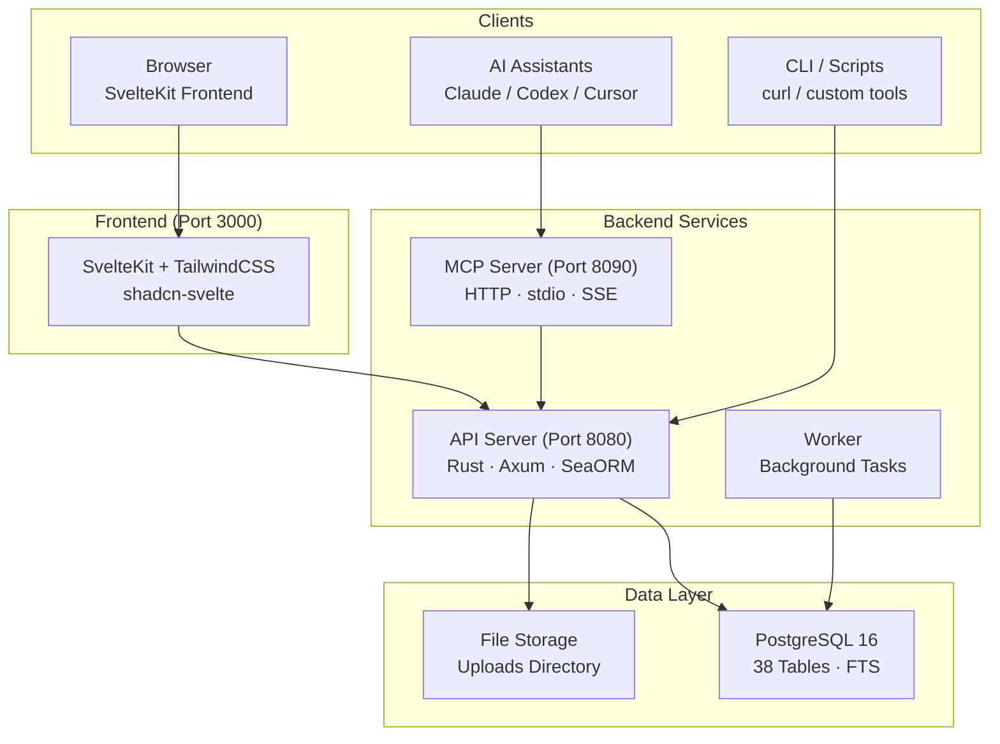

# OpenPR

**OpenPR** — платформа управления проектами с открытым исходным кодом для команд, которым нужно прозрачное управление, AI-ассистированные рабочие процессы и полный контроль над данными проекта. Она объединяет отслеживание задач, планирование спринтов, kanban-доски и полноценный центр управления — предложения, голосование, оценки доверия, механизмы вето — в единую самостоятельно размещаемую платформу.

OpenPR построена на **Rust** (Axum + SeaORM) для бэкенда и **SvelteKit** для фронтенда, на основе **PostgreSQL**. Она предоставляет REST API и встроенный MCP-сервер с 34 инструментами через три транспортных протокола, что делает её первоклассным поставщиком инструментов для AI-ассистентов, таких как Claude, Codex и других MCP-совместимых клиентов.

## Почему OpenPR?

Большинство инструментов управления проектами являются либо закрытыми SaaS-платформами с ограниченными возможностями настройки, либо альтернативами с открытым исходным кодом, не имеющими функций управления. OpenPR придерживается другого подхода:

- **Самостоятельный хостинг и прозрачность.** Ваши данные проекта остаются на вашей инфраструктуре. Каждая функция, каждая запись решения, каждый журнал аудита под вашим контролем.
- **Встроенное управление.** Предложения, голосование, оценки доверия, право вето и эскалация — не дополнительные модули, а основные функции с полной поддержкой API.
- **Нативная поддержка AI.** Встроенный MCP-сервер превращает OpenPR в поставщика инструментов для AI-агентов. Токены ботов, назначение задач AI и обратные вызовы webhook обеспечивают полностью автоматизированные рабочие процессы.
- **Производительность Rust.** Бэкенд обрабатывает тысячи одновременных запросов с минимальным использованием ресурсов. Полнотекстовый поиск PostgreSQL обеспечивает мгновенный поиск по всем сущностям.

## Ключевые возможности

| Категория | Возможности |
|----------|------------|
| **Управление проектами** | Рабочие пространства, проекты, задачи, kanban-доска, спринты, метки, комментарии, вложения файлов, лента активности, уведомления, полнотекстовый поиск |
| **Центр управления** | Предложения, голосование с кворумом, записи решений, вето и эскалация, оценки доверия с историей и апелляциями, шаблоны предложений, обзоры влияния, журналы аудита |
| **Интеграция AI** | Токены ботов (префикс `opr_`), регистрация AI-агентов, назначение задач AI с отслеживанием прогресса, обзор AI предложений, MCP-сервер (34 инструмента, 3 транспорта), обратные вызовы webhook |
| **Аутентификация** | JWT (access + refresh токены), аутентификация по токену бота, ролевой доступ (admin/user), разрешения области рабочего пространства (owner/admin/member) |
| **Развёртывание** | Docker Compose, Podman, обратный прокси Caddy/Nginx, PostgreSQL 15+ |

## Архитектура



## Технический стек

| Уровень | Технология |
|---------|-----------|
| **Бэкенд** | Rust, Axum, SeaORM, PostgreSQL |
| **Фронтенд** | SvelteKit, TailwindCSS, shadcn-svelte |
| **MCP** | JSON-RPC 2.0 (HTTP + stdio + SSE) |
| **Аутентификация** | JWT (access + refresh) + Bot Tokens (`opr_`) |
| **Развёртывание** | Docker Compose, Podman, Caddy, Nginx |

## Быстрый старт

```bash
git clone https://github.com/openprx/openpr.git
cd openpr
cp .env.example .env
docker-compose up -d
```

Сервисы запускаются по адресам:
- **Frontend**: http://localhost:3000
- **API**: http://localhost:8080
- **MCP Server**: http://localhost:8090

Первый зарегистрированный пользователь автоматически становится администратором.

Подробнее см. в [Руководстве по установке](./getting-started/installation) для всех методов развёртывания или в [Быстром старте](./getting-started/quickstart) для запуска за 5 минут.

## Разделы документации

| Раздел | Описание |
|--------|----------|
| [Установка](./getting-started/installation) | Docker Compose, сборка из исходного кода и варианты развёртывания |
| [Быстрый старт](./getting-started/quickstart) | Запуск OpenPR за 5 минут |
| [Управление рабочим пространством](./workspace/) | Рабочие пространства, проекты и роли участников |
| [Задачи и отслеживание](./issues/) | Задачи, состояния рабочего процесса, спринты и метки |
| [Центр управления](./governance/) | Предложения, голосование, решения и оценки доверия |
| [REST API](./api/) | Аутентификация, эндпоинты и форматы ответов |
| [MCP-сервер](./mcp-server/) | Интеграция AI с 34 инструментами и 3 транспортами |
| [Конфигурация](./configuration/) | Переменные окружения и настройки |
| [Развёртывание](./deployment/docker) | Руководства по развёртыванию Docker и для продакшена |
| [Устранение неполадок](./troubleshooting/) | Распространённые проблемы и решения |

## Связанные проекты

| Репозиторий | Описание |
|------------|----------|
| [openpr](https://github.com/openprx/openpr) | Основная платформа (этот проект) |
| [openpr-webhook](https://github.com/openprx/openpr-webhook) | Приёмник webhook для внешних интеграций |
| [prx](https://github.com/openprx/prx) | Фреймворк AI-ассистента со встроенным OpenPR MCP |
| [prx-memory](https://github.com/openprx/prx-memory) | Локальная MCP-память для coding-агентов |

## Информация о проекте

- **Лицензия:** MIT OR Apache-2.0
- **Язык:** Rust (редакция 2024)
- **Репозиторий:** [github.com/openprx/openpr](https://github.com/openprx/openpr)
- **Минимальная версия Rust:** 1.75.0
- **Frontend:** SvelteKit
