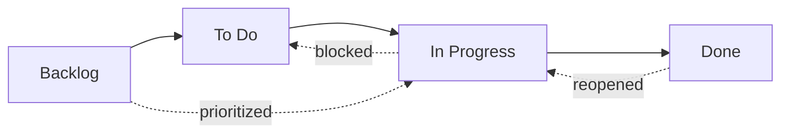
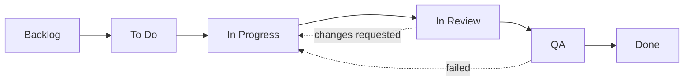

# Состояния рабочего процесса

Каждая задача в OpenPR имеет **состояние**, отражающее её позицию в рабочем процессе. Колонки kanban-доски напрямую соответствуют этим состояниям.

OpenPR поставляется с четырьмя состояниями по умолчанию, но поддерживает полностью **настраиваемые состояния рабочего процесса** через систему разрешения 3-го уровня. Вы можете определять разные рабочие процессы для каждого проекта, рабочего пространства или полагаться на системные значения по умолчанию.

## Состояния по умолчанию



| Состояние | Значение | Описание |
|----------|---------|----------|
| **Backlog** | `backlog` | Идеи, будущая работа и незапланированные элементы. Ещё не запланировано. |
| **To Do** | `todo` | Запланировано и приоритизировано. Готово к выполнению. |
| **In Progress** | `in_progress` | Активно выполняется исполнителем. |
| **Done** | `done` | Завершено и проверено. |

Это встроенные состояния, с которых начинает каждое новое рабочее пространство. Вы можете настроить их или добавить дополнительные состояния, как описано в разделе [Пользовательские рабочие процессы](#пользовательские-рабочие-процессы) ниже.

## Переходы состояний

OpenPR допускает гибкие переходы состояний. Нет принудительных ограничений — любое состояние может переходить в любое другое. Распространённые паттерны:

| Переход | Триггер | Пример |
|---------|--------|--------|
| Backlog -> To Do | Планирование спринта, приоритизация | Задача перенесена в предстоящий спринт |
| To Do -> In Progress | Разработчик берёт работу | Исполнитель начинает реализацию |
| In Progress -> Done | Работа завершена | Пул-реквест смёрджен |
| In Progress -> To Do | Работа заблокирована или приостановлена | Ожидание внешней зависимости |
| Done -> In Progress | Задача переоткрыта | Обнаружена регрессия бага |
| Backlog -> In Progress | Срочный хотфикс | Критическая проблема в продакшене |

## Пользовательские рабочие процессы

OpenPR поддерживает пользовательские состояния рабочего процесса через систему **разрешения 3-го уровня**. Когда API валидирует состояние рабочего элемента, он разрешает эффективный рабочий процесс, проверяя три уровня по порядку:

```
Рабочий процесс проекта  >  Рабочий процесс рабочего пространства  >  Системные значения по умолчанию
```

Если проект определяет собственный рабочий процесс, он имеет приоритет. В противном случае используется рабочий процесс уровня рабочего пространства. Если ни один не существует, применяются четыре системных состояния по умолчанию.

### Схема базы данных

Пользовательские рабочие процессы хранятся в двух таблицах (введены в миграции `0024_workflow_config.sql`):

- **`workflows`** — Определяет именованный рабочий процесс, прикреплённый к проекту или рабочему пространству.
- **`workflow_states`** — Отдельные состояния внутри рабочего процесса.

Каждое состояние имеет следующие свойства:

| Поле | Тип | Описание |
|------|-----|----------|
| `key` | string | Машиночитаемый идентификатор (например, `in_review`) |
| `display_name` | string | Человекочитаемое имя (например, "In Review") |
| `category` | string | Группировочная категория для состояния |
| `position` | integer | Порядок отображения на kanban-доске |
| `color` | string | Hex-код цвета для значка состояния |
| `is_initial` | boolean | Является ли это состояние начальным для новых задач |
| `is_terminal` | boolean | Представляет ли это состояние завершение |

### Создание пользовательского рабочего процесса через API

**Шаг 1 — Создать рабочий процесс для проекта:**

```bash
curl -X POST http://localhost:8080/api/workflows \
  -H "Content-Type: application/json" \
  -H "Authorization: Bearer <token>" \
  -d '{
    "name": "Engineering Flow",
    "project_id": "<project_uuid>"
  }'
```

**Шаг 2 — Добавить состояния в рабочий процесс:**

```bash
curl -X POST http://localhost:8080/api/workflows/<workflow_id>/states \
  -H "Content-Type: application/json" \
  -H "Authorization: Bearer <token>" \
  -d '{
    "key": "in_review",
    "display_name": "In Review",
    "category": "active",
    "position": 3,
    "color": "#f59e0b",
    "is_initial": false,
    "is_terminal": false
  }'
```

### Пример: 6-состояний инженерного рабочего процесса



| Состояние | Ключ | Категория | Начальное | Конечное |
|----------|-----|----------|---------|--------|
| Backlog | `backlog` | backlog | да | нет |
| To Do | `todo` | planned | нет | нет |
| In Progress | `in_progress` | active | нет | нет |
| In Review | `in_review` | active | нет | нет |
| QA | `qa` | active | нет | нет |
| Done | `done` | completed | нет | да |

### Динамическая валидация

При обновлении состояния рабочего элемента API валидирует новое состояние по **эффективному рабочему процессу** для этого проекта. Если вы устанавливаете ключ состояния, который не существует в разрешённом рабочем процессе, API возвращает ошибку `422 Unprocessable Entity`. Состояния не захардкожены — они динамически ищутся во время запроса.

## Kanban-доска

Вид доски отображает задачи в виде карточек в колонках, соответствующих состояниям рабочего процесса. Перетаскивайте карточки между колонками для изменения состояния. При активных пользовательских рабочих процессах доска автоматически отражает пользовательские состояния и их настроенный порядок.

Каждая карточка показывает:
- Идентификатор задачи (например, `API-42`)
- Заголовок
- Индикатор приоритета
- Аватар исполнителя
- Значки меток

## Обновление состояния через API

```bash
# Перевести задачу в "in_progress"
curl -X PATCH http://localhost:8080/api/issues/<issue_id> \
  -H "Content-Type: application/json" \
  -H "Authorization: Bearer <token>" \
  -d '{"state": "in_progress"}'
```

## Обновление состояния через MCP

```json
{
  "method": "tools/call",
  "params": {
    "name": "work_items.update",
    "arguments": {
      "work_item_id": "<issue_uuid>",
      "state": "in_progress"
    }
  }
}
```

## Уровни приоритета

В дополнение к состояниям каждая задача может иметь уровень приоритета:

| Приоритет | Значение | Описание |
|----------|---------|----------|
| Низкий | `low` | Желательно, но без срочности |
| Средний | `medium` | Стандартный приоритет, плановая работа |
| Высокий | `high` | Важно, должно быть выполнено в ближайшее время |
| Срочный | `urgent` | Критично, требует немедленного внимания |

## Отслеживание активности

Каждое изменение состояния записывается в ленте активности задачи с указанием исполнителя, временной метки и старых/новых значений. Это обеспечивает полный журнал аудита.

## Следующие шаги

- [Планирование спринтов](./sprints) — организуйте задачи в ограниченные по времени итерации
- [Метки](./labels) — добавьте категоризацию к задачам
- [Обзор задач](./index) — полный справочник полей задачи
