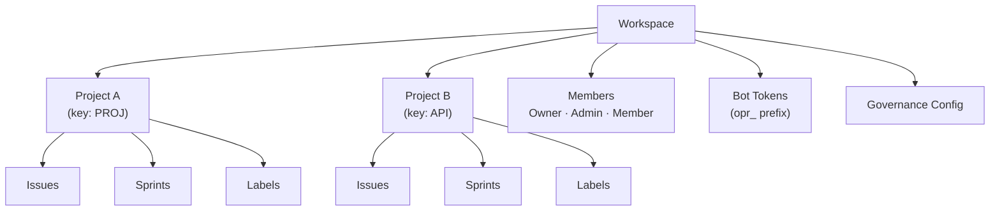

# Управление рабочим пространством

**Рабочее пространство** — организационная единица верхнего уровня в OpenPR. Оно обеспечивает мультиарендную изоляцию — у каждого рабочего пространства есть собственные проекты, участники, метки, токены ботов и настройки управления. Пользователи могут принадлежать к нескольким рабочим пространствам.

## Создание рабочего пространства

После входа нажмите **Create Workspace** на дашборде или перейдите в **Settings** > **Workspaces** > **New**.

Укажите:

| Поле | Обязательное | Описание |
|------|-------------|----------|
| Название | Да | Отображаемое имя (например, "Engineering Team") |
| Slug | Да | URL-дружественный идентификатор (например, "engineering") |

Создающий пользователь автоматически получает роль **Owner**.

## Структура рабочего пространства



## Настройки рабочего пространства

Доступ к настройкам рабочего пространства через значок шестерёнки или **Settings** в боковой панели:

- **General** — Обновление названия, slug и описания рабочего пространства.
- **Members** — Приглашение пользователей, изменение ролей, удаление участников. См. [Участники](./members).
- **Bot Tokens** — Создание и управление MCP-токенами ботов.
- **Governance** — Настройка порогов голосования, шаблонов предложений и правил оценки доверия. См. [Управление](../governance/).
- **Webhooks** — Настройка webhook-эндпоинтов для внешних интеграций.

## Доступ через API

```bash
# Список рабочих пространств
curl -H "Authorization: Bearer <token>" \
  http://localhost:8080/api/workspaces

# Получить детали рабочего пространства
curl -H "Authorization: Bearer <token>" \
  http://localhost:8080/api/workspaces/<workspace_id>
```

## Доступ через MCP

Через MCP-сервер AI-ассистенты работают в рабочем пространстве, указанном в переменной окружения `OPENPR_WORKSPACE_ID`. Все MCP-инструменты автоматически ограничивают операции этим рабочим пространством.

## Следующие шаги

- [Проекты](./projects) — создание и управление проектами в рабочем пространстве
- [Участники и разрешения](./members) — приглашение пользователей и настройка ролей
