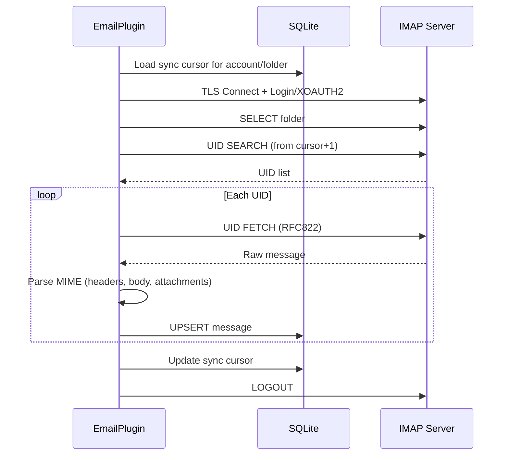

# Конфигурация IMAP

PRX-Email подключается к IMAP-серверам через TLS с помощью библиотеки `rustls`. Поддерживается парольная аутентификация и XOAUTH2 для Gmail и Outlook. Синхронизация входящих основана на UID и является инкрементальной, с персистентностью курсора в SQLite-базе данных.

## Базовая настройка IMAP

```rust
use prx_email::plugin::{ImapConfig, AuthConfig};

let imap = ImapConfig {
    host: "imap.example.com".to_string(),
    port: 993,
    user: "you@example.com".to_string(),
    auth: AuthConfig {
        password: Some("your-app-password".to_string()),
        oauth_token: None,
    },
};
```

### Поля конфигурации

| Поле | Тип | Обязательно | Описание |
|------|-----|-------------|----------|
| `host` | `String` | Да | Имя хоста IMAP-сервера (не должно быть пустым) |
| `port` | `u16` | Да | Порт IMAP-сервера (обычно 993 для TLS) |
| `user` | `String` | Да | IMAP-пользователь (обычно адрес электронной почты) |
| `auth.password` | `Option<String>` | Одно из | Пароль приложения для IMAP LOGIN |
| `auth.oauth_token` | `Option<String>` | Одно из | OAuth-токен доступа для XOAUTH2 |

::: warning Аутентификация
Должно быть установлено ровно одно из `password` или `oauth_token`. Установка обоих или ни одного приведёт к ошибке валидации.
:::

## Настройки распространённых провайдеров

| Провайдер | Хост | Порт | Метод аутентификации |
|-----------|------|------|---------------------|
| Gmail | `imap.gmail.com` | 993 | Пароль приложения или XOAUTH2 |
| Outlook / Office 365 | `outlook.office365.com` | 993 | XOAUTH2 (рекомендуется) |
| Yahoo | `imap.mail.yahoo.com` | 993 | Пароль приложения |
| Fastmail | `imap.fastmail.com` | 993 | Пароль приложения |
| ProtonMail Bridge | `127.0.0.1` | 1143 | Пароль Bridge |

## Синхронизация входящих

Метод `sync` подключается к IMAP-серверу, выбирает папку, получает новые сообщения по UID и сохраняет их в SQLite:

```rust
use prx_email::plugin::SyncRequest;

plugin.sync(SyncRequest {
    account_id: 1,
    folder: Some("INBOX".to_string()),
    cursor: None,        // Продолжить с последнего сохранённого курсора
    now_ts: now,
    max_messages: 100,   // Получить не более 100 сообщений за синхронизацию
})?;
```

### Процесс синхронизации



### Инкрементальная синхронизация

PRX-Email использует UID-курсоры для предотвращения повторной выборки сообщений. После каждой синхронизации:

1. Наибольший увиденный UID сохраняется как курсор
2. Следующая синхронизация начинается с `cursor + 1`
3. Сообщения с существующими парами `(account_id, message_id)` обновляются (UPSERT)

Курсор хранится в таблице `sync_state` с составным ключом `(account_id, folder_id)`.

## Синхронизация нескольких папок

Синхронизация нескольких папок для одного аккаунта:

```rust
for folder in &["INBOX", "Sent", "Drafts", "Archive"] {
    plugin.sync(SyncRequest {
        account_id,
        folder: Some(folder.to_string()),
        cursor: None,
        now_ts: now,
        max_messages: 100,
    })?;
}
```

## Планировщик синхронизации

Для периодической синхронизации используйте встроенный sync runner:

```rust
use prx_email::plugin::{SyncJob, SyncRunnerConfig};

let jobs = vec![
    SyncJob { account_id: 1, folder: "INBOX".into(), max_messages: 100 },
    SyncJob { account_id: 1, folder: "Sent".into(), max_messages: 50 },
    SyncJob { account_id: 2, folder: "INBOX".into(), max_messages: 100 },
];

let config = SyncRunnerConfig {
    max_concurrency: 4,         // Макс. задач на тик планировщика
    base_backoff_seconds: 10,   // Начальный backoff при ошибке
    max_backoff_seconds: 300,   // Максимальный backoff (5 минут)
};

let report = plugin.run_sync_runner(&jobs, now, &config);
println!(
    "Run {}: attempted={}, succeeded={}, failed={}",
    report.run_id, report.attempted, report.succeeded, report.failed
);
```

### Поведение планировщика

- **Ограничение конкурентности**: не более `max_concurrency` задач на тик
- **Backoff при ошибках**: экспоненциальный backoff по формуле `base * 2^failures`, ограниченный `max_backoff_seconds`
- **Проверка срока**: задачи пропускаются, если их окно backoff ещё не истекло
- **Отслеживание состояния**: для каждого ключа `account::folder` отслеживаются `(next_allowed_at, failure_count)`

## Разбор сообщений

Входящие сообщения разбираются с помощью крейта `mail-parser` со следующим извлечением:

| Поле | Источник | Примечания |
|------|----------|------------|
| `message_id` | Заголовок `Message-ID` | Резерв: SHA-256 сырых байт |
| `subject` | Заголовок `Subject` | |
| `sender` | Первый адрес из заголовка `From` | |
| `recipients` | Все адреса из заголовка `To` | Разделённые запятыми |
| `body_text` | Первая часть `text/plain` | |
| `body_html` | Первая часть `text/html` | Резерв: извлечение сырого раздела |
| `snippet` | Первые 120 символов body_text или body_html | |
| `references_header` | Заголовок `References` | Для группировки в цепочки |
| `attachments` | MIME-части вложений | Метаданные в формате JSON |

## TLS

Все IMAP-подключения используют TLS через `rustls` с сертификатным пакетом `webpki-roots`. Нет возможности отключить TLS или использовать STARTTLS — подключения всегда шифруются с самого начала.

## Следующие шаги

- [Конфигурация SMTP](./smtp) — настройка отправки писем
- [OAuth-аутентификация](./oauth) — настройка XOAUTH2 для Gmail и Outlook
- [SQLite-хранение](../storage/) — понимание схемы базы данных
