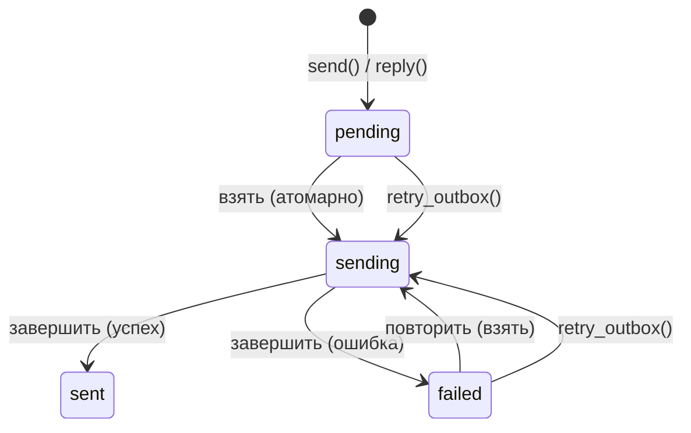

# Конфигурация SMTP

PRX-Email отправляет электронную почту через SMTP с помощью крейта `lettre` с TLS от `rustls`. Outbox-конвейер использует атомарный workflow «взять-отправить-завершить» для предотвращения дублирования отправки, с экспоненциальным backoff повторных попыток и детерминированными ключами идемпотентности Message-ID.

## Базовая настройка SMTP

```rust
use prx_email::plugin::{SmtpConfig, AuthConfig};

let smtp = SmtpConfig {
    host: "smtp.example.com".to_string(),
    port: 465,
    user: "you@example.com".to_string(),
    auth: AuthConfig {
        password: Some("your-app-password".to_string()),
        oauth_token: None,
    },
};
```

### Поля конфигурации

| Поле | Тип | Обязательно | Описание |
|------|-----|-------------|----------|
| `host` | `String` | Да | Имя хоста SMTP-сервера (не должно быть пустым) |
| `port` | `u16` | Да | Порт SMTP-сервера (465 для неявного TLS, 587 для STARTTLS) |
| `user` | `String` | Да | SMTP-пользователь (обычно адрес электронной почты) |
| `auth.password` | `Option<String>` | Одно из | Пароль для SMTP AUTH PLAIN/LOGIN |
| `auth.oauth_token` | `Option<String>` | Одно из | OAuth-токен доступа для XOAUTH2 |

## Настройки распространённых провайдеров

| Провайдер | Хост | Порт | Метод аутентификации |
|-----------|------|------|---------------------|
| Gmail | `smtp.gmail.com` | 465 | Пароль приложения или XOAUTH2 |
| Outlook / Office 365 | `smtp.office365.com` | 587 | XOAUTH2 |
| Yahoo | `smtp.mail.yahoo.com` | 465 | Пароль приложения |
| Fastmail | `smtp.fastmail.com` | 465 | Пароль приложения |

## Отправка письма

### Базовая отправка

```rust
use prx_email::plugin::SendEmailRequest;

let response = plugin.send(SendEmailRequest {
    account_id: 1,
    to: "recipient@example.com".to_string(),
    subject: "Hello".to_string(),
    body_text: "Message body here.".to_string(),
    now_ts: now,
    attachment: None,
    failure_mode: None,
});
```

### Ответ на сообщение

```rust
use prx_email::plugin::ReplyEmailRequest;

let response = plugin.reply(ReplyEmailRequest {
    account_id: 1,
    in_reply_to_message_id: "<original-msg-id@example.com>".to_string(),
    body_text: "Thanks for your message!".to_string(),
    now_ts: now,
    attachment: None,
    failure_mode: None,
});
```

Ответы автоматически:
- Устанавливают заголовок `In-Reply-To`
- Строят цепочку `References` из родительского сообщения
- Определяют получателя из отправителя родительского сообщения
- Добавляют префикс `Re:` к теме

## Outbox-конвейер

Outbox-конвейер обеспечивает надёжную доставку писем через атомарный state machine:



### Правила state machine

| Переход | Условие | Защита |
|---------|---------|--------|
| `pending` -> `sending` | `claim_outbox_for_send()` | `status IN ('pending','failed') AND next_attempt_at <= now` |
| `sending` -> `sent` | Провайдер принял | `update_outbox_status_if_current(status='sending')` |
| `sending` -> `failed` | Провайдер отклонил или сетевая ошибка | `update_outbox_status_if_current(status='sending')` |
| `failed` -> `sending` | `retry_outbox()` | `status IN ('pending','failed') AND next_attempt_at <= now` |

### Идемпотентность

Каждое outbox-сообщение получает детерминированный Message-ID:

```
<outbox-{id}-{retries}@prx-email.local>
```

Это гарантирует, что повторные попытки отличимы от исходной отправки, и провайдеры, дедуплицирующие по Message-ID, принимают каждую повторную попытку.

### Backoff повторных попыток

Неудачные отправки используют экспоненциальный backoff:

```
next_attempt_at = now + base_backoff * 2^retries
```

С базовым backoff в 5 секунд:

| Попытка | Backoff |
|---------|---------|
| 1 | 10с |
| 2 | 20с |
| 3 | 40с |
| 4 | 80с |
| 5 | 160с |
| 6 | 320с |
| 7 | 640с |
| 10 | 5 120с (~85 мин) |

### Ручная повторная попытка

```rust
use prx_email::plugin::RetryOutboxRequest;

let response = plugin.retry_outbox(RetryOutboxRequest {
    outbox_id: 42,
    now_ts: now,
    failure_mode: None,
});
```

Повторная попытка отклоняется если:
- Статус outbox — `sent` или `sending` (не допускает повтора)
- Время `next_attempt_at` ещё не наступило (`retry_not_due`)

## Вложения

### Отправка с вложением

```rust
use prx_email::plugin::{SendEmailRequest, AttachmentInput};

let response = plugin.send(SendEmailRequest {
    account_id: 1,
    to: "recipient@example.com".to_string(),
    subject: "Report attached".to_string(),
    body_text: "Please find the report attached.".to_string(),
    now_ts: now,
    attachment: Some(AttachmentInput {
        filename: "report.pdf".to_string(),
        content_type: "application/pdf".to_string(),
        base64: Some(base64_encoded_content),
        path: None,
    }),
    failure_mode: None,
});
```

### Политика вложений

`AttachmentPolicy` применяет ограничения размера и MIME-типа:

```rust
use prx_email::plugin::AttachmentPolicy;

let policy = AttachmentPolicy {
    max_size_bytes: 25 * 1024 * 1024,  // 25 МиБ
    allowed_content_types: [
        "application/pdf",
        "image/jpeg",
        "image/png",
        "text/plain",
        "application/zip",
    ].into_iter().map(String::from).collect(),
};
```

| Правило | Поведение |
|---------|-----------|
| Размер превышает `max_size_bytes` | Отклонено с "attachment exceeds size limit" |
| MIME-тип не в `allowed_content_types` | Отклонено с "attachment content type is not allowed" |
| Вложение по пути без `attachment_store` | Отклонено с "attachment store not configured" |
| Путь выходит за пределы корня (`../` обход) | Отклонено с "attachment path escapes storage root" |

### Вложения по пути

Для вложений, хранящихся на диске, настройте хранилище вложений:

```rust
use prx_email::plugin::AttachmentStoreConfig;

let store = AttachmentStoreConfig {
    enabled: true,
    dir: "/var/lib/prx-email/attachments".to_string(),
};
```

Разрешение путей включает защиту от обхода директорий — любой путь, разрешающийся за пределами настроенного корня хранилища, отклоняется, включая обходы через симлинки.

## Формат API-ответа

Все операции отправки возвращают `ApiResponse<SendResult>`:

```rust
pub struct SendResult {
    pub outbox_id: i64,
    pub status: String,          // "sent" или "failed"
    pub retries: i64,
    pub provider_message_id: Option<String>,
    pub next_attempt_at: i64,
}
```

## Следующие шаги

- [OAuth-аутентификация](./oauth) — настройка XOAUTH2 для провайдеров, которые это требуют
- [Справочник конфигурации](../configuration/) — все настройки и переменные окружения
- [Устранение неполадок](../troubleshooting/) — распространённые проблемы SMTP и их решения
