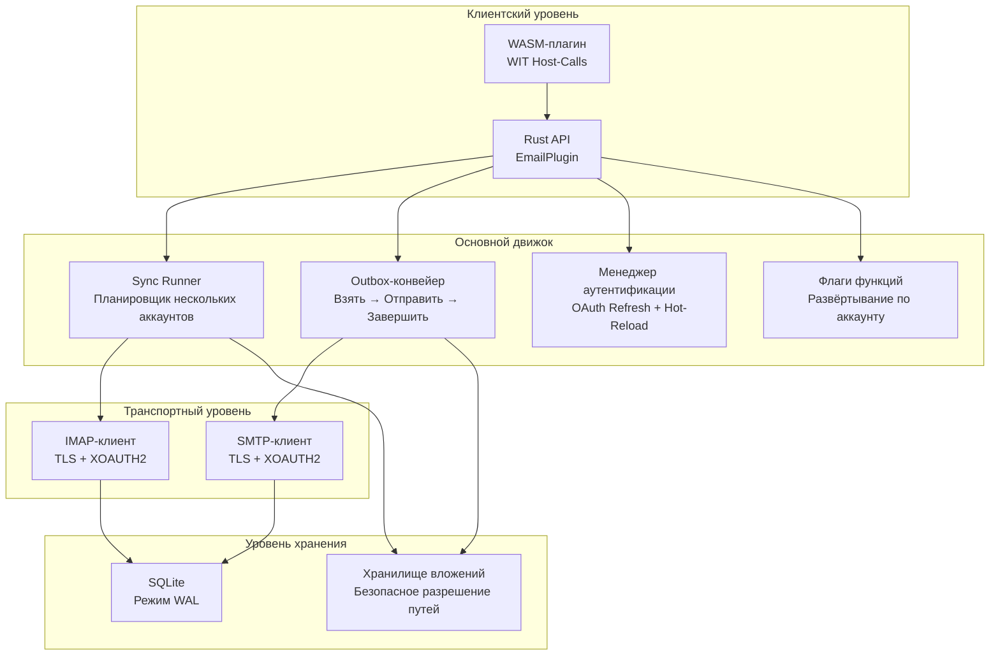

# PRX-Email

**PRX-Email** — самохостируемый плагин почтового клиента, написанный на Rust, с SQLite-персистентностью и production-hardened примитивами. Он обеспечивает синхронизацию IMAP-входящих, отправку через SMTP с атомарным outbox-конвейером, OAuth 2.0-аутентификацию для Gmail и Outlook, управление вложениями и WASM-плагинный интерфейс для интеграции в экосистему PRX.

PRX-Email разработан для разработчиков и команд, которым нужен надёжный встраиваемый бэкенд электронной почты — поддерживающий многоаккаунтное планирование синхронизации, безопасную доставку с outbox с повторными попытками и backoff, управление жизненным циклом OAuth-токенов и поэтапное развёртывание функций — без зависимости от сторонних SaaS-API электронной почты.

## Зачем нужен PRX-Email?

Большинство почтовых интеграций полагается на вендор-специфичные API или хрупкие IMAP/SMTP-обёртки, игнорирующие производственные проблемы, такие как дублирование отправки, истечение токенов и безопасность вложений. PRX-Email придерживается другого подхода:

- **Production-hardened outbox.** Атомарный state machine «взять и завершить» предотвращает дублирование отправки. Экспоненциальный backoff и детерминированные ключи идемпотентности Message-ID обеспечивают безопасные повторные попытки.
- **OAuth в первую очередь.** Нативная поддержка XOAUTH2 для IMAP и SMTP с отслеживанием истечения токенов, подключаемыми провайдерами обновления и горячей перезагрузкой из переменных окружения.
- **SQLite-native хранение.** Режим WAL, ограниченный чекпойнтинг и параметризованные запросы обеспечивают быструю, надёжную локальную персистентность без внешних зависимостей от баз данных.
- **Расширяемость через WASM.** Плагин компилируется в WebAssembly и предоставляет операции с электронной почтой через WIT host-calls, с переключателем безопасности сети, отключающим реальные IMAP/SMTP по умолчанию.

## Ключевые возможности

<div class="vp-features">

- **Синхронизация IMAP-входящих** — Подключение к любому IMAP-серверу с TLS. Синхронизация нескольких аккаунтов и папок с UID-инкрементальной выборкой и персистентностью курсора.

- **SMTP Outbox-конвейер** — Атомарный workflow «взять-отправить-завершить» предотвращает дублирование отправки. Неудачные сообщения повторяются с экспоненциальным backoff и настраиваемыми лимитами.

- **OAuth 2.0-аутентификация** — XOAUTH2 для Gmail и Outlook. Отслеживание истечения токенов, подключаемые провайдеры обновления и горячая перезагрузка из окружения без перезапуска.

- **Планировщик синхронизации нескольких аккаунтов** — Периодический опрос по аккаунту и папке с настраиваемой конкурентностью, backoff при ошибках и жёсткими лимитами на запуск.

- **SQLite-персистентность** — Режим WAL, NORMAL синхронность, 5-секундный busy timeout. Полная схема с аккаунтами, папками, сообщениями, outbox, состоянием синхронизации и флагами функций.

- **Управление вложениями** — Ограничения максимального размера, соблюдение MIME-whitelist и защита от обхода директорий защищают от чрезмерно больших или вредоносных вложений.

- **Поэтапное развёртывание флагов функций** — Флаги функций для каждого аккаунта с процентным развёртыванием. Независимое управление чтением входящих, поиском, отправкой, ответом и функциями повтора.

- **WASM-плагинный интерфейс** — Компилируется в WebAssembly для изолированного выполнения в PRX-среде. Host-calls обеспечивают операции email.sync, list, get, search, send и reply.

- **Наблюдаемость** — Метрики во время выполнения в памяти (попытки/успехи/неудачи синхронизации, неудачи отправки, количество повторов) и структурированные лог-payload с аккаунтом, папкой, message_id, run_id и error_code.

</div>

## Архитектура



## Быстрая установка

Клонируйте репозиторий и соберите:

```bash
git clone https://github.com/openprx/prx_email.git
cd prx_email
cargo build --release
```

Или добавьте как зависимость в `Cargo.toml`:

```toml
[dependencies]
prx_email = { git = "https://github.com/openprx/prx_email.git" }
```

Полные инструкции по установке, включая компиляцию WASM-плагина, см. в [Руководстве по установке](./getting-started/installation).

## Разделы документации

| Раздел | Описание |
|--------|----------|
| [Установка](./getting-started/installation) | Установка PRX-Email, настройка зависимостей и сборка WASM-плагина |
| [Быстрый старт](./getting-started/quickstart) | Настройка первого аккаунта и отправка письма за 5 минут |
| [Управление аккаунтами](./accounts/) | Добавление, настройка и управление почтовыми аккаунтами |
| [Конфигурация IMAP](./accounts/imap) | Настройки IMAP-сервера, TLS и синхронизация папок |
| [Конфигурация SMTP](./accounts/smtp) | Настройки SMTP-сервера, TLS и конвейер отправки |
| [OAuth-аутентификация](./accounts/oauth) | Настройка OAuth 2.0 для Gmail и Outlook |
| [SQLite-хранение](./storage/) | Схема базы данных, режим WAL, настройка производительности и обслуживание |
| [WASM-плагины](./plugins/) | Сборка и развёртывание WASM-плагина с WIT host-calls |
| [Справочник конфигурации](./configuration/) | Все переменные окружения, настройки среды выполнения и параметры политики |
| [Устранение неполадок](./troubleshooting/) | Распространённые проблемы и решения |

## Информация о проекте

- **Лицензия:** MIT OR Apache-2.0
- **Язык:** Rust (редакция 2024)
- **Репозиторий:** [github.com/openprx/prx_email](https://github.com/openprx/prx_email)
- **Хранение:** SQLite (rusqlite с bundled-функцией)
- **IMAP:** крейт `imap` с rustls TLS
- **SMTP:** крейт `lettre` с rustls TLS
