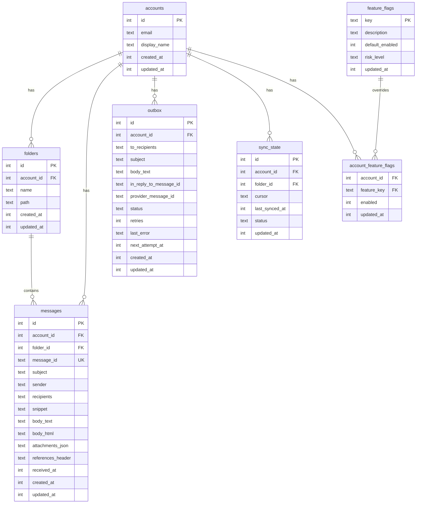

# SQLite-хранение

PRX-Email использует SQLite как единственный бэкенд хранения, доступный через крейт `rusqlite` с bundled-компиляцией SQLite. База данных работает в режиме WAL с включёнными внешними ключами, обеспечивая быстрые конкурентные чтения и надёжную изоляцию записей.

## Конфигурация базы данных

### Настройки по умолчанию

| Настройка | Значение | Описание |
|-----------|----------|----------|
| `journal_mode` | WAL | Журналирование с опережающей записью для конкурентных чтений |
| `synchronous` | NORMAL | Сбалансированная долговечность/производительность |
| `foreign_keys` | ON | Обеспечение ссылочной целостности |
| `busy_timeout` | 5000 мс | Время ожидания заблокированной базы данных |
| `wal_autocheckpoint` | 1000 страниц | Порог автоматического чекпойнта WAL |

### Пользовательская конфигурация

```rust
use prx_email::db::{EmailStore, StoreConfig, SynchronousMode};

let config = StoreConfig {
    enable_wal: true,
    busy_timeout_ms: 5_000,
    wal_autocheckpoint_pages: 1_000,
    synchronous: SynchronousMode::Normal,
};

let store = EmailStore::open_with_config("./email.db", &config)?;
```

### Режимы синхронности

| Режим | Долговечность | Производительность | Вариант использования |
|-------|--------------|-------------------|----------------------|
| `Full` | Максимальная | Самые медленные записи | Финансовые или compliance-нагрузки |
| `Normal` | Хорошая (по умолчанию) | Сбалансированная | Общее production-использование |
| `Off` | Минимальная | Самые быстрые записи | Только разработка и тестирование |

### База данных в памяти

Для тестирования используйте in-memory-базу данных:

```rust
let store = EmailStore::open_in_memory()?;
store.migrate()?;
```

## Схема

Схема базы данных применяется через инкрементальные миграции. Запуск `store.migrate()` применяет все ожидающие миграции.

### Таблицы



### Индексы

| Таблица | Индекс | Назначение |
|---------|--------|------------|
| `messages` | `(account_id)` | Фильтрация сообщений по аккаунту |
| `messages` | `(folder_id)` | Фильтрация сообщений по папке |
| `messages` | `(subject)` | LIKE-поиск по темам |
| `messages` | `(account_id, message_id)` | Ограничение уникальности для UPSERT |
| `outbox` | `(account_id)` | Фильтрация outbox по аккаунту |
| `outbox` | `(status, next_attempt_at)` | Взятие подходящих outbox-записей |
| `sync_state` | `(account_id, folder_id)` | Ограничение уникальности для UPSERT |
| `account_feature_flags` | `(account_id)` | Поиск флагов функций |

## Миграции

Миграции встроены в бинарный файл и применяются по порядку:

| Миграция | Описание |
|----------|----------|
| `0001_init.sql` | Таблицы accounts, folders, messages, sync_state |
| `0002_outbox.sql` | Таблица outbox для конвейера отправки |
| `0003_rollout.sql` | Флаги функций и флаги функций аккаунтов |
| `0005_m41.sql` | Уточнения схемы M4.1 |
| `0006_m42_perf.sql` | Индексы производительности M4.2 |

Дополнительные столбцы (`body_html`, `attachments_json`, `references_header`) добавляются через `ALTER TABLE` при отсутствии.

## Настройка производительности

### Нагрузки с преобладанием чтения

Для приложений, которые читают намного больше, чем пишут (типичные почтовые клиенты):

```rust
let config = StoreConfig {
    enable_wal: true,              // Конкурентные чтения
    busy_timeout_ms: 10_000,       // Более высокий timeout при конкуренции
    wal_autocheckpoint_pages: 2_000, // Менее частые чекпойнты
    synchronous: SynchronousMode::Normal,
};
```

### Нагрузки с преобладанием записи

Для высокообъёмных операций синхронизации:

```rust
let config = StoreConfig {
    enable_wal: true,
    busy_timeout_ms: 5_000,
    wal_autocheckpoint_pages: 500, // Более частые чекпойнты
    synchronous: SynchronousMode::Normal,
};
```

### Анализ плана запроса

Проверка медленных запросов с `EXPLAIN QUERY PLAN`:

```sql
EXPLAIN QUERY PLAN
SELECT * FROM messages
WHERE account_id = 1 AND subject LIKE '%invoice%'
ORDER BY received_at DESC LIMIT 50;
```

## Планирование ёмкости

### Факторы роста

| Таблица | Паттерн роста | Стратегия хранения |
|---------|--------------|-------------------|
| `messages` | Доминирующая таблица; растёт с каждой синхронизацией | Периодически удалять старые сообщения |
| `outbox` | Накапливает историю отправленных и неудачных | Удалять старые отправленные записи |
| WAL-файл | Всплески во время пачек записей | Автоматический чекпойнт |

### Пороги мониторинга

- Отслеживать размер файла БД и размер WAL независимо
- Оповещать, когда WAL остаётся большим через несколько чекпойнтов
- Оповещать, когда невыполненный backlog неудачных outbox превышает операционный SLO

## Обслуживание данных

### Вспомогательные средства очистки

```rust
// Удалить отправленные outbox-записи старше 30 дней
let cutoff = now - 30 * 86400;
let deleted = repo.delete_sent_outbox_before(cutoff)?;
println!("Deleted {} old sent records", deleted);

// Удалить сообщения старше 90 дней
let cutoff = now - 90 * 86400;
let deleted = repo.delete_old_messages_before(cutoff)?;
println!("Deleted {} old messages", deleted);
```

### SQL для обслуживания

Проверка распределения статусов outbox:

```sql
SELECT status, COUNT(*) FROM outbox GROUP BY status;
```

Распределение возраста сообщений:

```sql
SELECT
  CASE
    WHEN received_at >= strftime('%s','now') - 86400 THEN 'lt_1d'
    WHEN received_at >= strftime('%s','now') - 604800 THEN 'lt_7d'
    ELSE 'ge_7d'
  END AS age_bucket,
  COUNT(*)
FROM messages
GROUP BY age_bucket;
```

Чекпойнт WAL и уплотнение:

```sql
PRAGMA wal_checkpoint(TRUNCATE);
VACUUM;
```

::: warning VACUUM
`VACUUM` перестраивает весь файл базы данных и требует свободного места на диске, равного размеру базы данных. Выполняйте в окне обслуживания после больших удалений.
:::

## Безопасность SQL

Все запросы к базе данных используют параметризованные инструкции для предотвращения SQL-инъекций:

```rust
// Безопасно: параметризованный запрос
conn.execute(
    "SELECT * FROM messages WHERE account_id = ?1 AND message_id = ?2",
    params![account_id, message_id],
)?;
```

Динамические идентификаторы (имена таблиц, имена столбцов) проверяются по шаблону `^[a-zA-Z_][a-zA-Z0-9_]{0,62}$` перед использованием в SQL-строках.

## Следующие шаги

- [Справочник конфигурации](../configuration/) — все настройки среды выполнения
- [Устранение неполадок](../troubleshooting/) — проблемы, связанные с базой данных
- [Конфигурация IMAP](../accounts/imap) — понимание потока данных синхронизации
