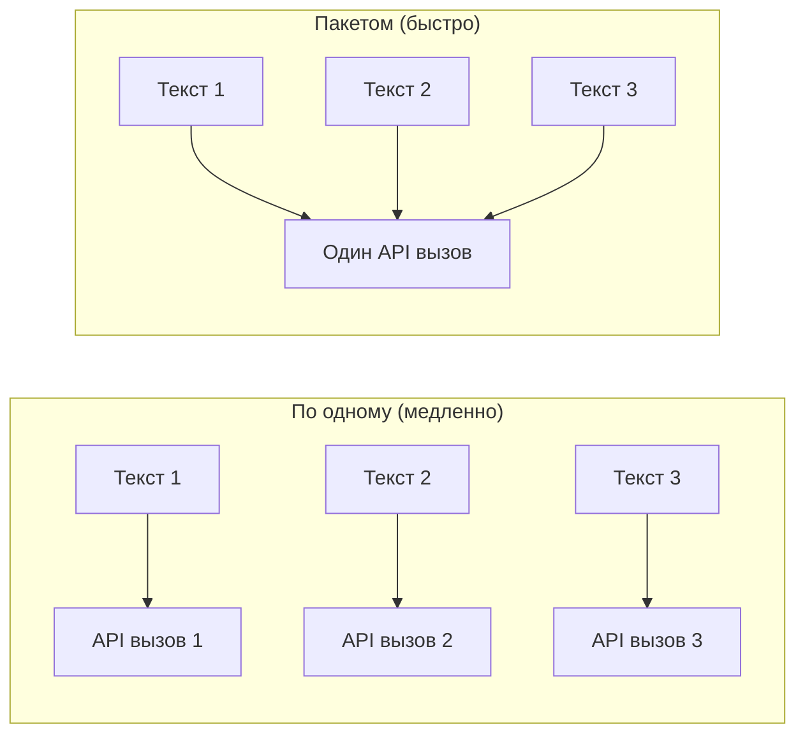

# Пакетная обработка

При работе с большими наборами воспоминаний генерация эмбеддинга для одного текста за раз неэффективна. PRX-Memory поддерживает пакетную генерацию эмбеддингов для сокращения числа API-запросов и повышения пропускной способности.

## Принцип работы пакетной генерации

Вместо отдельных API-вызовов для каждого воспоминания пакетная обработка группирует несколько текстов в один запрос. Большинство провайдеров эмбеддингов поддерживают размеры пакетов от 100 до 2048 текстов на вызов.



## Сценарии использования

### Первоначальный импорт

При импорте большого набора существующих знаний используйте `memory_import` для загрузки воспоминаний и запуска пакетной генерации эмбеддингов:

```json
{
  "jsonrpc": "2.0",
  "id": 1,
  "method": "tools/call",
  "params": {
    "name": "memory_import",
    "arguments": {
      "data": "... exported memory JSON ..."
    }
  }
}
```

### Перегенерация после смены модели

При переходе на новую модель эмбеддингов инструмент `memory_reembed` обрабатывает все сохранённые воспоминания пакетами:

```json
{
  "jsonrpc": "2.0",
  "id": 1,
  "method": "tools/call",
  "params": {
    "name": "memory_reembed",
    "arguments": {}
  }
}
```

### Уплотнение хранилища

Инструмент `memory_compact` оптимизирует хранение и может запускать перегенерацию эмбеддингов для записей с устаревшими или отсутствующими векторами:

```json
{
  "jsonrpc": "2.0",
  "id": 1,
  "method": "tools/call",
  "params": {
    "name": "memory_compact",
    "arguments": {}
  }
}
```

## Советы по производительности

| Совет | Описание |
|-------|----------|
| Используйте провайдеров с поддержкой пакетов | Jina и OpenAI-совместимые эндпоинты поддерживают большие размеры пакетов |
| Планируйте в периоды низкой нагрузки | Пакетные операции конкурируют за ту же квоту API, что и запросы в реальном времени |
| Мониторьте через метрики | Используйте эндпоинт `/metrics` для отслеживания количества вызовов эмбеддинга и задержек |
| Выбирайте эффективные модели | Меньшие модели (768 измерений) генерируют эмбеддинги быстрее, чем большие (3072 измерения) |

## Ограничение скорости запросов

Большинство провайдеров эмбеддингов применяют ограничения скорости. PRX-Memory обрабатывает ответы об ограничении скорости (HTTP 429) с автоматическим backoff. Если вы сталкиваетесь с постоянным ограничением скорости:

- Уменьшите размер пакета, обрабатывая меньше воспоминаний за раз.
- Используйте провайдера с более высокими лимитами скорости.
- Растяните пакетные операции на более длительный временной промежуток.

::: tip
Для крупномасштабных операций перегенерации рассмотрите использование локального сервера инференса, чтобы полностью избежать ограничений скорости. Установите `PRX_EMBED_PROVIDER=openai-compatible` и укажите в `PRX_EMBED_BASE_URL` адрес вашего локального сервера.
:::

## Следующие шаги

- [Поддерживаемые модели](./models) — выбор подходящей модели эмбеддингов
- [Бэкенды хранения](../storage/) — где хранятся векторы
- [Справочник конфигурации](../configuration/) — все переменные окружения
