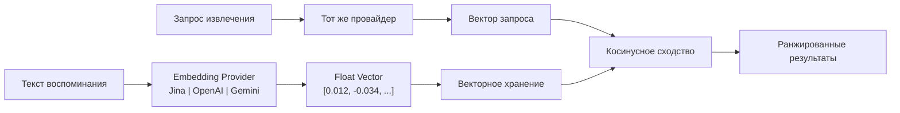

# Движок эмбеддингов

Движок эмбеддингов — основа семантических возможностей извлечения PRX-Memory. Он преобразует тексты воспоминаний в многомерные векторы, захватывающие смысл, что позволяет осуществлять поиск по сходству, выходящий за рамки сопоставления ключевых слов.

## Принцип работы

При сохранении воспоминания с включёнными эмбеддингами PRX-Memory:

1. Отправляет текст воспоминания настроенному провайдеру эмбеддингов.
2. Получает векторное представление (обычно 768–3072 измерений).
3. Хранит вектор вместе с метаданными воспоминания.
4. Использует вектор для поиска по косинусному сходству при извлечении.



## Архитектура провайдеров

Крейт `prx-memory-embed` определяет трейт провайдера, который реализуют все бэкенды эмбеддингов. Этот дизайн позволяет переключать провайдеров без изменения кода приложения.

Поддерживаемые провайдеры:

| Провайдер | Ключ окружения | Описание |
|----------|--------------|----------|
| OpenAI-совместимый | `PRX_EMBED_PROVIDER=openai-compatible` | Любой OpenAI-совместимый API (OpenAI, Azure, локальные серверы) |
| Jina | `PRX_EMBED_PROVIDER=jina` | Модели эмбеддингов Jina AI |
| Gemini | `PRX_EMBED_PROVIDER=gemini` | Модели эмбеддингов Google Gemini |

## Конфигурация

Установите провайдера и учётные данные через переменные окружения:

```bash
PRX_EMBED_PROVIDER=jina
PRX_EMBED_API_KEY=your_api_key
PRX_EMBED_MODEL=jina-embeddings-v3
PRX_EMBED_BASE_URL=https://api.jina.ai  # опционально, для пользовательских эндпоинтов
```

::: tip Резервные ключи провайдеров
Если `PRX_EMBED_API_KEY` не установлен, система откатывается к ключам, специфичным для провайдера:
- Jina: `JINA_API_KEY`
- Gemini: `GEMINI_API_KEY`
:::

## Когда включать эмбеддинги

| Сценарий | Нужны эмбеддинги? |
|---------|-----------------|
| Маленький набор памяти (<100 записей) | Опционально — лексического поиска может быть достаточно |
| Большой набор памяти (1000+ записей) | Рекомендуется — векторное сходство значительно улучшает извлечение |
| Запросы на естественном языке | Рекомендуется — захватывает семантический смысл |
| Точная фильтрация по тегам/областям | Не требуется — лексический поиск справляется с этим |
| Межъязыковое извлечение | Рекомендуется — многоязычные модели работают между языками |

## Характеристики производительности

- **Задержка:** 50–200 мс на вызов эмбеддинга в зависимости от провайдера и модели.
- **Пакетный режим:** Группируйте несколько текстов в один API-вызов для уменьшения количества запросов.
- **Локальное кэширование:** Векторы хранятся локально и повторно используются; только новые или изменённые воспоминания требуют вызовов эмбеддинга.
- **Бенчмарк 100k:** p95 извлечения менее 123 мс для лексического+важности+актуальности на 100 000 записей (без сетевых вызовов).

## Следующие шаги

- [Поддерживаемые модели](./models) — подробное сравнение моделей
- [Пакетная обработка](./batch-processing) — эффективная массовая генерация эмбеддингов
- [Реранкинг](../reranking/) — второй этап реранкинга для лучшей точности
