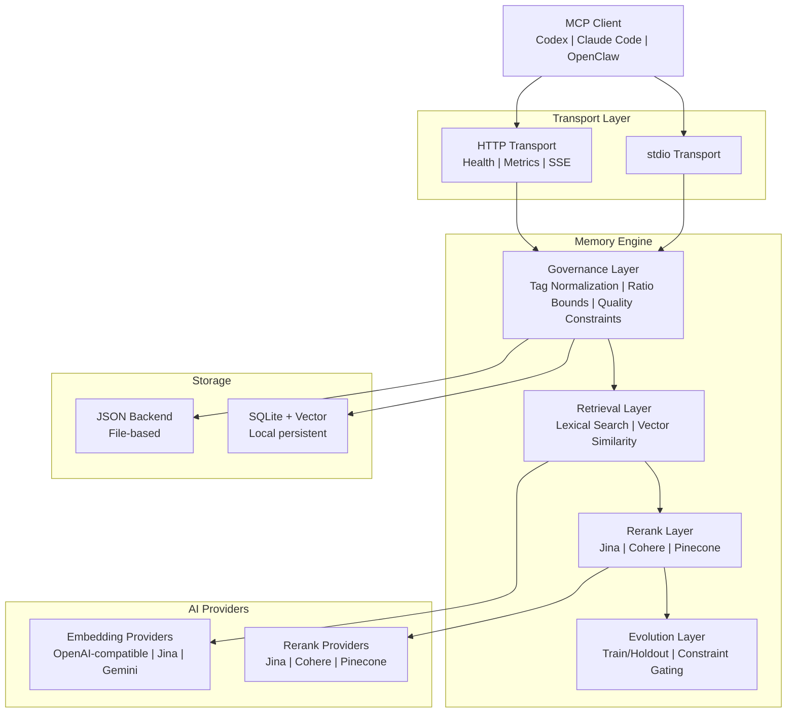

# PRX-Memory

**PRX-Memory** — локальный семантический движок памяти, предназначенный для кодирующих агентов. Он объединяет извлечение на основе эмбеддингов, реранкинг, управление и измеримую эволюцию в единый MCP-совместимый компонент. PRX-Memory поставляется как автономный демон (`prx-memoryd`), который взаимодействует через stdio или HTTP, что делает его совместимым с Codex, Claude Code, OpenClaw, OpenPRX и любым другим MCP-клиентом.

PRX-Memory ориентирован на **переиспользуемые инженерные знания**, а не на сырые логи. Система хранит структурированные воспоминания с тегами, областями видимости и оценками важности, затем извлекает их с помощью комбинации лексического поиска, векторного сходства и опционального реранкинга — всё под управлением ограничений качества и безопасности.

## Зачем нужен PRX-Memory?

Большинство кодирующих агентов относятся к памяти как к второстепенному — плоские файлы, неструктурированные логи или привязанные к вендору облачные сервисы. PRX-Memory придерживается другого подхода:

- **Локальный.** Все данные остаются на вашей машине. Без облачной зависимости, без телеметрии, без утечки данных из сети.
- **Структурированный и управляемый.** Каждая запись памяти следует стандартизированному формату с тегами, областями видимости, категориями и ограничениями качества. Нормализация тегов и границы соотношений предотвращают дрейф.
- **Семантическое извлечение.** Комбинация лексического сопоставления с векторным сходством и опциональным реранкингом для нахождения наиболее релевантных воспоминаний в контексте.
- **Измеримая эволюция.** Инструмент `memory_evolve` использует разделения train/holdout и ограничительные шлюзы для принятия или отклонения кандидатных улучшений — без угадывания.
- **MCP-нативный.** Первоклассная поддержка Model Context Protocol через stdio и HTTP транспорты, с шаблонами ресурсов, манифестами навыков и потоковыми сессиями.

## Ключевые возможности

- **Мультипровайдерный эмбеддинг** — Поддерживает OpenAI-совместимые, Jina и Gemini провайдеры эмбеддингов через унифицированный интерфейс адаптера. Переключайте провайдеров изменением переменной окружения.

- **Конвейер реранкинга** — Опциональный второй этап реранкинга с использованием Jina, Cohere или Pinecone реранкеров для улучшения точности извлечения за пределами сырого векторного сходства.

- **Управление** — Структурированный формат памяти с нормализацией тегов, границами соотношений, периодическим обслуживанием и ограничениями качества обеспечивают высокое качество памяти со временем.

- **Эволюция памяти** — Инструмент `memory_evolve` оценивает кандидатные изменения с использованием train/holdout приёмочного тестирования и ограничительных шлюзов, предоставляя измеримые гарантии улучшений.

- **MCP-сервер с двойным транспортом** — Запускайте как stdio-сервер для прямой интеграции или как HTTP-сервер с проверками работоспособности, метриками Prometheus и потоковыми сессиями.

- **Распределение навыков** — Встроенные пакеты навыков управления, обнаруживаемые через ресурсный и инструментальный протоколы MCP, с шаблонами payload для стандартизированных операций с памятью.

- **Наблюдаемость** — Эндпоинт метрик Prometheus, шаблоны Grafana-дашбордов, настраиваемые пороги оповещений и элементы управления кардинальностью для продакшен-развёртываний.

## Архитектура



## Быстрый старт

Сборка и запуск демона памяти:

```bash
cargo build -p prx-memory-mcp --bin prx-memoryd

PRX_MEMORYD_TRANSPORT=stdio \
PRX_MEMORY_DB=./data/memory-db.json \
./target/debug/prx-memoryd
```

Или установка через Cargo:

```bash
cargo install prx-memory-mcp
```

Полные методы установки и параметры конфигурации см. в [Руководстве по установке](./getting-started/installation).

## Крейты воркспейса

| Крейт | Описание |
|-------|----------|
| `prx-memory-core` | Основные примитивы оценки и эволюции домена |
| `prx-memory-embed` | Абстракция провайдера эмбеддингов и адаптеры |
| `prx-memory-rerank` | Абстракция провайдера реранкинга и адаптеры |
| `prx-memory-ai` | Унифицированная абстракция провайдера для эмбеддингов и реранкинга |
| `prx-memory-skill` | Встроенные payload навыков управления |
| `prx-memory-storage` | Локальный постоянный движок хранения (JSON, SQLite, LanceDB) |
| `prx-memory-mcp` | Поверхность MCP-сервера с stdio и HTTP транспортами |

## Разделы документации

| Раздел | Описание |
|--------|----------|
| [Установка](./getting-started/installation) | Сборка из исходного кода или установка через Cargo |
| [Быстрый старт](./getting-started/quickstart) | Запуск PRX-Memory за 5 минут |
| [Движок эмбеддингов](./embedding/) | Провайдеры эмбеддингов и пакетная обработка |
| [Поддерживаемые модели](./embedding/models) | OpenAI-совместимые, Jina, Gemini модели |
| [Движок реранкинга](./reranking/) | Конвейер реранкинга второго этапа |
| [Бэкенды хранения](./storage/) | JSON, SQLite и векторный поиск |
| [Интеграция MCP](./mcp/) | Протокол MCP, инструменты, ресурсы и шаблоны |
| [Справочник Rust API](./api/) | API библиотеки для встраивания PRX-Memory в Rust-проекты |
| [Конфигурация](./configuration/) | Все переменные окружения и профили |
| [Устранение неполадок](./troubleshooting/) | Распространённые проблемы и решения |

## Информация о проекте

- **Лицензия:** MIT OR Apache-2.0
- **Язык:** Rust (редакция 2024)
- **Репозиторий:** [github.com/openprx/prx-memory](https://github.com/openprx/prx-memory)
- **Минимальный Rust:** стабильный toolchain
- **Транспорты:** stdio, HTTP
