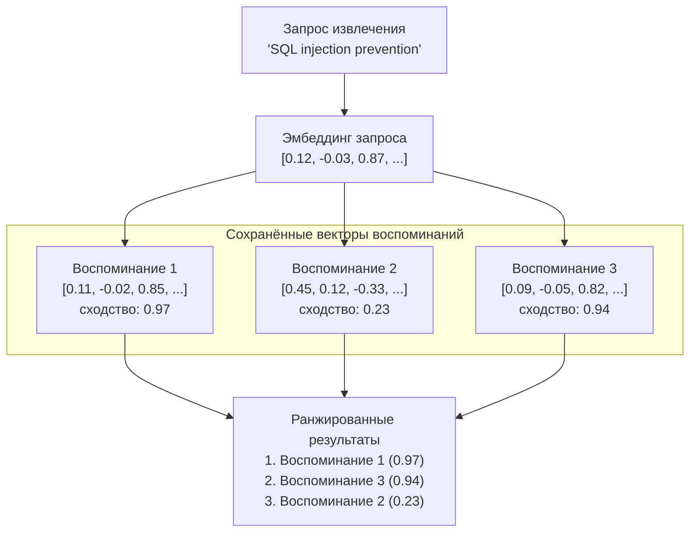

# Векторный поиск

Векторный поиск — это основной механизм, обеспечивающий семантическое извлечение памяти в PRX-Memory. Вместо сопоставления ключевых слов векторный поиск сравнивает математическое сходство между эмбеддингами запроса и воспоминаний для поиска концептуально связанных результатов.

## Принцип работы

1. **Эмбеддинг запроса:** Запрос извлечения отправляется настроенному провайдеру эмбеддингов, который возвращает вектор.
2. **Вычисление сходства:** Вектор запроса сравнивается со всеми сохранёнными векторами воспоминаний с помощью косинусного сходства.
3. **Оценка:** Каждое воспоминание получает оценку сходства от -1.0 до 1.0 (выше — более похожее).
4. **Ранжирование:** Результаты сортируются по оценке и объединяются с другими сигналами (лексическое сопоставление, важность, актуальность).



## Косинусное сходство

PRX-Memory использует косинусное сходство в качестве метрики расстояния. Косинусное сходство измеряет угол между двумя векторами, игнорируя их величину:

```
similarity(A, B) = (A . B) / (|A| * |B|)
```

| Оценка | Значение |
|--------|----------|
| 0.95–1.0 | Почти идентичный смысл |
| 0.80–0.95 | Высокая связанность |
| 0.60–0.80 | Умеренная связанность |
| < 0.60 | Вероятно не связаны |

## Комбинированное ранжирование

Векторное сходство — один из сигналов в многосигнальном ранжировании PRX-Memory. Итоговая оценка объединяет:

| Сигнал | Вес | Описание |
|--------|-----|----------|
| Векторное сходство | Высокий | Семантическая релевантность из сравнения эмбеддингов |
| Лексическое сопоставление | Средний | Пересечение ключевых слов между запросом и текстом воспоминания |
| Оценка важности | Средний | Назначенная пользователем или вычисленная системой важность |
| Актуальность | Низкий | Более свежие воспоминания получают небольшой бонус |

Точные веса зависят от конфигурации извлечения и от того, включены ли эмбеддинги и реранкинг.

## Производительность

Бенчмарк на 100 тыс. записей показывает:

| Метрика | Значение |
|---------|----------|
| Размер набора данных | 100 000 записей |
| Задержка p95 | 122.683 мс |
| Порог | < 300 мс |
| Метод | Лексический + важность + актуальность (без сетевых вызовов) |

::: info
Этот бенчмарк измеряет только путь ранжирования при извлечении, без сетевых вызовов эмбеддинга или реранкинга. Сквозная задержка зависит от времени отклика провайдера.
:::

## Соображения по масштабированию

| Размер набора данных | Рекомендуемый подход |
|---------------------|---------------------|
| < 10 000 | Полный перебор косинусного сходства (JSON или SQLite-бэкенд) |
| 10 000–100 000 | SQLite с векторным сканированием в памяти |
| > 100 000 | LanceDB с ANN-индексированием |

Для наборов данных, превышающих 100 000 записей, включите LanceDB-бэкенд для приближённого поиска ближайших соседей (ANN), обеспечивающего сублинейное время запроса.

## Следующие шаги

- [Движок эмбеддингов](../embedding/) — как генерируются векторы
- [Реранкинг](../reranking/) — улучшение точности второго этапа
- [Бэкенды хранения](./index) — выбор подходящего бэкенда хранения
