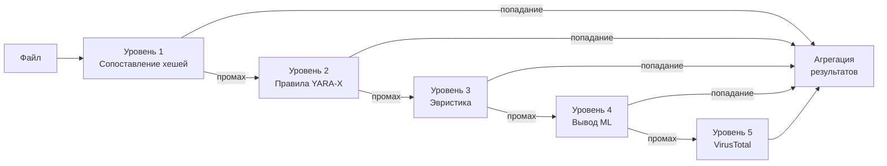

# Движок обнаружения

PRX-SD использует многоуровневый конвейер обнаружения для идентификации вредоносных программ. Каждый уровень использует различную технику, и они выполняются последовательно — от самых быстрых до наиболее тщательных. Этот подход эшелонированной обороны гарантирует, что даже если один уровень пропустит угрозу, последующие уровни её поймают.

## Обзор конвейера

Конвейер обнаружения обрабатывает каждый файл через до пяти уровней:



## Сводка уровней

| Уровень | Движок | Скорость | Покрытие | Обязателен |
|---------|--------|---------|---------|------------|
| **Уровень 1** | Сопоставление хешей LMDB | ~1 микросекунда/файл | Известные вредоносные программы (точное совпадение) | Да (по умолчанию) |
| **Уровень 2** | Сканирование правил YARA-X | ~0,3 мс/файл | По паттернам (38 800+ правил) | Да (по умолчанию) |
| **Уровень 3** | Эвристический анализ | ~1-5 мс/файл | Поведенческие индикаторы по типу файла | Да (по умолчанию) |
| **Уровень 4** | Вывод ML ONNX | ~10-50 мс/файл | Новые/полиморфные вредоносные программы | Опционально (`--features ml`) |
| **Уровень 5** | API VirusTotal | ~200-500 мс/файл | Консенсус 70+ вендоров | Опционально (`--features virustotal`) |

## Уровень 1: Сопоставление хешей

Самый быстрый уровень. PRX-SD вычисляет хеш SHA-256 каждого файла и ищет его в базе данных LMDB, содержащей хеши известных вредоносных файлов. LMDB обеспечивает O(1) среднее время поиска с файлами, отображёнными в память, что делает этот уровень практически бесплатным с точки зрения производительности.

**Источники данных:**
- abuse.ch MalwareBazaar (последние 48 часов, обновление каждые 5 минут)
- abuse.ch URLhaus (ежечасные обновления)
- abuse.ch Feodo Tracker (Emotet/Dridex/TrickBot, каждые 5 минут)
- abuse.ch ThreatFox (платформа обмена IOC)
- VirusShare (20 млн+ хешей MD5, опциональное обновление `--full`)
- Встроенный список блокировок (EICAR, WannaCry, NotPetya, Emotet и другие)

Совпадение хеша немедленно даёт вердикт `MALICIOUS`. Оставшиеся уровни для этого файла пропускаются.

Подробнее см. в [Сопоставлении хешей](./hash-matching).

## Уровень 2: Правила YARA-X

Если совпадение хеша не найдено, файл сканируется по 38 800+ правилам YARA с использованием движка YARA-X — переписанной на Rust следующего поколения версии YARA. Правила обнаруживают вредоносные программы путём сопоставления байтовых паттернов, строк и структурных условий внутри содержимого файлов.

**Источники правил:**
- 64 встроенных правила (программы-вымогатели, трояны, бэкдоры, руткиты, майнеры, веб-шеллы)
- Yara-Rules/rules (поддерживается сообществом, GitHub)
- Neo23x0/signature-base (высококачественные правила для APT и популярных вредоносных программ)
- ReversingLabs YARA (правила коммерческого уровня с открытым исходным кодом)
- ESET IOC (отслеживание продвинутых постоянных угроз)
- InQuest (вредоносные документы: OLE, DDE, вредоносные макросы)

Совпадение с правилом YARA даёт вердикт `MALICIOUS` с именем правила в отчёте.

Подробнее см. в [Правилах YARA](./yara-rules).

## Уровень 3: Эвристический анализ

Файлы, прошедшие проверки хешей и YARA, анализируются с помощью эвристики с учётом типа файла. PRX-SD определяет тип файла по сигнатуре и применяет целевые проверки:

| Тип файла | Эвристические проверки |
|-----------|----------------------|
| PE (Windows) | Энтропия секций, подозрительные API-импорты, обнаружение упаковщиков, аномалии временных меток |
| ELF (Linux) | Энтропия секций, ссылки на LD_PRELOAD, persistence через cron/systemd, паттерны SSH-бэкдоров |
| Mach-O (macOS) | Энтропия секций, внедрение dylib, persistence через LaunchAgent, доступ к Keychain |
| Office (docx/xlsx) | Макросы VBA, поля DDE, ссылки на внешние шаблоны, триггеры автоматического выполнения |
| PDF | Встроенный JavaScript, действия Launch, действия URI, обфусцированные потоки |

Каждая проверка добавляет баллы к накопительной оценке:

| Оценка | Вердикт |
|--------|---------|
| 0 - 29 | **Clean** |
| 30 - 59 | **Suspicious** — рекомендуется ручная проверка |
| 60 - 100 | **Malicious** — угроза с высокой достоверностью |

Подробнее см. в [Эвристическом анализе](./heuristics).

## Уровень 4: Вывод ML (опционально)

При компиляции с функцией `ml` PRX-SD может запускать файлы через модель машинного обучения ONNX, обученную на миллионах образцов вредоносных программ. Этот уровень особенно эффективен для обнаружения новых и полиморфных вредоносных программ, которые уклоняются от обнаружения на основе сигнатур.

```bash
# Сборка с поддержкой ML
cargo build --release --features ml
```

Модель ML работает локально с использованием ONNX Runtime. Облачное соединение не требуется.

::: tip Когда использовать ML
Вывод ML добавляет задержку (~10-50 мс на файл). Включайте его для целевых сканирований подозрительных файлов или каталогов, а не для полного сканирования диска, где первые три уровня обеспечивают достаточное покрытие.
:::

## Уровень 5: VirusTotal (опционально)

При компиляции с функцией `virustotal` и настройке с ключом API PRX-SD может отправлять хеши файлов в VirusTotal для получения консенсуса от 70+ антивирусных вендоров.

```bash
# Сборка с поддержкой VirusTotal
cargo build --release --features virustotal

# Настройка ключа API
sd config set virustotal.api_key "YOUR_API_KEY"
```

::: warning Ограничения скорости
Бесплатный API VirusTotal разрешает 4 запроса в минуту и 500 в день. PRX-SD автоматически соблюдает эти ограничения. Этот уровень лучше использовать как финальный шаг подтверждения, а не для массового сканирования.
:::

## Агрегация результатов

Когда файл сканируется через несколько уровней, окончательный вердикт определяется **наивысшим найденным уровнем серьёзности**:

```
MALICIOUS > SUSPICIOUS > CLEAN
```

Если уровень 1 возвращает `MALICIOUS`, файл считается вредоносным независимо от того, что могут сказать другие уровни. Если уровень 3 возвращает `SUSPICIOUS` и ни один другой уровень не возвращает `MALICIOUS`, файл считается подозрительным.

Отчёт о сканировании включает подробности с каждого уровня, который дал результат, предоставляя аналитику полный контекст.

## Отключение уровней

Для специализированных случаев использования отдельные уровни можно отключить:

```bash
# Сканирование только по хешам (быстрее всего, только известные угрозы)
sd scan /path --no-yara --no-heuristics

# Пропустить эвристику (только хеши + YARA)
sd scan /path --no-heuristics
```

## Следующие шаги

- [Сопоставление хешей](./hash-matching) — детальное изучение базы данных хешей LMDB
- [Правила YARA](./yara-rules) — источники правил и управление пользовательскими правилами
- [Эвристический анализ](./heuristics) — поведенческие проверки с учётом типа файла
- [Поддерживаемые типы файлов](./file-types) — матрица форматов файлов и определение по сигнатуре
