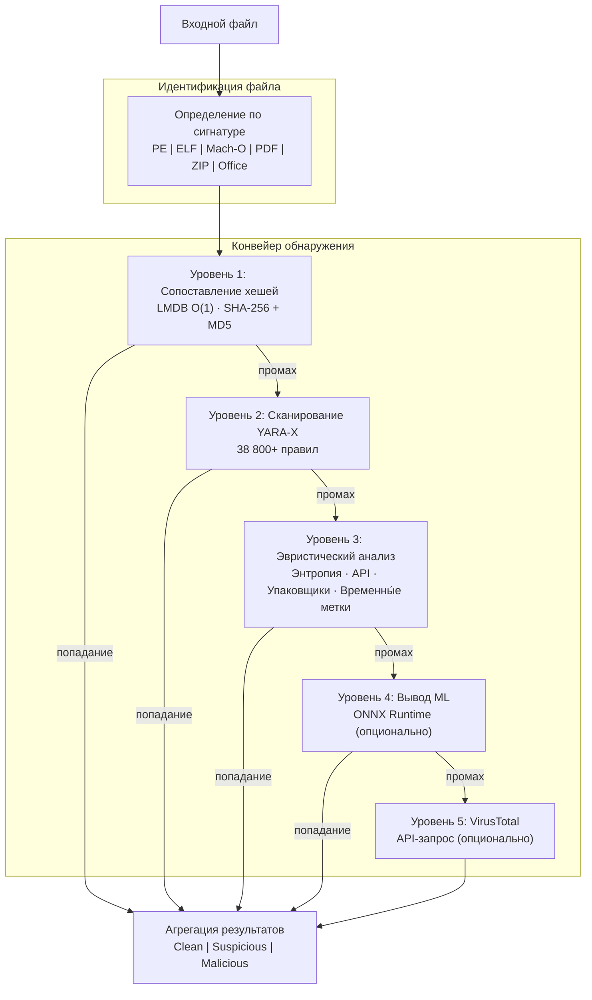

# PRX-SD

**PRX-SD** — высокопроизводительный антивирусный движок с открытым исходным кодом, написанный на Rust. Он объединяет сопоставление подписей на основе хешей, более 38 800 правил YARA, эвристический анализ с учётом типов файлов и опциональный вывод ML в единый многоуровневый конвейер обнаружения. PRX-SD поставляется как инструмент командной строки (`sd`), системный демон для защиты в реальном времени и настольный интерфейс на Tauri + Vue 3.

PRX-SD разработан для специалистов по безопасности, системных администраторов и специалистов по реагированию на инциденты, которым нужен быстрый, прозрачный и расширяемый движок обнаружения вредоносных программ — способный сканировать миллионы файлов, отслеживать каталоги в реальном времени, обнаруживать руткиты и интегрироваться с внешними источниками разведки угроз — без зависимости от непрозрачных коммерческих решений.

## Почему PRX-SD?

Традиционные антивирусные продукты имеют закрытый исходный код, потребляют много ресурсов и сложны в настройке. PRX-SD придерживается иного подхода:

- **Открытый и проверяемый.** Каждое правило обнаружения, эвристическая проверка и порог оценки видны в исходном коде. Скрытая телеметрия отсутствует, зависимость от облака не требуется.
- **Многоуровневая защита.** Пять независимых уровней обнаружения гарантируют: если один метод пропустит угрозу, следующий её поймает.
- **Производительность Rust.** Zero-copy I/O, O(1)-поиск в LMDB и параллельное сканирование обеспечивают пропускную способность, сравнимую с коммерческими движками на обычном оборудовании.
- **Расширяемость по дизайну.** Плагины WASM, пользовательские правила YARA и модульная архитектура делают PRX-SD легко адаптируемым к специализированным средам.

## Ключевые возможности

<div class="vp-features">

- **Многоуровневый конвейер обнаружения** — Сопоставление хешей, правила YARA-X, эвристический анализ, опциональный вывод ML и опциональная интеграция с VirusTotal работают последовательно для максимизации обнаружения.

- **Защита в реальном времени** — Демон `sd monitor` отслеживает каталоги с помощью inotify (Linux) / FSEvents (macOS) и немедленно сканирует новые или изменённые файлы.

- **Защита от программ-вымогателей** — Специальные правила YARA и эвристика обнаруживают семейства программ-вымогателей, включая WannaCry, LockBit, Conti, REvil, BlackCat и другие.

- **Более 38 800 правил YARA** — Агрегированы из 8 источников сообщества и коммерческого уровня: Yara-Rules, Neo23x0 signature-base, ReversingLabs, ESET IOC, InQuest и 64 встроенных правила.

- **База хешей LMDB** — Хеши SHA-256 и MD5 из abuse.ch MalwareBazaar, URLhaus, Feodo Tracker, ThreatFox, VirusShare (20 млн+) и встроенного списка блокировок хранятся в LMDB для O(1)-поиска.

- **Кросс-платформенность** — Linux (x86_64, aarch64), macOS (Apple Silicon, Intel) и Windows (WSL2). Нативное определение типов файлов для форматов PE, ELF, Mach-O, PDF, Office и архивов.

- **Система плагинов WASM** — Расширяйте логику обнаружения, добавляйте пользовательские сканеры или интегрируйте проприетарные источники угроз через плагины WebAssembly.

</div>

## Архитектура



## Быстрая установка

```bash
curl -fsSL https://raw.githubusercontent.com/openprx/prx-sd/main/install.sh | bash
```

Или установка через Cargo:

```bash
cargo install prx-sd
```

Затем обновите базу данных сигнатур:

```bash
sd update
```

Подробнее обо всех методах, включая Docker и сборку из исходников, см. в [руководстве по установке](./getting-started/installation).

## Разделы документации

| Раздел | Описание |
|--------|----------|
| [Установка](./getting-started/installation) | Установка PRX-SD на Linux, macOS или Windows WSL2 |
| [Быстрый старт](./getting-started/quickstart) | Запуск сканирования с PRX-SD за 5 минут |
| [Сканирование файлов и каталогов](./scanning/file-scan) | Полный справочник команды `sd scan` |
| [Сканирование памяти](./scanning/memory-scan) | Сканирование памяти запущенных процессов |
| [Обнаружение руткитов](./scanning/rootkit) | Обнаружение руткитов ядра и пользовательского пространства |
| [Сканирование USB](./scanning/usb-scan) | Автоматическое сканирование съёмных носителей |
| [Движок обнаружения](./detection/) | Как работает многоуровневый конвейер |
| [Сопоставление хешей](./detection/hash-matching) | База хешей LMDB и источники данных |
| [Правила YARA](./detection/yara-rules) | 38 800+ правил из 8 источников |
| [Эвристический анализ](./detection/heuristics) | Поведенческий анализ с учётом типа файла |
| [Поддерживаемые типы файлов](./detection/file-types) | Матрица форматов файлов и определение по сигнатуре |

## Информация о проекте

- **Лицензия:** MIT OR Apache-2.0
- **Язык:** Rust (редакция 2024)
- **Репозиторий:** [github.com/openprx/prx-sd](https://github.com/openprx/prx-sd)
- **Минимальная версия Rust:** 1.85.0
- **GUI:** Tauri 2 + Vue 3
