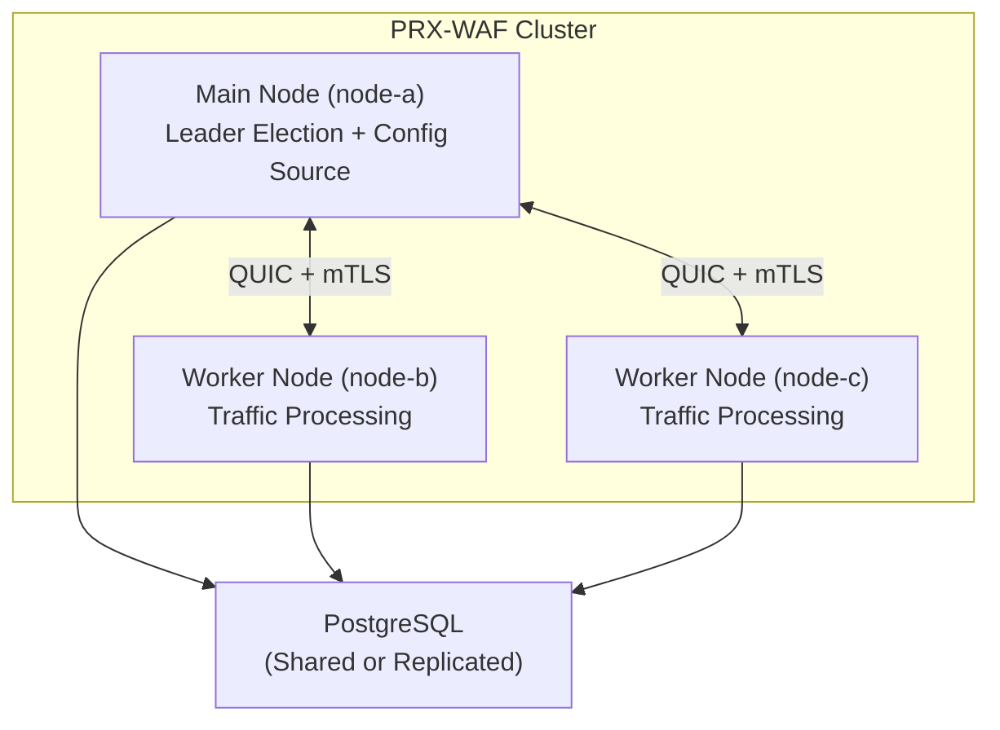

# Кластерный режим

PRX-WAF поддерживает многоузловые кластерные развёртывания для горизонтального масштабирования и высокой доступности. Кластерный режим использует межузловую коммуникацию на базе QUIC, выбор лидера по принципу Raft и автоматическую синхронизацию правил, конфигурации и событий безопасности между всеми узлами.

::: info
Кластерный режим полностью опционален. По умолчанию PRX-WAF работает в автономном режиме без кластерных накладных расходов. Включите его, добавив раздел `[cluster]` в вашу конфигурацию.
:::

## Архитектура

Кластер PRX-WAF состоит из одного **главного** узла и одного или нескольких **рабочих** узлов:



### Роли узлов

| Роль | Описание |
|------|----------|
| `main` | Хранит авторитетную конфигурацию и набор правил. Передаёт обновления рабочим узлам. Участвует в выборе лидера. |
| `worker` | Обрабатывает трафик и применяет конвейер WAF. Получает обновления конфигурации и правил от главного узла. Передаёт события безопасности обратно главному. |
| `auto` | Участвует в выборе лидера по принципу Raft. Любой узел может стать главным. |

## Что синхронизируется

| Данные | Направление | Интервал |
|--------|------------|---------|
| Правила | От главного к рабочим | Каждые 10с (настраивается) |
| Конфигурация | От главного к рабочим | Каждые 30с (настраивается) |
| События безопасности | От рабочих к главному | Каждые 5с или 100 событий (что наступит раньше) |
| Статистика | От рабочих к главному | Каждые 10с |

## Межузловая коммуникация

Вся кластерная коммуникация использует QUIC (через Quinn) через UDP с взаимным TLS (mTLS):

- **Порт:** `16851` (по умолчанию)
- **Шифрование:** mTLS с автоматически сгенерированными или предоставленными сертификатами
- **Протокол:** Пользовательский бинарный протокол через QUIC-потоки
- **Соединение:** Постоянное с автоматическим переподключением

## Выбор лидера

При настройке `role = "auto"` узлы используют протокол выборов по принципу Raft:

| Параметр | По умолчанию | Описание |
|---------|-------------|----------|
| `timeout_min_ms` | `150` | Минимальный таймаут выборов (случайный диапазон) |
| `timeout_max_ms` | `300` | Максимальный таймаут выборов (случайный диапазон) |
| `heartbeat_interval_ms` | `50` | Интервал heartbeat от главного к рабочим |
| `phi_suspect` | `8.0` | Порог подозрения детектора отказов Phi accrual |
| `phi_dead` | `12.0` | Порог смерти детектора отказов Phi accrual |

Когда главный узел становится недоступным, рабочие узлы ждут случайного таймаута в настроенном диапазоне перед инициированием выборов. Первый узел, получивший большинство голосов, становится новым главным.

## Мониторинг здоровья

Проверка здоровья кластера выполняется на каждом узле и отслеживает связность с пирами:

```toml
[cluster.health]
check_interval_secs   = 5    # Частота проверки здоровья
max_missed_heartbeats = 3    # Помечать пир как нездоровый после N пропусков
```

Нездоровые узлы исключаются из кластера до их восстановления и повторной синхронизации.

## Управление сертификатами

Узлы кластера аутентифицируют друг друга с использованием mTLS-сертификатов:

- **Режим автогенерации:** Главный узел генерирует CA-сертификат и автоматически подписывает сертификаты узлов при первом запуске. Рабочие узлы получают свои сертификаты в процессе присоединения.
- **Предоставленный режим:** Сертификаты генерируются офлайн и распространяются на каждый узел перед запуском.

```toml
[cluster.crypto]
ca_cert        = "/certs/cluster-ca.pem"
node_cert      = "/certs/node-a.pem"
node_key       = "/certs/node-a.key"
auto_generate  = true
ca_validity_days    = 3650   # 10 лет
node_validity_days  = 365    # 1 год
renewal_before_days = 7      # Автоматически обновлять за 7 дней до истечения
```

## Следующие шаги

- [Развёртывание кластера](./deployment) — пошаговое руководство по настройке нескольких узлов
- [Справочник конфигурации](../configuration/reference) — все ключи конфигурации кластера
- [Устранение неполадок](../troubleshooting/) — распространённые проблемы кластера
