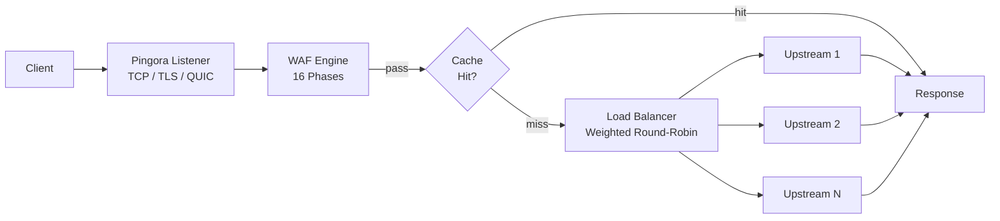

# Шлюз

PRX-WAF построен на [Pingora](https://github.com/cloudflare/pingora) — библиотеке Rust HTTP-прокси от Cloudflare. Шлюз обрабатывает весь входящий трафик, маршрутизирует запросы к апстрим-бэкендам и применяет конвейер обнаружения WAF перед проксированием.

## Поддержка протоколов

| Протокол | Статус | Примечания |
|---------|--------|------------|
| HTTP/1.1 | Поддерживается | По умолчанию |
| HTTP/2 | Поддерживается | Автоматическое обновление через ALPN |
| HTTP/3 (QUIC) | Опционально | Через библиотеку Quinn, требует конфигурации `[http3]` |
| WebSocket | Поддерживается | Полнодуплексное проксирование |

## Ключевые возможности

### Балансировка нагрузки

PRX-WAF распределяет трафик по апстрим-бэкендам с использованием взвешенной балансировки нагрузки round-robin. Каждая запись хоста может указывать несколько апстрим-серверов с относительными весами:

```toml
[[hosts]]
host        = "example.com"
port        = 80
remote_host = "10.0.0.1"
remote_port = 8080
guard_status = true
```

Хостами также можно управлять через Admin UI или REST API по адресу `/api/hosts`.

### Кеширование ответов

Шлюз включает LRU in-memory кеш на базе moka для снижения нагрузки на апстрим-серверы:

```toml
[cache]
enabled          = true
max_size_mb      = 256       # Максимальный размер кеша
default_ttl_secs = 60        # TTL по умолчанию для кешированных ответов
max_ttl_secs     = 3600      # Максимальный TTL
```

Кеш соблюдает стандартные HTTP-заголовки кеширования (`Cache-Control`, `Expires`, `ETag`, `Last-Modified`) и поддерживает инвалидацию кеша через Admin API.

### Обратные туннели

PRX-WAF может создавать обратные туннели на базе WebSocket (аналогично Cloudflare Tunnels) для предоставления доступа к внутренним сервисам без открытия входящих портов брандмауэра:

```bash
# Список активных туннелей
curl -H "Authorization: Bearer $TOKEN" http://localhost:9527/api/tunnels

# Создать туннель
curl -X POST -H "Authorization: Bearer $TOKEN" \
  -H "Content-Type: application/json" \
  -d '{"name":"internal-api","target":"http://192.168.1.10:3000"}' \
  http://localhost:9527/api/tunnels
```

### Защита от хотлинкинга

Шлюз поддерживает защиту от хотлинкинга на основе Referer для каждого хоста. При включении запросы без допустимого заголовка Referer с настроенного домена блокируются. Это настраивается для каждого хоста в Admin UI или через API.

## Архитектура



## Следующие шаги

- [Reverse Proxy](./reverse-proxy) — детальная конфигурация маршрутизации бэкендов и балансировки нагрузки
- [SSL/TLS](./ssl-tls) — HTTPS, Let's Encrypt и настройка HTTP/3
- [Справочник конфигурации](../configuration/reference) — все ключи конфигурации шлюза
