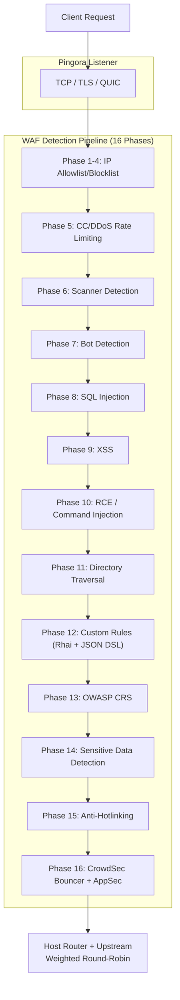

# PRX-WAF

**PRX-WAF** — готовый к производству межсетевой экран веб-приложений (прокси), созданный на базе [Pingora](https://github.com/cloudflare/pingora) (библиотека Rust HTTP-прокси от Cloudflare). Он объединяет 16-фазный конвейер обнаружения атак, движок сценариев Rhai, поддержку OWASP CRS, импорт правил ModSecurity, интеграцию CrowdSec, WASM-плагины и Vue 3 Admin UI в единый развёртываемый бинарный файл.

PRX-WAF предназначен для DevOps-инженеров, команд безопасности и операторов платформ, которым нужен быстрый, прозрачный и расширяемый WAF — способный проксировать миллионы запросов, обнаруживать атаки OWASP Top 10, автоматически обновлять TLS-сертификаты, масштабироваться горизонтально в кластерном режиме и интегрироваться с внешними фидами разведки угроз — без зависимости от проприетарных облачных WAF-сервисов.

## Почему PRX-WAF?

Традиционные WAF-продукты являются проприетарными, дорогостоящими и сложно настраиваемыми. PRX-WAF предлагает иной подход:

- **Открытый и проверяемый.** Каждое правило обнаружения, пороговое значение и механизм оценки видны в исходном коде. Никакого скрытого сбора данных, никакой привязки к поставщику.
- **Многофазная защита.** 16 последовательных фаз обнаружения гарантируют, что если одна проверка пропустит атаку, последующие фазы её поймают.
- **Производительность Rust.** Созданный на Pingora, PRX-WAF достигает пропускной способности, близкой к линейной скорости, с минимальными накладными расходами на задержку на обычном оборудовании.
- **Расширяемость по дизайну.** Правила YAML, скрипты Rhai, WASM-плагины и импорт правил ModSecurity делают PRX-WAF легко адаптируемым к любому стеку приложений.

## Ключевые возможности

<div class="vp-features">

- **Pingora Reverse Proxy** — HTTP/1.1, HTTP/2 и HTTP/3 через QUIC (Quinn). Взвешенная балансировка нагрузки round-robin между бэкендами.

- **16-фазный конвейер обнаружения** — белые/чёрные списки IP, ограничение CC/DDoS, обнаружение сканеров, обнаружение ботов, SQLi, XSS, RCE, обход каталогов, пользовательские правила, OWASP CRS, обнаружение чувствительных данных, защита от хотлинкинга и интеграция CrowdSec.

- **Движок правил YAML** — декларативные правила YAML с 11 операторами, 12 полями запроса, уровнями паранойи 1-4 и горячей перезагрузкой без простоя.

- **Поддержка OWASP CRS** — 310+ правил, конвертированных из OWASP ModSecurity Core Rule Set v4, охватывающих SQLi, XSS, RCE, LFI, RFI, обнаружение сканеров и многое другое.

- **Интеграция CrowdSec** — режим Bouncer (кеш решений от LAPI), режим AppSec (удалённая HTTP-инспекция) и log pusher для общественной разведки угроз.

- **Кластерный режим** — межузловая коммуникация на базе QUIC, выбор лидера по принципу Raft, автоматическая синхронизация правил/конфигурации/событий и управление mTLS-сертификатами.

- **Vue 3 Admin UI** — аутентификация JWT + TOTP, мониторинг WebSocket в реальном времени, управление хостами, управление правилами и дашборды событий безопасности.

- **Автоматизация SSL/TLS** — Let's Encrypt через ACME v2 (instant-acme), автоматическое обновление сертификатов и поддержка HTTP/3 QUIC.

</div>

## Архитектура

PRX-WAF организован как рабочее пространство Cargo из 7 крейтов:

| Крейт | Роль |
|-------|------|
| `prx-waf` | Бинарный файл: точка входа CLI, начальная загрузка сервера |
| `gateway` | Pingora-прокси, HTTP/3, автоматизация SSL, кешировании, туннели |
| `waf-engine` | Конвейер обнаружения, движок правил, проверки, плагины, CrowdSec |
| `waf-storage` | Слой PostgreSQL (sqlx), миграции, модели |
| `waf-api` | Axum REST API, аутентификация JWT/TOTP, WebSocket, статический UI |
| `waf-common` | Общие типы: RequestCtx, WafDecision, HostConfig, конфигурация |
| `waf-cluster` | Кластерный консенсус, QUIC-транспорт, синхронизация правил, управление сертификатами |

### Поток запросов



## Быстрая установка

```bash
git clone https://github.com/openprx/prx-waf
cd prx-waf
docker compose up -d
```

Admin UI: `http://localhost:9527` (учётные данные по умолчанию: `admin` / `admin`)

Подробнее в [Руководстве по установке](./getting-started/installation), включая установку через Cargo и сборку из исходного кода.

## Разделы документации

| Раздел | Описание |
|--------|----------|
| [Установка](./getting-started/installation) | Установка PRX-WAF через Docker, Cargo или сборку из исходного кода |
| [Быстрый старт](./getting-started/quickstart) | Защита вашего приложения за 5 минут |
| [Движок правил](./rules/) | Как работает движок правил YAML |
| [Синтаксис YAML](./rules/yaml-syntax) | Полный справочник схемы правил YAML |
| [Встроенные правила](./rules/builtin-rules) | OWASP CRS, ModSecurity, патчи CVE |
| [Пользовательские правила](./rules/custom-rules) | Написание собственных правил обнаружения |
| [Gateway](./gateway/) | Обзор Pingora reverse proxy |
| [Reverse Proxy](./gateway/reverse-proxy) | Маршрутизация бэкендов и балансировка нагрузки |
| [SSL/TLS](./gateway/ssl-tls) | HTTPS, Let's Encrypt, HTTP/3 |
| [Кластерный режим](./cluster/) | Обзор многоузлового развёртывания |
| [Развёртывание кластера](./cluster/deployment) | Пошаговое руководство по настройке кластера |
| [Admin UI](./admin-ui/) | Дашборд управления Vue 3 |
| [Конфигурация](./configuration/) | Обзор конфигурации |
| [Справочник конфигурации](./configuration/reference) | Каждый ключ TOML с документацией |
| [Справочник CLI](./cli/) | Все команды и подкоманды CLI |
| [Устранение неполадок](./troubleshooting/) | Распространённые проблемы и решения |

## Информация о проекте

- **Лицензия:** MIT OR Apache-2.0
- **Язык:** Rust (редакция 2024)
- **Репозиторий:** [github.com/openprx/prx-waf](https://github.com/openprx/prx-waf)
- **Минимальная версия Rust:** 1.82.0
- **Admin UI:** Vue 3 + Tailwind CSS
- **База данных:** PostgreSQL 16+
