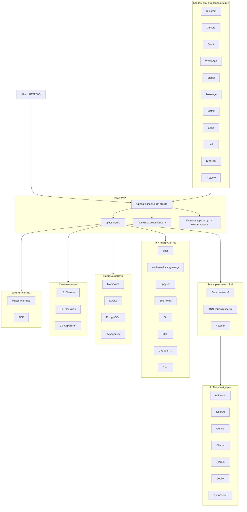

# PRX

**PRX** — высокопроизводительная, самоэволюционирующая среда выполнения AI-агентов, написанная на Rust. Она связывает большие языковые модели с 19 мессенджер-платформами, предоставляет 46+ встроенных инструментов, поддерживает расширение через WASM-плагины и автономно совершенствует собственное поведение с помощью 3-уровневой системы самоэволюции.

PRX предназначен для разработчиков и команд, которым нужен единый универсальный агент, работающий на всех используемых ими мессенджер-платформах — от Telegram и Discord до Slack, WhatsApp, Signal, iMessage, DingTalk, Lark и других — при сохранении безопасности, наблюдаемости и надёжности на уровне промышленной эксплуатации.

## Почему PRX?

Большинство фреймворков AI-агентов сосредоточены на одной точке интеграции или требуют большого количества связующего кода для соединения различных сервисов. PRX использует иной подход:

- **Один бинарник — все каналы.** Единый бинарник `prx` одновременно подключается ко всем 19 мессенджер-платформам. Никаких отдельных ботов, никакого разрастания микросервисов.
- **Самоэволюция.** PRX автономно совершенствует свою память, промпты и стратегии на основе обратной связи от взаимодействий — с безопасным откатом на каждом уровне.
- **Производительность Rust.** 177 тысяч строк на Rust обеспечивают низкую задержку, минимальный объём памяти и отсутствие пауз сборщика мусора. Демон комфортно работает на Raspberry Pi.
- **Расширяемость по замыслу.** WASM-плагины, интеграция инструментов MCP и архитектура на основе трейтов позволяют легко расширять PRX без форка.

## Ключевые возможности

<div class="vp-features">

- **19 каналов обмена сообщениями** — Telegram, Discord, Slack, WhatsApp, Signal, iMessage, Matrix, Email, Lark, DingTalk, QQ, IRC, Mattermost, Nextcloud Talk, LINQ, CLI и другие.

- **9 LLM-провайдеров** — Anthropic Claude, OpenAI, Google Gemini, GitHub Copilot, Ollama, AWS Bedrock, GLM (Zhipu), OpenAI Codex, OpenRouter, а также любой OpenAI-совместимый эндпоинт.

- **46+ встроенных инструментов** — выполнение команд оболочки, файловый ввод-вывод, автоматизация браузера, веб-поиск, HTTP-запросы, операции с git, управление памятью, планирование по cron, интеграция MCP, суб-агенты и многое другое.

- **3-уровневая самоэволюция** — L1 эволюция памяти, L2 эволюция промптов, L3 эволюция стратегий — каждый уровень с ограничениями безопасности и автоматическим откатом.

- **Система WASM-плагинов** — расширяйте PRX через WebAssembly-компоненты в 6 мирах плагинов: tool, middleware, hook, cron, provider и storage. Полный PDK с 47 хост-функциями.

- **Маршрутизатор LLM** — интеллектуальный выбор модели посредством эвристической оценки (возможности, Elo, стоимость, задержка), семантической маршрутизации KNN и эскалации на основе уверенности Automix.

- **Безопасность промышленного уровня** — 4-уровневое управление автономностью, движок политик, изоляция в песочнице (Docker/Firejail/Bubblewrap/Landlock), хранилище секретов ChaCha20, аутентификация сопряжением.

- **Наблюдаемость** — трассировка OpenTelemetry, метрики Prometheus, структурированное логирование и встроенная веб-консоль.

</div>

## Архитектура



## Быстрая установка

```bash
curl -fsSL https://openprx.dev/install.sh | bash
```

Или установка через Cargo:

```bash
cargo install openprx
```

Затем запустите мастер настройки:

```bash
prx onboard
```

Подробнее — в [Руководстве по установке](./getting-started/installation), включая Docker и сборку из исходного кода.

## Разделы документации

| Раздел | Описание |
|--------|----------|
| [Установка](./getting-started/installation) | Установка PRX на Linux, macOS или Windows WSL2 |
| [Быстрый старт](./getting-started/quickstart) | Запуск PRX за 5 минут |
| [Мастер настройки](./getting-started/onboarding) | Настройка LLM-провайдера и начальных параметров |
| [Каналы](./channels/) | Подключение к Telegram, Discord, Slack и ещё 16 платформам |
| [Провайдеры](./providers/) | Настройка Anthropic, OpenAI, Gemini, Ollama и других |
| [Инструменты](./tools/) | 46+ встроенных инструментов для shell, браузера, git, памяти и других задач |
| [Самоэволюция](./self-evolution/) | Система автономного самосовершенствования L1/L2/L3 |
| [Плагины (WASM)](./plugins/) | Расширение PRX через WebAssembly-компоненты |
| [Конфигурация](./config/) | Полный справочник конфигурации и горячая перезагрузка |
| [Безопасность](./security/) | Движок политик, песочница, секреты, модель угроз |
| [Справочник CLI](./cli/) | Полный справочник команд бинарника `prx` |

## Информация о проекте

- **Лицензия:** MIT OR Apache-2.0
- **Язык:** Rust (редакция 2024)
- **Репозиторий:** [github.com/openprx/prx](https://github.com/openprx/prx)
- **Минимальная версия Rust:** 1.92.0
