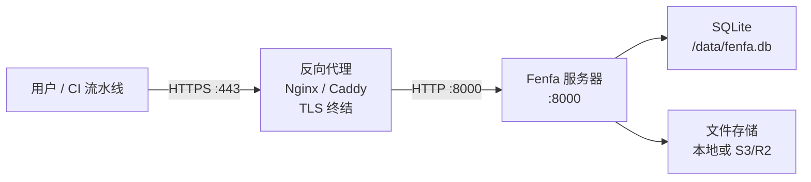

# 生产环境部署

本指南涵盖在生产环境运行 Fenfa 所需的一切：反向代理与 TLS、安全 Token 配置、备份策略和监控。

## 架构



## 反向代理设置

### Caddy（推荐）

Caddy 自动从 Let's Encrypt 获取和续期 TLS 证书：

```
dist.example.com {
    reverse_proxy localhost:8000
}
```

就这么简单。Caddy 自动处理 HTTPS、HTTP/2 和证书管理。

### Nginx

```nginx
server {
    listen 443 ssl http2;
    server_name dist.example.com;

    ssl_certificate /etc/letsencrypt/live/dist.example.com/fullchain.pem;
    ssl_certificate_key /etc/letsencrypt/live/dist.example.com/privkey.pem;

    client_max_body_size 2G;

    location / {
        proxy_pass http://127.0.0.1:8000;
        proxy_set_header Host $host;
        proxy_set_header X-Real-IP $remote_addr;
        proxy_set_header X-Forwarded-For $proxy_add_x_forwarded_for;
        proxy_set_header X-Forwarded-Proto $scheme;

        # 大文件上传
        proxy_request_buffering off;
        proxy_read_timeout 600s;
    }
}

server {
    listen 80;
    server_name dist.example.com;
    return 301 https://$host$request_uri;
}
```

::: warning client_max_body_size
将 `client_max_body_size` 设置得足够大以容纳最大的构建文件。IPA 和 APK 文件可能有数百 MB。上面的示例允许最大 2 GB。
:::

### 获取 TLS 证书

使用 Certbot 配合 Nginx：

```bash
sudo certbot --nginx -d dist.example.com
```

使用 Certbot standalone 模式：

```bash
sudo certbot certonly --standalone -d dist.example.com
```

## 安全检查清单

### 1. 更改默认 Token

生成安全的随机 Token：

```bash
# 生成 32 字符的随机 Token
openssl rand -hex 16
```

通过环境变量或配置设置：

```bash
FENFA_ADMIN_TOKEN=$(openssl rand -hex 16)
FENFA_UPLOAD_TOKEN=$(openssl rand -hex 16)
```

### 2. 绑定到 localhost

只通过反向代理暴露 Fenfa：

```yaml
ports:
  - "127.0.0.1:8000:8000"  # 不要用 0.0.0.0:8000
```

### 3. 设置主域名

为 iOS manifest 和回调配置正确的公开域名：

```bash
FENFA_PRIMARY_DOMAIN=https://dist.example.com
```

::: danger iOS Manifest
如果 `primary_domain` 设置错误，iOS OTA 安装将失败。Manifest plist 包含 iOS 用来获取 IPA 文件的下载 URL。这些 URL 必须从用户设备可访问。
:::

### 4. 分离上传 Token

为不同的 CI/CD 流水线或团队成员颁发不同的上传 Token：

```json
{
  "auth": {
    "upload_tokens": [
      "token-for-ios-pipeline",
      "token-for-android-pipeline",
      "token-for-desktop-pipeline"
    ],
    "admin_tokens": [
      "admin-token-for-ops-team"
    ]
  }
}
```

这样可以单独撤销 Token 而不影响其他流水线。

## 备份策略

### 需要备份的内容

| 组件 | 路径 | 大小 | 频率 |
|------|------|------|------|
| SQLite 数据库 | `/data/fenfa.db` | 小（通常 < 100 MB） | 每日 |
| 上传文件 | `/app/uploads/` | 可能很大 | 每次上传后（或使用 S3） |
| 配置文件 | `config.json` | 很小 | 变更时 |

### SQLite 备份

```bash
# 复制数据库文件（Fenfa 运行时安全 -- SQLite 使用 WAL 模式）
cp /data/fenfa.db /backups/fenfa-$(date +%Y%m%d).db
```

### 自动备份脚本

```bash
#!/bin/bash
BACKUP_DIR="/backups/fenfa"
DATE=$(date +%Y%m%d-%H%M)

mkdir -p "$BACKUP_DIR"

# 数据库
cp /path/to/data/fenfa.db "$BACKUP_DIR/fenfa-$DATE.db"

# 上传文件（使用本地存储时）
tar czf "$BACKUP_DIR/uploads-$DATE.tar.gz" /path/to/uploads/

# 清理旧备份（保留 30 天）
find "$BACKUP_DIR" -name "*.db" -mtime +30 -delete
find "$BACKUP_DIR" -name "*.tar.gz" -mtime +30 -delete
```

::: tip S3 存储
使用 S3 兼容存储（R2、AWS S3、MinIO）时，上传文件已在冗余存储后端上。只需备份 SQLite 数据库。
:::

## 监控

### 健康检查

监控 `/healthz` 端点：

```bash
curl -sf http://localhost:8000/healthz || echo "Fenfa 已停止"
```

### 使用在线监控服务

将 uptime 监控服务（UptimeRobot、Hetrix 等）指向：

```
https://dist.example.com/healthz
```

预期响应：HTTP 200，内容 `{"ok": true}`。

### 日志监控

Fenfa 输出到 stdout。使用容器运行时的日志驱动将日志转发到聚合系统：

```yaml
services:
  fenfa:
    logging:
      driver: "json-file"
      options:
        max-size: "10m"
        max-file: "3"
```

## 完整生产 Docker Compose

```yaml
version: "3.8"

services:
  fenfa:
    image: fenfa/fenfa:latest
    container_name: fenfa
    restart: unless-stopped
    ports:
      - "127.0.0.1:8000:8000"
    environment:
      FENFA_ADMIN_TOKEN: ${FENFA_ADMIN_TOKEN}
      FENFA_UPLOAD_TOKEN: ${FENFA_UPLOAD_TOKEN}
      FENFA_PRIMARY_DOMAIN: https://dist.example.com
    volumes:
      - fenfa-data:/data
      - fenfa-uploads:/app/uploads
    healthcheck:
      test: ["CMD", "wget", "-q", "--spider", "http://localhost:8000/healthz"]
      interval: 30s
      timeout: 5s
      retries: 3
      start_period: 10s
    logging:
      driver: "json-file"
      options:
        max-size: "10m"
        max-file: "3"
    deploy:
      resources:
        limits:
          memory: 512M

volumes:
  fenfa-data:
  fenfa-uploads:
```

## 下一步

- [Docker 部署](./docker) -- Docker 基础和配置
- [配置参考](../configuration/) -- 所有设置
- [故障排除](../troubleshooting/) -- 常见生产环境问题
