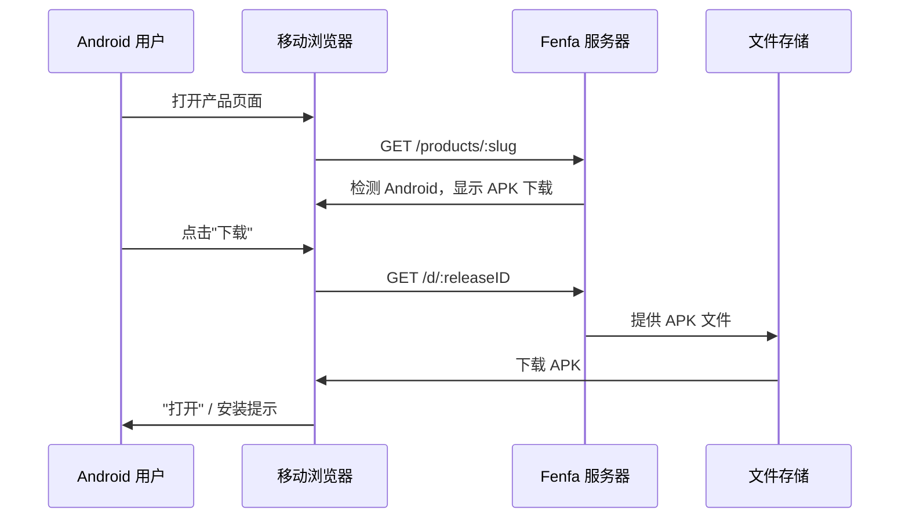

# Android 分发

Fenfa 中的 Android 分发非常简单：上传 APK 文件，用户从产品页面直接下载。Fenfa 自动检测 Android 设备并显示对应的下载按钮。

## 工作原理



与 iOS 不同，Android 不需要特殊协议来安装。APK 文件通过 HTTP(S) 直接下载，用户使用系统包安装器安装。

## 设置 Android 变体

为产品创建 Android 变体：

```bash
curl -X POST http://localhost:8000/admin/api/products/prd_abc123/variants \
  -H "X-Auth-Token: YOUR_ADMIN_TOKEN" \
  -H "Content-Type: application/json" \
  -d '{
    "platform": "android",
    "display_name": "Android",
    "identifier": "com.example.myapp",
    "arch": "universal",
    "installer_type": "apk"
  }'
```

::: tip 架构变体
如果你为每个架构单独构建 APK，可以创建多个变体：
- `Android ARM64`（arch: `arm64-v8a`）
- `Android ARM`（arch: `armeabi-v7a`）
- `Android x86_64`（arch: `x86_64`）

如果你发布通用 APK 或 AAB，使用 `universal` 架构的单个变体即可。
:::

## 上传 APK 文件

### 标准上传

```bash
curl -X POST http://localhost:8000/upload \
  -H "X-Auth-Token: YOUR_UPLOAD_TOKEN" \
  -F "variant_id=var_android" \
  -F "app_file=@app-release.apk" \
  -F "version=2.1.0" \
  -F "build=210" \
  -F "changelog=新增深色模式支持"
```

### 智能上传

智能上传自动从 APK 文件提取元数据：

```bash
curl -X POST http://localhost:8000/admin/api/smart-upload \
  -H "X-Auth-Token: YOUR_ADMIN_TOKEN" \
  -F "variant_id=var_android" \
  -F "app_file=@app-release.apk"
```

提取的元数据包括：
- 包名（`com.example.myapp`）
- 版本名称（`2.1.0`）
- 版本代码（`210`）
- 应用图标
- 最低 SDK 版本

## 用户安装

当用户在 Android 设备上访问产品页面时：

1. 页面自动检测 Android 平台。
2. 用户点击 **下载** 按钮。
3. 浏览器下载 APK 文件。
4. Android 提示用户安装 APK。

::: warning 未知来源
用户必须在设备设置中启用"允许安装未知来源应用"（或较新 Android 版本中的"安装未知应用"）才能从 Fenfa 安装 APK。这是 Android 侧载应用的标准要求。
:::

## 直接下载链接

每个发布都有一个直接下载 URL，兼容任何 HTTP 客户端：

```bash
# 通过 curl 下载
curl -LO http://localhost:8000/d/rel_xxx

# 通过 wget 下载
wget http://localhost:8000/d/rel_xxx
```

此 URL 支持 HTTP Range 请求，可在慢速连接上实现断点续传。

## 下一步

- [桌面端分发](./desktop) -- macOS、Windows 和 Linux 分发
- [发布管理](../products/releases) -- 版本管理和 APK 发布管理
- [上传 API](../api/upload) -- 从 CI/CD 自动化 APK 上传
