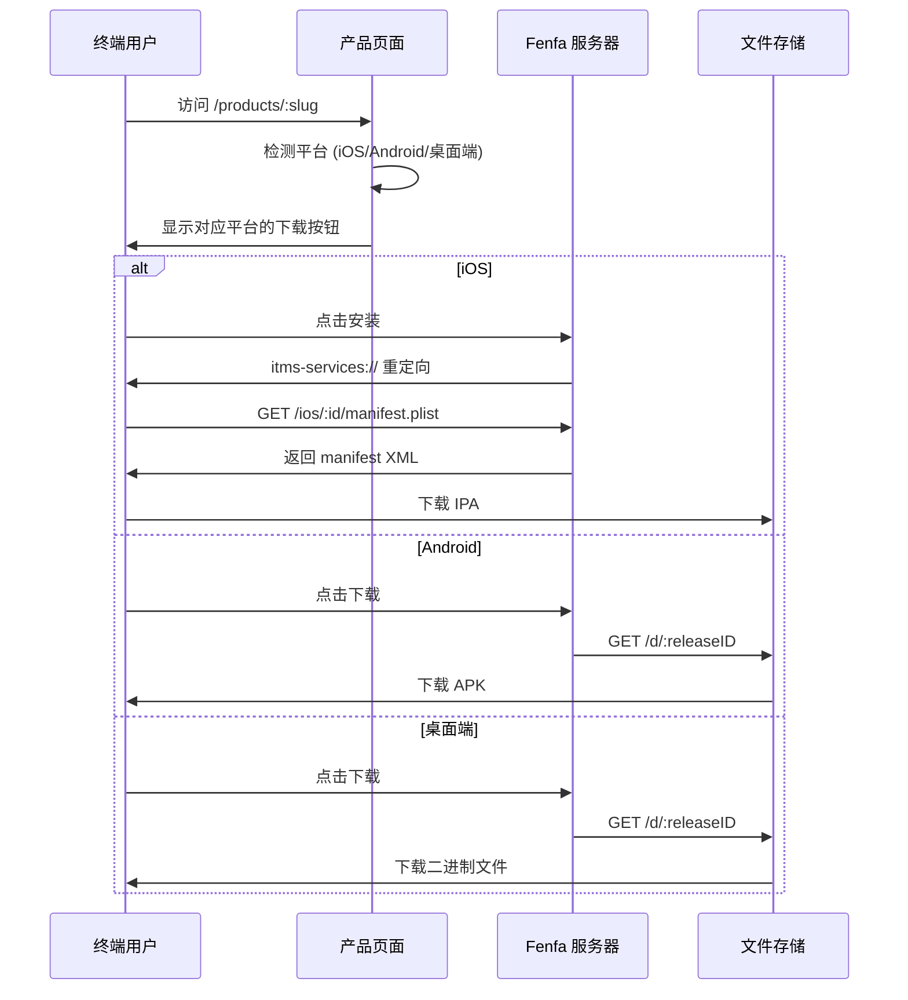

# 分发概述

Fenfa 为所有平台提供统一的分发体验。每个产品获得一个公开下载页面，自动检测访问者的平台并显示对应的下载按钮。

## 分发流程



## 产品下载页面

每个已发布的产品都有一个公开页面 `/products/:slug`。页面包含：

- **应用图标和名称** -- 来自产品配置
- **平台检测** -- 通过浏览器 User-Agent 优先显示对应平台的下载按钮
- **二维码** -- 自动生成，便于移动端扫描
- **发布历史** -- 所选变体的所有发布，最新的在前
- **更新日志** -- 每个发布的说明内联显示
- **多变体** -- 如果产品有多个平台的变体，用户可以切换

## 各平台分发方式

| 平台 | 方式 | 详情 |
|------|------|------|
| iOS | OTA via `itms-services://` | Manifest plist + 直接 IPA 下载。需要 HTTPS。 |
| Android | 直接 APK 下载 | 浏览器下载 APK，用户需开启"允许未知来源安装"。 |
| macOS | 直接下载 | DMG、PKG 或 ZIP 文件通过浏览器下载。 |
| Windows | 直接下载 | EXE、MSI 或 ZIP 文件通过浏览器下载。 |
| Linux | 直接下载 | DEB、RPM、AppImage 或 tar.gz 文件通过浏览器下载。 |

## 直接下载链接

每个发布都有一个直接下载 URL：

```
https://your-domain.com/d/:releaseID
```

此 URL：
- 返回带有正确 `Content-Type` 和 `Content-Disposition` 头的二进制文件
- 支持 HTTP Range 请求实现断点续传
- 递增下载计数器
- 兼容任何 HTTP 客户端（curl、wget、浏览器）

## 事件追踪

Fenfa 追踪三类事件：

| 事件 | 触发条件 | 追踪数据 |
|------|----------|----------|
| `visit` | 用户打开产品页面 | IP、User-Agent、变体 |
| `click` | 用户点击下载按钮 | IP、User-Agent、发布 ID |
| `download` | 文件实际被下载 | IP、User-Agent、发布 ID |

事件可在管理后台查看或导出为 CSV：

```bash
curl -o events.csv http://localhost:8000/admin/exports/events.csv \
  -H "X-Auth-Token: YOUR_ADMIN_TOKEN"
```

## HTTPS 要求

::: warning iOS 需要 HTTPS
iOS 通过 `itms-services://` 的 OTA 安装要求服务器使用带有效 TLS 证书的 HTTPS。本地测试可使用 `ngrok` 或 `mkcert` 等工具。生产环境请使用反向代理配合 Let's Encrypt。详见 [生产环境部署](../deployment/production)。
:::

## 平台指南

- [iOS 分发](./ios) -- OTA 安装、manifest 生成、UDID 设备绑定
- [Android 分发](./android) -- APK 分发和安装
- [桌面端分发](./desktop) -- macOS、Windows 和 Linux 分发
