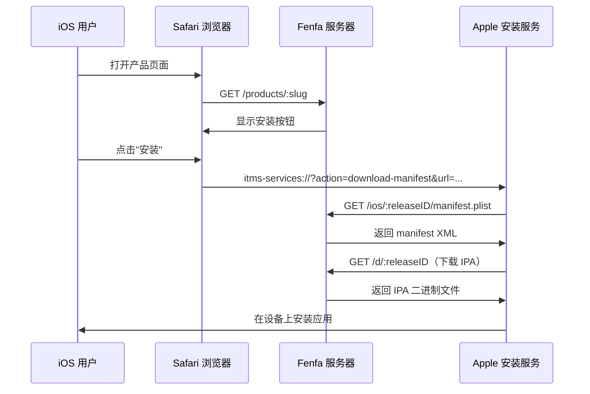
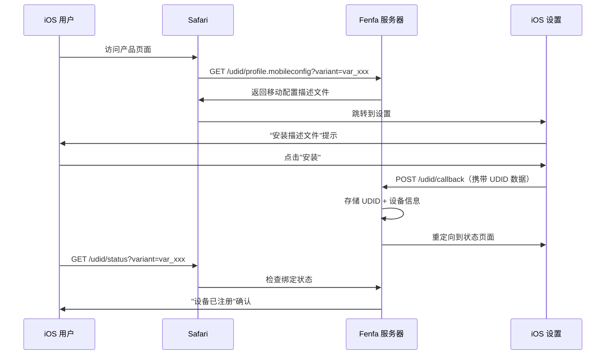

# iOS 分发

Fenfa 提供完整的 iOS OTA（Over-The-Air）分发支持，包括 `itms-services://` manifest 生成、ad-hoc 描述文件的 UDID 设备绑定，以及可选的 Apple Developer API 集成实现自动设备注册。

## iOS OTA 工作原理



iOS 使用 `itms-services://` 协议从网页直接安装应用。当用户点击安装按钮时，Safari 将请求交给系统安装器，系统安装器会：

1. 从 Fenfa 获取 manifest plist
2. 下载 IPA 文件
3. 在设备上安装应用

::: warning 需要 HTTPS
iOS OTA 安装需要带有效 TLS 证书的 HTTPS。自签名证书无法使用。本地测试可使用 `ngrok` 创建临时 HTTPS 隧道。
:::

## Manifest 生成

Fenfa 自动为每个 iOS 发布生成 `manifest.plist` 文件。Manifest 服务地址：

```
GET /ios/:releaseID/manifest.plist
```

Manifest 包含：
- Bundle identifier（来自变体的标识符字段）
- Bundle version（来自发布版本）
- 下载 URL（指向 `/d/:releaseID`）
- 应用标题

`itms-services://` 安装链接为：

```
itms-services://?action=download-manifest&url=https://your-domain.com/ios/rel_xxx/manifest.plist
```

此链接自动包含在上传 API 返回中，并显示在产品页面上。

## UDID 设备绑定

对于 ad-hoc 分发，iOS 设备必须注册在应用的描述文件中。Fenfa 提供 UDID 绑定流程来收集用户的设备标识符。

### UDID 绑定流程



### UDID 端点

| 端点 | 方法 | 说明 |
|------|------|------|
| `/udid/profile.mobileconfig?variant=:variantID` | GET | 下载移动配置描述文件 |
| `/udid/callback` | POST | iOS 安装描述文件后的回调（包含 UDID） |
| `/udid/status?variant=:variantID` | GET | 检查当前设备是否已绑定 |

### 安全机制

UDID 绑定流程使用一次性随机数防止重放攻击：
- 每次下载描述文件生成唯一随机数
- 随机数嵌入回调 URL
- 使用后随机数不可复用
- 随机数在可配置超时后过期

## Apple Developer API 集成

Fenfa 可以自动将设备注册到你的 Apple Developer 账号，省去手动在 Apple Developer Portal 添加 UDID 的步骤。

### 设置

1. 进入 **管理后台 > 设置 > Apple Developer API**。
2. 输入 App Store Connect API 凭据：

| 字段 | 说明 |
|------|------|
| Key ID | API 密钥 ID（如 "ABC123DEF4"） |
| Issuer ID | 发行者 ID（UUID 格式） |
| Private Key | PEM 格式私钥内容 |
| Team ID | Apple Developer Team ID |

::: tip 创建 API 密钥
在 [Apple Developer Portal](https://developer.apple.com/account/resources/authkeys/list) 创建具有 "Devices" 权限的 API 密钥。下载 `.p8` 私钥文件 -- 只能下载一次。
:::

### 注册设备

配置完成后，可以从管理后台注册设备到 Apple：

**单个设备：**

```bash
curl -X POST http://localhost:8000/admin/api/devices/DEVICE_ID/register-apple \
  -H "X-Auth-Token: YOUR_ADMIN_TOKEN"
```

**批量注册：**

```bash
curl -X POST http://localhost:8000/admin/api/devices/register-apple \
  -H "X-Auth-Token: YOUR_ADMIN_TOKEN"
```

### 检查 Apple API 状态

```bash
curl http://localhost:8000/admin/api/apple/status \
  -H "X-Auth-Token: YOUR_ADMIN_TOKEN"
```

### 列出 Apple 已注册设备

```bash
curl http://localhost:8000/admin/api/apple/devices \
  -H "X-Auth-Token: YOUR_ADMIN_TOKEN"
```

## Ad-Hoc 分发完整流程

iOS ad-hoc 分发的完整工作流：

1. **用户绑定设备** -- 访问产品页面，安装 mobileconfig 描述文件，UDID 被采集。
2. **管理员注册设备** -- 在管理后台将设备注册到 Apple（或使用批量注册）。
3. **开发者重签 IPA** -- 更新描述文件以包含新设备，重签 IPA。
4. **上传新构建** -- 将重签的 IPA 上传到 Fenfa。
5. **用户安装** -- 用户现在可以通过产品页面安装应用。

::: info 企业分发
如果你有 Apple 企业开发者账号，可以完全跳过 UDID 绑定。企业描述文件允许在任何设备上安装。相应设置变体并上传企业签名的 IPA 即可。
:::

## 管理 iOS 设备

在管理后台或通过 API 查看所有已绑定设备：

```bash
curl http://localhost:8000/admin/api/ios_devices \
  -H "X-Auth-Token: YOUR_ADMIN_TOKEN"
```

导出设备为 CSV：

```bash
curl -o devices.csv http://localhost:8000/admin/exports/ios_devices.csv \
  -H "X-Auth-Token: YOUR_ADMIN_TOKEN"
```

## 下一步

- [Android 分发](./android) -- Android APK 分发
- [上传 API](../api/upload) -- 从 CI/CD 自动化 iOS 上传
- [生产环境部署](../deployment/production) -- 为 iOS OTA 设置 HTTPS
