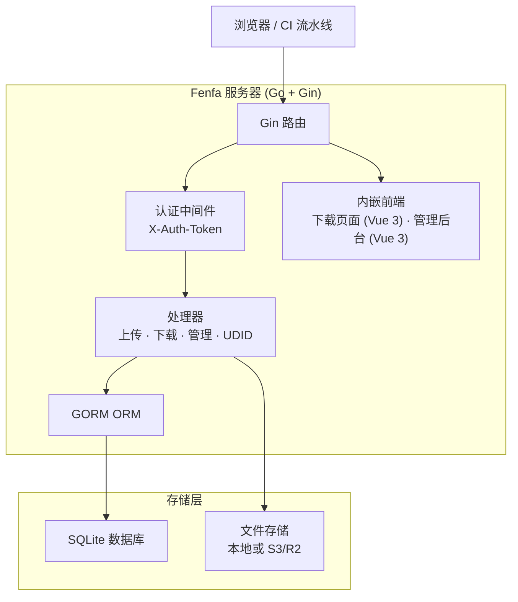
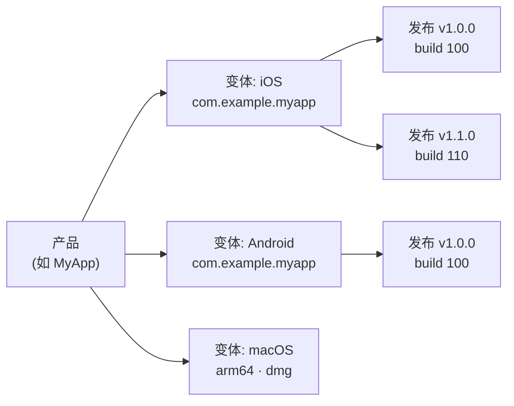

# Fenfa

**Fenfa**（分发）是自托管的应用分发平台，支持 iOS、Android、macOS、Windows 和 Linux。上传构建包即可获得安装页面和二维码，通过管理后台统一管理发布 -- 一个 Go 二进制文件内嵌前端，搭配 SQLite 存储，开箱即用。

Fenfa 面向开发团队、QA 工程师和企业 IT 部门，提供私有可控的应用分发通道 -- 处理 iOS OTA 安装、Android APK 分发和桌面应用交付，无需依赖公开应用商店或第三方服务。

## 为什么选择 Fenfa？

公开应用商店有审核延迟、内容限制和隐私问题。第三方分发服务按下载收费并控制你的数据。Fenfa 让你完全掌控：

- **自托管。** 你的构建包，你的服务器，你的数据。无供应商锁定，无按量收费。
- **多平台。** 单个产品页面覆盖 iOS、Android、macOS、Windows 和 Linux 构建，自动检测平台。
- **零依赖。** 单个 Go 二进制文件内嵌 SQLite。无需 Redis、PostgreSQL 或消息队列。
- **iOS OTA 分发。** 完整支持 `itms-services://` manifest 生成、UDID 设备绑定，以及 Apple Developer API 集成实现自动化描述文件管理。

## 核心特性

<div class="vp-features">

- **智能上传** -- 自动从 IPA 和 APK 包中检测应用元数据（Bundle ID、版本号、图标）。只需上传文件，Fenfa 自动处理其余工作。

- **产品页面** -- 带二维码的公开下载页面，自动检测平台，每个版本显示更新日志。分享一个链接即可覆盖所有平台。

- **iOS UDID 绑定** -- Ad-hoc 分发的设备注册流程。用户通过 mobileconfig 配置描述文件绑定设备 UDID，管理员可通过 Apple Developer API 自动注册设备。

- **S3/R2 存储** -- 可选的 S3 兼容对象存储（Cloudflare R2、AWS S3、MinIO），实现可扩展的文件托管。本地存储开箱可用。

- **管理后台** -- 功能完整的 Vue 3 管理面板，管理产品、变体、发布、设备和系统设置。支持中英文界面。

- **Token 认证** -- 分离的上传和管理 Token 权限。CI/CD 流水线使用上传 Token；管理员使用管理 Token 获得完全控制。

- **事件追踪** -- 追踪页面访问、下载点击和文件下载。支持导出 CSV 用于数据分析。

</div>

## 架构



## 数据模型



- **产品（Product）**：逻辑上的应用，包含名称、slug、图标和描述。一个产品页面服务所有平台。
- **变体（Variant）**：产品下的平台构建目标（iOS、Android、macOS、Windows、Linux），包含自己的标识符、架构和安装包类型。
- **发布（Release）**：变体下的特定上传构建，包含版本号、构建号、更新日志和二进制文件。

## 快速安装

```bash
docker run -d --name fenfa -p 8000:8000 fenfa/fenfa:latest
```

访问 `http://localhost:8000/admin`，使用 Token `dev-admin-token` 登录。

详见 [安装指南](./getting-started/installation) 了解 Docker Compose、源码构建和生产环境配置。

## 文档导航

| 章节 | 说明 |
|------|------|
| [安装](./getting-started/installation) | Docker 安装或源码构建 |
| [快速上手](./getting-started/quickstart) | 5 分钟内运行 Fenfa 并上传第一个构建 |
| [产品管理](./products/) | 创建和管理多平台产品 |
| [平台变体](./products/variants) | 配置 iOS、Android 和桌面端变体 |
| [发布管理](./products/releases) | 上传、版本管理和发布管理 |
| [分发概述](./distribution/) | Fenfa 如何将应用分发给终端用户 |
| [iOS 分发](./distribution/ios) | iOS OTA 安装、manifest 生成、UDID 绑定 |
| [Android 分发](./distribution/android) | Android APK 分发 |
| [桌面端分发](./distribution/desktop) | macOS、Windows 和 Linux 分发 |
| [API 概述](./api/) | REST API 参考 |
| [上传 API](./api/upload) | 通过 API 或 CI/CD 上传构建 |
| [管理 API](./api/admin) | 完整管理 API 参考 |
| [配置参考](./configuration/) | 所有配置选项 |
| [Docker 部署](./deployment/docker) | Docker 和 Docker Compose 部署 |
| [生产环境部署](./deployment/production) | 反向代理、TLS、备份和监控 |
| [故障排除](./troubleshooting/) | 常见问题和解决方案 |

## 项目信息

- **许可证：** MIT
- **语言：** Go 1.25+（后端）、Vue 3 + Vite（前端）
- **数据库：** SQLite（通过 GORM）
- **仓库：** [github.com/openprx/fenfa](https://github.com/openprx/fenfa)
- **组织：** [OpenPRX](https://github.com/openprx)
