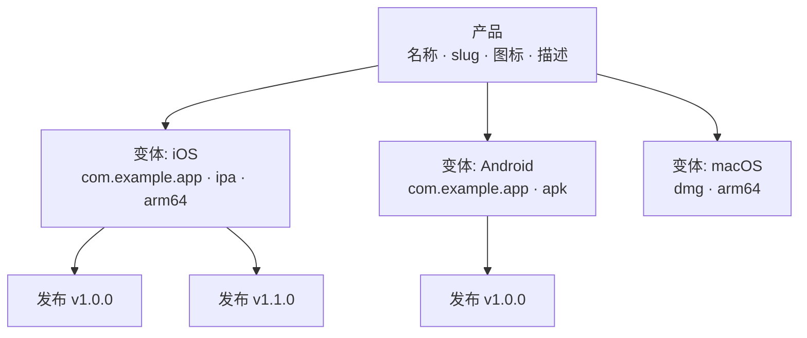

# 产品管理

产品是 Fenfa 中的顶层组织单元。每个产品代表一个应用，可以包含多个平台变体（iOS、Android、macOS、Windows、Linux）。产品拥有自己的公开下载页面、图标和 slug URL。

## 概念



- **产品**：逻辑上的应用。具有唯一的 slug，作为下载页面 URL（`/products/:slug`）。
- **变体**：产品下的平台构建目标。详见 [平台变体](./variants)。
- **发布**：变体下的特定上传构建。详见 [发布管理](./releases)。

## 创建产品

### 通过管理后台

1. 在侧边栏导航到 **产品**。
2. 点击 **创建产品**。
3. 填写字段：

| 字段 | 必填 | 说明 |
|------|------|------|
| 名称 | 是 | 显示名称（如 "MyApp"） |
| Slug | 是 | URL 标识符（如 "myapp"），必须唯一 |
| 描述 | 否 | 下载页面上显示的应用简介 |
| 图标 | 否 | 应用图标（上传图片文件） |

4. 点击 **保存**。

### 通过 API

```bash
curl -X POST http://localhost:8000/admin/api/products \
  -H "X-Auth-Token: YOUR_ADMIN_TOKEN" \
  -H "Content-Type: application/json" \
  -d '{
    "name": "MyApp",
    "slug": "myapp",
    "description": "跨平台移动应用"
  }'
```

## 列出产品

### 通过管理后台

管理后台的 **产品** 页面展示所有产品及其变体数量和总下载量。

### 通过 API

```bash
curl http://localhost:8000/admin/api/products \
  -H "X-Auth-Token: YOUR_ADMIN_TOKEN"
```

返回：

```json
{
  "ok": true,
  "data": [
    {
      "id": "prd_abc123",
      "name": "MyApp",
      "slug": "myapp",
      "description": "跨平台移动应用",
      "published": true,
      "created_at": "2025-01-15T10:30:00Z"
    }
  ]
}
```

## 更新产品

```bash
curl -X PUT http://localhost:8000/admin/api/products/prd_abc123 \
  -H "X-Auth-Token: YOUR_ADMIN_TOKEN" \
  -H "Content-Type: application/json" \
  -d '{
    "name": "MyApp Pro",
    "description": "更新后的描述"
  }'
```

## 删除产品

::: danger 级联删除
删除产品会永久移除其所有变体、发布和上传的文件。
:::

```bash
curl -X DELETE http://localhost:8000/admin/api/products/prd_abc123 \
  -H "X-Auth-Token: YOUR_ADMIN_TOKEN"
```

## 发布与取消发布

产品可以发布或取消发布。取消发布的产品在公开下载页面返回 404。

```bash
# 取消发布
curl -X PUT http://localhost:8000/admin/api/apps/prd_abc123/unpublish \
  -H "X-Auth-Token: YOUR_ADMIN_TOKEN"

# 发布
curl -X PUT http://localhost:8000/admin/api/apps/prd_abc123/publish \
  -H "X-Auth-Token: YOUR_ADMIN_TOKEN"
```

## 公开下载页面

每个已发布的产品都有一个公开下载页面：

```
https://your-domain.com/products/:slug
```

页面包含：
- 应用图标、名称和描述
- 根据访问者设备自动检测的平台下载按钮
- 用于移动端扫描的二维码
- 带版本号和更新日志的发布历史
- iOS `itms-services://` OTA 安装链接

## ID 格式

产品 ID 使用 `prd_` 前缀加随机字符串（如 `prd_abc123`）。ID 自动生成，不可更改。

## 下一步

- [平台变体](./variants) -- 为产品添加 iOS、Android 和桌面端变体
- [发布管理](./releases) -- 上传和管理构建
- [分发概述](../distribution/) -- 终端用户如何安装你的应用
