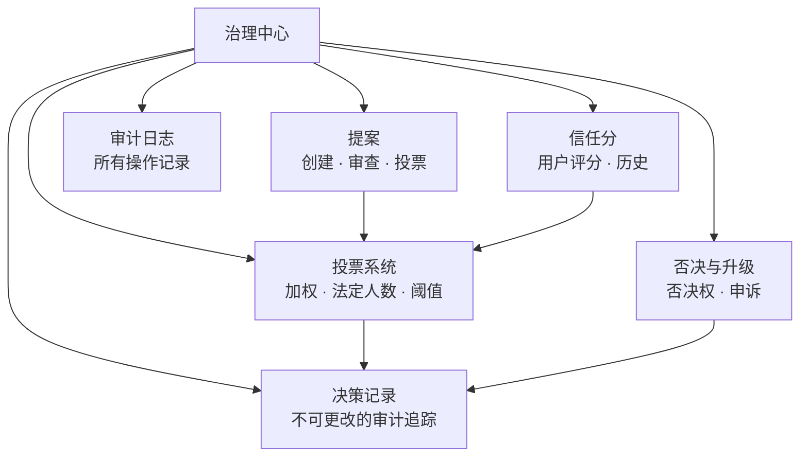

# 治理中心

治理中心是 OpenPR 的核心模块，为项目管理带来透明、结构化的决策机制。它提供提案、投票、决策记录、信任分、否决机制和全面的审计追踪。

## 为什么需要治理？

传统项目管理工具专注于任务跟踪，但决策过程缺乏结构化。OpenPR 的治理中心确保：

- **决策有记录。** 每个提案、投票和决策都有完整的审计追踪。
- **流程透明。** 投票阈值、法定人数规则和信任分对所有成员可见。
- **权力分散。** 否决机制和升级路径防止单方面决策。
- **历史可追溯。** 决策记录创建不可更改的日志，记录决策内容、决策者和原因。

## 治理模块

| 模块 | 说明 |
|------|------|
| [提案](./proposals) | 创建、审查和投票提案 |
| [投票与决策](./voting) | 加权投票，法定人数和阈值规则 |
| [信任分](./trust-scores) | 用户信誉评分与历史 |
| 否决与升级 | 否决权，升级投票和申诉 |
| 决策域 | 按领域分类决策 |
| 影响评审 | 评估提案影响和指标 |
| 审计日志 | 所有治理操作的完整记录 |

## 数据库结构

治理模块使用 20 张专用表：

| 表 | 用途 |
|----|------|
| `proposals` | 提案记录 |
| `proposal_templates` | 可复用的提案模板 |
| `proposal_comments` | 提案讨论 |
| `proposal_issue_links` | 提案与 Issue 关联 |
| `votes` | 个人投票记录 |
| `decisions` | 最终决策记录 |
| `decision_domains` | 决策分类域 |
| `decision_audit_reports` | 决策审计报告 |
| `governance_configs` | 工作区治理设置 |
| `governance_audit_logs` | 所有治理操作日志 |
| `vetoers` | 有否决权的用户 |
| `veto_events` | 否决操作记录 |
| `appeals` | 对决策或否决的申诉 |
| `trust_scores` | 当前用户信任分 |
| `trust_score_logs` | 信任分变更历史 |
| `impact_reviews` | 提案影响评估 |
| `impact_metrics` | 定量影响指标 |
| `review_participants` | 评审分配记录 |
| `feedback_loop_links` | 反馈环关联 |

## API 端点

| 类别 | 基础路径 | 操作 |
|------|----------|------|
| 提案 | `/api/proposals/*` | 创建、投票、提交、归档 |
| 治理 | `/api/governance/*` | 配置、审计日志 |
| 决策 | `/api/decisions/*` | 决策记录 |
| 信任分 | `/api/trust-scores/*` | 评分、历史、申诉 |
| 否决 | `/api/veto/*` | 否决、升级、投票 |

## MCP 工具

| 工具 | 参数 | 说明 |
|------|------|------|
| `proposals.list` | `project_id` | 列出提案（可选状态筛选） |
| `proposals.get` | `proposal_id` | 获取提案详情 |
| `proposals.create` | `project_id`, `title`, `description` | 创建治理提案 |

## 下一步

- [提案](./proposals) -- 创建和管理治理提案
- [投票与决策](./voting) -- 配置投票规则和查看决策
- [信任分](./trust-scores) -- 了解信任评分机制
