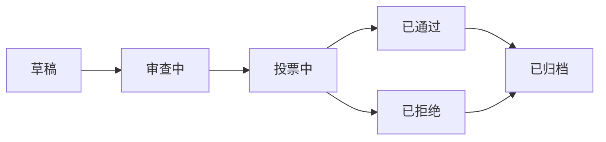

# 提案

提案是 OpenPR 治理决策的入口。提案描述需要团队参与的变更、改进或决策，并遵循从创建到投票再到最终决策的结构化生命周期。

## 提案生命周期



1. **草稿** -- 作者创建提案，包含标题、描述和背景。
2. **审查中** -- 团队成员通过评论进行讨论和反馈。
3. **投票中** -- 投票期开启。成员根据治理规则投票。
4. **已通过/已拒绝** -- 投票关闭。结果由阈值和法定人数决定。
5. **已归档** -- 决策记录完成，提案归档。

## 创建提案

### 通过网页 UI

1. 进入项目。
2. 进入 **治理** > **提案**。
3. 点击 **新建提案**。
4. 填写标题、描述和关联 Issue。
5. 点击 **创建**。

### 通过 API

```bash
curl -X POST http://localhost:8080/api/proposals \
  -H "Content-Type: application/json" \
  -H "Authorization: Bearer <token>" \
  -d '{
    "project_id": "<project_uuid>",
    "title": "前端模块采用 TypeScript",
    "description": "提议将前端模块从 JavaScript 迁移到 TypeScript 以获得更好的类型安全。"
  }'
```

### 通过 MCP

```json
{
  "method": "tools/call",
  "params": {
    "name": "proposals.create",
    "arguments": {
      "project_id": "<project_uuid>",
      "title": "前端模块采用 TypeScript",
      "description": "提议将前端模块从 JavaScript 迁移到 TypeScript。"
    }
  }
}
```

## 提案模板

工作区管理员可以创建提案模板以标准化提案格式。模板定义：

- 标题模式
- 描述中的必填部分
- 默认投票参数

在 **工作区设置** > **治理** > **模板** 中管理模板。

## 关联提案到 Issue

提案可以通过 `proposal_issue_links` 表与相关 Issue 关联。这创建了双向引用：

- 从提案可以看到受影响的 Issue。
- 从 Issue 可以看到引用它的提案。

## 提案评论

每个提案有独立的讨论线程，与 Issue 评论分开。提案评论支持 Markdown 格式，所有工作区成员可见。

## MCP 工具

| 工具 | 参数 | 说明 |
|------|------|------|
| `proposals.list` | `project_id` | 列出提案（可选 `status` 筛选） |
| `proposals.get` | `proposal_id` | 获取完整提案详情 |
| `proposals.create` | `project_id`, `title`, `description` | 创建新提案 |

## 下一步

- [投票与决策](./voting) -- 投票如何进行和决策如何产生
- [信任分](./trust-scores) -- 信任分如何影响投票权重
- [治理概述](./index) -- 完整的治理模块参考
