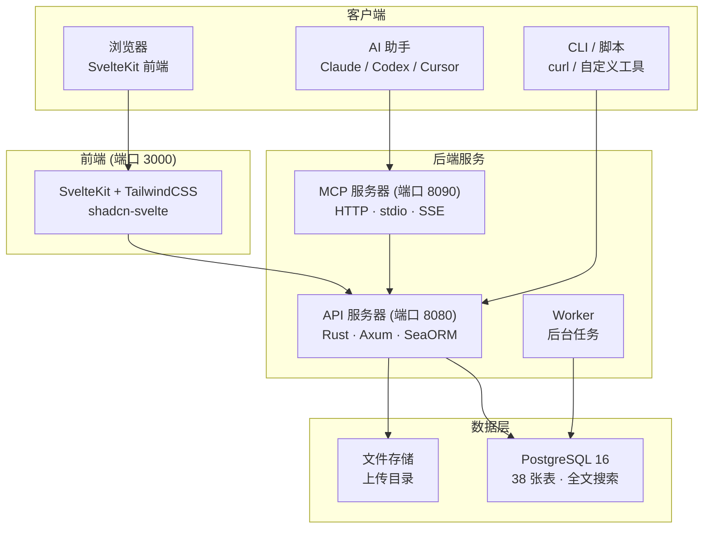

# OpenPR

**OpenPR** 是一个开源项目管理平台，专为需要透明治理、AI 辅助工作流和完全掌控项目数据的团队而设计。它将问题跟踪、Sprint 计划、看板面板和完整的治理中心——提案、投票、信任分、否决机制——整合在一个可自托管的平台中。

OpenPR 后端使用 **Rust** (Axum + SeaORM) 构建，前端使用 **SvelteKit**，数据库使用 **PostgreSQL**。它提供 REST API 和内置 MCP 服务器（34 个工具，三种传输协议），使其成为 Claude、Codex 等 MCP 兼容 AI 助手的一流工具提供方。

## 为什么选择 OpenPR？

大多数项目管理工具要么是定制受限的闭源 SaaS 平台，要么是缺乏治理功能的开源替代品。OpenPR 采用不同的方式：

- **可自托管、可审计。** 项目数据完全在你的基础设施上。每个功能、每条决策记录、每份审计日志都在你的掌控之中。
- **治理内置。** 提案、投票、信任分、否决权和申诉机制不是事后补充——而是具有完整 API 支持的核心模块。
- **AI 原生。** 内置 MCP 服务器将 OpenPR 变为 AI 代理的工具提供方。Bot Token、AI 任务分配和 Webhook 回调支持全自动化工作流。
- **Rust 高性能。** 后端以最小资源消耗处理数千并发请求。PostgreSQL 全文搜索实现跨实体即时查找。

## 核心功能

| 类别 | 功能 |
|------|------|
| **项目管理** | 工作区、项目、Issue、看板面板、Sprint、标签、评论、文件附件、活动流、通知、全文搜索 |
| **治理中心** | 提案、带法定人数的投票、决策记录、否决与申诉、信任分（含历史与申诉）、提案模板、影响评审、审计日志 |
| **AI 集成** | Bot Token（`opr_` 前缀）、AI 代理注册、AI 任务分配与进度跟踪、AI 评审、MCP 服务器（34 工具，3 种传输协议）、Webhook 回调 |
| **认证** | JWT（访问令牌 + 刷新令牌）、Bot Token 认证、基于角色的访问控制（admin/user）、工作区级权限（owner/admin/member） |
| **部署** | Docker Compose、Podman、Caddy/Nginx 反向代理、PostgreSQL 15+ |

## 架构



## 技术栈

| 层级 | 技术 |
|------|------|
| **后端** | Rust、Axum、SeaORM、PostgreSQL |
| **前端** | SvelteKit、TailwindCSS、shadcn-svelte |
| **MCP** | JSON-RPC 2.0（HTTP + stdio + SSE） |
| **认证** | JWT（访问 + 刷新）+ Bot Token（`opr_`） |
| **部署** | Docker Compose、Podman、Caddy、Nginx |

## 快速开始

```bash
git clone https://github.com/openprx/openpr.git
cd openpr
cp .env.example .env
docker-compose up -d
```

服务启动后：
- **前端**：http://localhost:3000
- **API**：http://localhost:8080
- **MCP 服务器**：http://localhost:8090

第一个注册的用户自动成为管理员。

参阅 [安装指南](./getting-started/installation) 了解所有部署方式，或查看 [快速上手](./getting-started/quickstart) 在 5 分钟内运行起来。

## 文档目录

| 章节 | 说明 |
|------|------|
| [安装](./getting-started/installation) | Docker Compose、源码编译和部署选项 |
| [快速上手](./getting-started/quickstart) | 5 分钟运行 OpenPR |
| [工作区管理](./workspace/) | 工作区、项目和成员角色 |
| [Issue 与跟踪](./issues/) | Issue、工作流状态、Sprint 和标签 |
| [治理中心](./governance/) | 提案、投票、决策和信任分 |
| [REST API](./api/) | 认证、端点和响应格式 |
| [MCP 服务器](./mcp-server/) | AI 集成，34 个工具和 3 种传输协议 |
| [配置参考](./configuration/) | 环境变量和设置 |
| [部署](./deployment/docker) | Docker 和生产环境部署指南 |
| [故障排除](./troubleshooting/) | 常见问题与解决方案 |

## 相关项目

| 仓库 | 说明 |
|------|------|
| [openpr](https://github.com/openprx/openpr) | 核心平台（本项目） |
| [openpr-webhook](https://github.com/openprx/openpr-webhook) | 外部集成 Webhook 接收器 |
| [prx](https://github.com/openprx/prx) | 内置 OpenPR MCP 的 AI 助手框架 |
| [prx-memory](https://github.com/openprx/prx-memory) | 编码代理的本地优先 MCP 记忆 |

## 项目信息

- **许可证：** MIT OR Apache-2.0
- **语言：** Rust（2024 版本）
- **仓库：** [github.com/openprx/openpr](https://github.com/openprx/openpr)
- **最低 Rust 版本：** 1.75.0
- **前端：** SvelteKit
