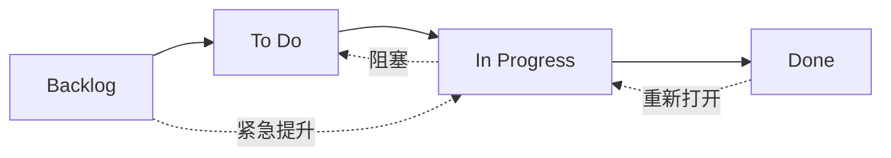
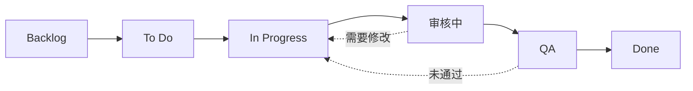

# 工作流状态

OpenPR 中的每个 Issue 都有一个 **状态**，表示其在工作流中的位置。看板面板的列直接映射到这些状态。

OpenPR 默认提供四个状态，但通过三级解析系统支持完全**自定义工作流状态**。你可以按项目、按工作区定义不同的工作流，或使用系统默认值。

## 默认状态



| 状态 | 值 | 说明 |
|------|-----|------|
| **Backlog** | `backlog` | 想法、未来工作和未计划的项目。尚未安排。 |
| **To Do** | `todo` | 已计划和优先排序。准备被领取。 |
| **In Progress** | `in_progress` | 由负责人正在进行中。 |
| **Done** | `done` | 已完成并验证。 |

以上是内置状态，每个新工作区初始都使用这些状态。你可以自定义或添加额外状态，详见下方[自定义工作流](#自定义工作流)。

## 状态流转

OpenPR 允许灵活的状态流转，没有强制约束——任何状态都可以转换到其他任何状态。常见模式包括：

| 流转 | 触发 | 示例 |
|------|------|------|
| Backlog -> To Do | Sprint 计划、优先排序 | Issue 被拉入即将开始的 Sprint |
| To Do -> In Progress | 开发者领取工作 | 负责人开始实现 |
| In Progress -> Done | 工作完成 | PR 已合并 |
| In Progress -> To Do | 工作被阻塞或暂停 | 等待外部依赖 |
| Done -> In Progress | Issue 重新打开 | 发现 Bug 回归 |
| Backlog -> In Progress | 紧急修复 | 严重的生产问题 |

## 自定义工作流

OpenPR 通过**三级解析**系统支持自定义工作流状态。当 API 验证工作项的状态时，按以下优先级解析生效的工作流：

```
项目工作流  >  工作区工作流  >  系统默认
```

如果项目定义了自己的工作流，则优先使用。否则使用工作区级别的工作流。如果两者都不存在，则使用四个系统默认状态。

### 数据库结构

自定义工作流存储在两张表中（由迁移 `0024_workflow_config.sql` 引入）：

- **`workflows`** -- 定义一个命名工作流，关联到项目或工作区。
- **`workflow_states`** -- 工作流中的各个状态。

每个状态具有以下属性：

| 字段 | 类型 | 说明 |
|------|------|------|
| `key` | 字符串 | 机器可读标识符（如 `in_review`） |
| `display_name` | 字符串 | 人类可读名称（如 "审核中"） |
| `category` | 字符串 | 状态分组类别 |
| `position` | 整数 | 在看板面板上的显示顺序 |
| `color` | 字符串 | 状态徽章的十六进制颜色代码 |
| `is_initial` | 布尔值 | 是否为新 Issue 的默认状态 |
| `is_terminal` | 布尔值 | 是否表示完成状态 |

### 通过 API 创建自定义工作流

**第一步 -- 为项目创建工作流：**

```bash
curl -X POST http://localhost:8080/api/workflows \
  -H "Content-Type: application/json" \
  -H "Authorization: Bearer <token>" \
  -d '{
    "name": "工程流程",
    "project_id": "<project_uuid>"
  }'
```

**第二步 -- 向工作流添加状态：**

```bash
curl -X POST http://localhost:8080/api/workflows/<workflow_id>/states \
  -H "Content-Type: application/json" \
  -H "Authorization: Bearer <token>" \
  -d '{
    "key": "in_review",
    "display_name": "审核中",
    "category": "active",
    "position": 3,
    "color": "#f59e0b",
    "is_initial": false,
    "is_terminal": false
  }'
```

### 示例：6 状态工程工作流



| 状态 | Key | 类别 | 初始状态 | 终止状态 |
|------|-----|------|----------|----------|
| Backlog | `backlog` | backlog | 是 | 否 |
| To Do | `todo` | planned | 否 | 否 |
| In Progress | `in_progress` | active | 否 | 否 |
| 审核中 | `in_review` | active | 否 | 否 |
| QA | `qa` | active | 否 | 否 |
| Done | `done` | completed | 否 | 是 |

### 动态验证

当工作项的状态被更新时，API 会根据该项目的**生效工作流**验证新状态。如果设置了在解析后的工作流中不存在的状态键，API 将返回 `422 Unprocessable Entity` 错误。状态不是硬编码的——它们在请求时动态查找。

## 看板面板

面板视图将 Issue 显示为列中的卡片，对应工作流状态。在列之间拖放卡片以更改状态。当自定义工作流激活时，面板会自动反映自定义状态及其配置的顺序。

每张卡片显示：
- Issue 标识符（如 `API-42`）
- 标题
- 优先级指示器
- 负责人头像
- 标签徽章

## 通过 API 更新状态

```bash
# 将 Issue 移至 "in_progress"
curl -X PATCH http://localhost:8080/api/issues/<issue_id> \
  -H "Content-Type: application/json" \
  -H "Authorization: Bearer <token>" \
  -d '{"state": "in_progress"}'
```

## 通过 MCP 更新状态

```json
{
  "method": "tools/call",
  "params": {
    "name": "work_items.update",
    "arguments": {
      "work_item_id": "<issue_uuid>",
      "state": "in_progress"
    }
  }
}
```

## 优先级

除状态外，每个 Issue 可以有优先级：

| 优先级 | 值 | 说明 |
|--------|-----|------|
| 低 | `low` | 可有可无，无时间压力 |
| 中 | `medium` | 标准优先级，计划中的工作 |
| 高 | `high` | 重要，应尽快处理 |
| 紧急 | `urgent` | 关键，需要立即处理 |

## 活动跟踪

每次状态变更都会记录在 Issue 的活动流中，包含操作者、时间戳和新旧值。这提供了完整的审计追踪。

## 下一步

- [Sprint 计划](./sprints) -- 将 Issue 组织到时间盒迭代中
- [标签](./labels) -- 为 Issue 添加分类
- [Issue 概述](./index) -- 完整的 Issue 字段参考
