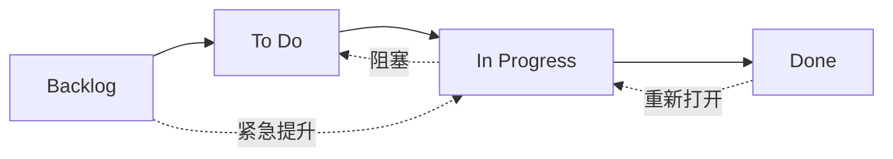

# 工作流状态

OpenPR 中的每个 Issue 都有一个 **状态**，表示其在工作流中的位置。看板面板的列直接映射到这些状态。

## 状态



| 状态 | 值 | 说明 |
|------|-----|------|
| **Backlog** | `backlog` | 想法、未来工作和未计划的项目。尚未安排。 |
| **To Do** | `todo` | 已计划和优先排序。准备被领取。 |
| **In Progress** | `in_progress` | 由负责人正在进行中。 |
| **Done** | `done` | 已完成并验证。 |

## 状态流转

OpenPR 允许灵活的状态流转，没有强制约束——任何状态都可以转换到其他任何状态。常见模式包括：

| 流转 | 触发 | 示例 |
|------|------|------|
| Backlog -> To Do | Sprint 计划、优先排序 | Issue 被拉入即将开始的 Sprint |
| To Do -> In Progress | 开发者领取工作 | 负责人开始实现 |
| In Progress -> Done | 工作完成 | PR 已合并 |
| In Progress -> To Do | 工作被阻塞或暂停 | 等待外部依赖 |
| Done -> In Progress | Issue 重新打开 | 发现 Bug 回归 |
| Backlog -> In Progress | 紧急修复 | 严重的生产问题 |

## 看板面板

面板视图将 Issue 显示为四列中的卡片，对应四个状态。在列之间拖放卡片以更改状态。

每张卡片显示：
- Issue 标识符（如 `API-42`）
- 标题
- 优先级指示器
- 负责人头像
- 标签徽章

## 通过 API 更新状态

```bash
# 将 Issue 移至 "in_progress"
curl -X PATCH http://localhost:8080/api/issues/<issue_id> \
  -H "Content-Type: application/json" \
  -H "Authorization: Bearer <token>" \
  -d '{"state": "in_progress"}'
```

## 通过 MCP 更新状态

```json
{
  "method": "tools/call",
  "params": {
    "name": "work_items.update",
    "arguments": {
      "work_item_id": "<issue_uuid>",
      "state": "in_progress"
    }
  }
}
```

## 优先级

除状态外，每个 Issue 可以有优先级：

| 优先级 | 值 | 说明 |
|--------|-----|------|
| 低 | `low` | 可有可无，无时间压力 |
| 中 | `medium` | 标准优先级，计划中的工作 |
| 高 | `high` | 重要，应尽快处理 |
| 紧急 | `urgent` | 关键，需要立即处理 |

## 活动跟踪

每次状态变更都会记录在 Issue 的活动流中，包含操作者、时间戳和新旧值。这提供了完整的审计追踪。

## 下一步

- [Sprint 计划](./sprints) -- 将 Issue 组织到时间盒迭代中
- [标签](./labels) -- 为 Issue 添加分类
- [Issue 概述](./index) -- 完整的 Issue 字段参考
