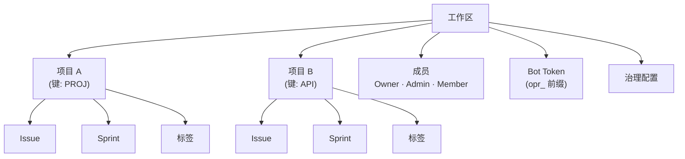

# 工作区管理

**工作区** 是 OpenPR 的顶级组织单元。它提供多租户隔离——每个工作区拥有独立的项目、成员、标签、Bot Token 和治理设置。用户可以属于多个工作区。

## 创建工作区

登录后，在仪表盘点击 **创建工作区** 或导航到 **设置** > **工作区** > **新建**。

需要提供：

| 字段 | 必填 | 说明 |
|------|------|------|
| 名称 | 是 | 显示名称（如"工程团队"） |
| 标识 | 是 | URL 友好的标识符（如"engineering"） |

创建者自动获得 **Owner** 角色。

## 工作区结构



## 工作区设置

通过齿轮图标或侧边栏的 **设置** 访问：

- **基本** -- 更新工作区名称、标识和描述。
- **成员** -- 邀请用户、更改角色、移除成员。参阅 [成员](./members)。
- **Bot Token** -- 创建和管理 MCP Bot Token。
- **治理** -- 配置投票阈值、提案模板和信任分规则。参阅 [治理](../governance/)。
- **Webhook** -- 设置外部集成的 Webhook 端点。

## API 访问

```bash
# 列出工作区
curl -H "Authorization: Bearer <token>" \
  http://localhost:8080/api/workspaces

# 获取工作区详情
curl -H "Authorization: Bearer <token>" \
  http://localhost:8080/api/workspaces/<workspace_id>
```

## MCP 访问

通过 MCP 服务器，AI 助手在 `OPENPR_WORKSPACE_ID` 环境变量指定的工作区内操作。所有 MCP 工具自动限定在该工作区范围内。

## 下一步

- [项目](./projects) -- 在工作区内创建和管理项目
- [成员与权限](./members) -- 邀请用户和配置角色
