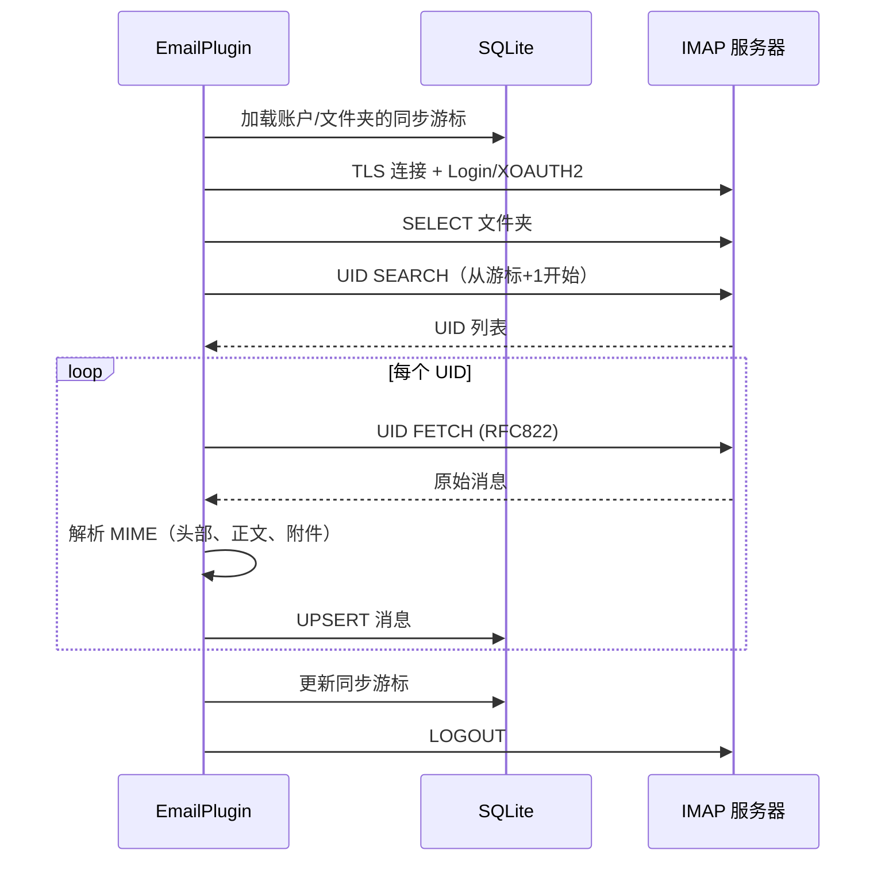

# IMAP 配置

PRX-Email 通过 `rustls` 库使用 TLS 连接 IMAP 服务器。支持密码认证和 Gmail/Outlook 的 XOAUTH2。收件箱同步基于 UID 增量拉取，游标持久化在 SQLite 数据库中。

## 基本 IMAP 设置

```rust
use prx_email::plugin::{ImapConfig, AuthConfig};

let imap = ImapConfig {
    host: "imap.example.com".to_string(),
    port: 993,
    user: "you@example.com".to_string(),
    auth: AuthConfig {
        password: Some("your-app-password".to_string()),
        oauth_token: None,
    },
};
```

### 配置字段

| 字段 | 类型 | 必填 | 说明 |
|------|------|------|------|
| `host` | `String` | 是 | IMAP 服务器主机名（不可为空） |
| `port` | `u16` | 是 | IMAP 服务器端口（TLS 通常为 993） |
| `user` | `String` | 是 | IMAP 用户名（通常为邮件地址） |
| `auth.password` | `Option<String>` | 二选一 | IMAP LOGIN 的应用密码 |
| `auth.oauth_token` | `Option<String>` | 二选一 | XOAUTH2 的 OAuth 访问令牌 |

::: warning 认证
必须且只能设置 `password` 或 `oauth_token` 中的一个。同时设置或都不设置会导致验证错误。
:::

## 常见邮件提供商设置

| 提供商 | 主机 | 端口 | 认证方式 |
|--------|------|------|----------|
| Gmail | `imap.gmail.com` | 993 | 应用密码或 XOAUTH2 |
| Outlook / Office 365 | `outlook.office365.com` | 993 | XOAUTH2（推荐） |
| Yahoo | `imap.mail.yahoo.com` | 993 | 应用密码 |
| Fastmail | `imap.fastmail.com` | 993 | 应用密码 |
| ProtonMail Bridge | `127.0.0.1` | 1143 | Bridge 密码 |

## 同步收件箱

`sync` 方法连接到 IMAP 服务器、选择文件夹、按 UID 拉取新消息并存储到 SQLite：

```rust
use prx_email::plugin::SyncRequest;

plugin.sync(SyncRequest {
    account_id: 1,
    folder: Some("INBOX".to_string()),
    cursor: None,        // 从上次保存的游标恢复
    now_ts: now,
    max_messages: 100,   // 每次同步最多拉取 100 条消息
})?;
```

### 同步流程



### 增量同步

PRX-Email 使用基于 UID 的游标避免重复拉取消息。每次同步后：

1. 记录遇到的最大 UID 作为游标
2. 下次同步从 `游标 + 1` 开始
3. 具有相同 `(account_id, message_id)` 的消息被更新（UPSERT）

游标存储在 `sync_state` 表中，以 `(account_id, folder_id)` 为复合键。

## 多文件夹同步

为同一账户同步多个文件夹：

```rust
for folder in &["INBOX", "Sent", "Drafts", "Archive"] {
    plugin.sync(SyncRequest {
        account_id,
        folder: Some(folder.to_string()),
        cursor: None,
        now_ts: now,
        max_messages: 100,
    })?;
}
```

## 同步调度器

使用内置同步调度器进行周期性同步：

```rust
use prx_email::plugin::{SyncJob, SyncRunnerConfig};

let jobs = vec![
    SyncJob { account_id: 1, folder: "INBOX".into(), max_messages: 100 },
    SyncJob { account_id: 1, folder: "Sent".into(), max_messages: 50 },
    SyncJob { account_id: 2, folder: "INBOX".into(), max_messages: 100 },
];

let config = SyncRunnerConfig {
    max_concurrency: 4,         // 每个调度周期最大作业数
    base_backoff_seconds: 10,   // 失败时的初始退避
    max_backoff_seconds: 300,   // 最大退避（5分钟）
};

let report = plugin.run_sync_runner(&jobs, now, &config);
println!(
    "运行 {}: 尝试={}, 成功={}, 失败={}",
    report.run_id, report.attempted, report.succeeded, report.failed
);
```

### 调度器行为

- **并发上限**：每个调度周期最多运行 `max_concurrency` 个作业
- **失败退避**：指数退避，公式为 `base * 2^失败次数`，上限为 `max_backoff_seconds`
- **到期检查**：退避窗口未过的作业被跳过
- **状态追踪**：按 `account::folder` 键追踪 `(next_allowed_at, failure_count)`

## 消息解析

传入的消息使用 `mail-parser` crate 解析，提取以下内容：

| 字段 | 来源 | 备注 |
|------|------|------|
| `message_id` | `Message-ID` 头部 | 无头部时回退到原始字节的 SHA-256 |
| `subject` | `Subject` 头部 | |
| `sender` | `From` 头部的第一个地址 | |
| `recipients` | `To` 头部的所有地址 | 逗号分隔 |
| `body_text` | 第一个 `text/plain` 部分 | |
| `body_html` | 第一个 `text/html` 部分 | 回退：原始段落提取 |
| `snippet` | body_text 或 body_html 的前 120 字符 | |
| `references_header` | `References` 头部 | 用于邮件线程 |
| `attachments` | MIME 附件部分 | JSON 序列化的元数据 |

## TLS

所有 IMAP 连接通过 `rustls` 使用 TLS，配合 `webpki-roots` 证书包。不支持禁用 TLS 或使用 STARTTLS——连接始终从一开始就加密。

## 后续步骤

- [SMTP 配置](./smtp) —— 配置邮件发送
- [OAuth 认证](./oauth) —— 为 Gmail 和 Outlook 设置 XOAUTH2
- [SQLite 存储](../storage/) —— 了解数据库 schema
