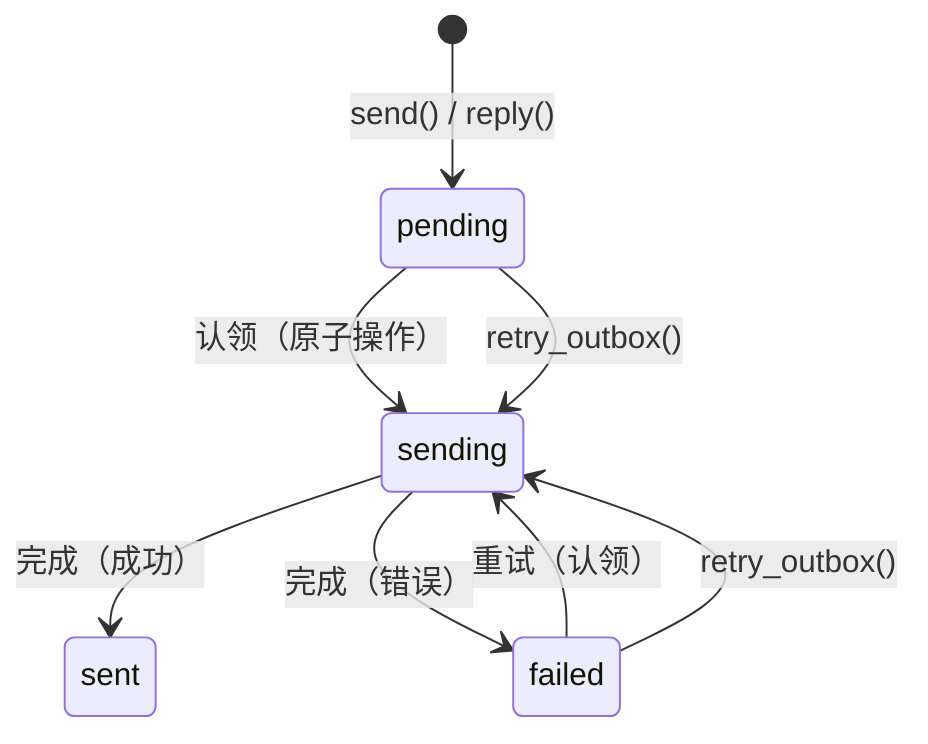

# SMTP 配置

PRX-Email 通过 `lettre` crate 使用 `rustls` TLS 发送邮件。发件箱流水线使用原子"认领-发送-完成"工作流防止重复发送，配合指数退避重试和确定性 Message-ID 幂等键。

## 基本 SMTP 设置

```rust
use prx_email::plugin::{SmtpConfig, AuthConfig};

let smtp = SmtpConfig {
    host: "smtp.example.com".to_string(),
    port: 465,
    user: "you@example.com".to_string(),
    auth: AuthConfig {
        password: Some("your-app-password".to_string()),
        oauth_token: None,
    },
};
```

### 配置字段

| 字段 | 类型 | 必填 | 说明 |
|------|------|------|------|
| `host` | `String` | 是 | SMTP 服务器主机名（不可为空） |
| `port` | `u16` | 是 | SMTP 服务器端口（465 为隐式 TLS，587 为 STARTTLS） |
| `user` | `String` | 是 | SMTP 用户名（通常为邮件地址） |
| `auth.password` | `Option<String>` | 二选一 | SMTP AUTH PLAIN/LOGIN 的密码 |
| `auth.oauth_token` | `Option<String>` | 二选一 | XOAUTH2 的 OAuth 访问令牌 |

## 常见邮件提供商设置

| 提供商 | 主机 | 端口 | 认证方式 |
|--------|------|------|----------|
| Gmail | `smtp.gmail.com` | 465 | 应用密码或 XOAUTH2 |
| Outlook / Office 365 | `smtp.office365.com` | 587 | XOAUTH2 |
| Yahoo | `smtp.mail.yahoo.com` | 465 | 应用密码 |
| Fastmail | `smtp.fastmail.com` | 465 | 应用密码 |

## 发送邮件

### 基本发送

```rust
use prx_email::plugin::SendEmailRequest;

let response = plugin.send(SendEmailRequest {
    account_id: 1,
    to: "recipient@example.com".to_string(),
    subject: "你好".to_string(),
    body_text: "消息正文。".to_string(),
    now_ts: now,
    attachment: None,
    failure_mode: None,
});
```

### 回复消息

```rust
use prx_email::plugin::ReplyEmailRequest;

let response = plugin.reply(ReplyEmailRequest {
    account_id: 1,
    in_reply_to_message_id: "<original-msg-id@example.com>".to_string(),
    body_text: "感谢你的消息！".to_string(),
    now_ts: now,
    attachment: None,
    failure_mode: None,
});
```

回复自动处理：
- 设置 `In-Reply-To` 头部
- 从父消息构建 `References` 引用链
- 从父消息的发件人推导收件人
- 在主题前添加 `Re:` 前缀

## 发件箱流水线

发件箱流水线通过原子状态机确保可靠的邮件投递：



### 状态机规则

| 转换 | 条件 | 防护 |
|------|------|------|
| `pending` -> `sending` | `claim_outbox_for_send()` | `status IN ('pending','failed') AND next_attempt_at <= now` |
| `sending` -> `sent` | 提供商接受 | `update_outbox_status_if_current(status='sending')` |
| `sending` -> `failed` | 提供商拒绝或网络错误 | `update_outbox_status_if_current(status='sending')` |
| `failed` -> `sending` | `retry_outbox()` | `status IN ('pending','failed') AND next_attempt_at <= now` |

### 幂等性

每个发件箱消息获得确定性 Message-ID：

```
<outbox-{id}-{retries}@prx-email.local>
```

这确保重试可与原始发送区分，按 Message-ID 去重的提供商会接受每次重试。

### 重试退避

失败的发送使用指数退避：

```
next_attempt_at = now + base_backoff * 2^retries
```

基础退避为 5 秒：

| 重试次数 | 退避时间 |
|----------|----------|
| 1 | 10秒 |
| 2 | 20秒 |
| 3 | 40秒 |
| 4 | 80秒 |
| 5 | 160秒 |
| 6 | 320秒 |
| 7 | 640秒 |
| 10 | 5,120秒（约85分钟） |

### 手动重试

```rust
use prx_email::plugin::RetryOutboxRequest;

let response = plugin.retry_outbox(RetryOutboxRequest {
    outbox_id: 42,
    now_ts: now,
    failure_mode: None,
});
```

在以下情况下重试被拒绝：
- 发件箱状态为 `sent` 或 `sending`（不可重试状态）
- `next_attempt_at` 尚未到达（`retry_not_due`）

## 附件

### 发送带附件的邮件

```rust
use prx_email::plugin::{SendEmailRequest, AttachmentInput};

let response = plugin.send(SendEmailRequest {
    account_id: 1,
    to: "recipient@example.com".to_string(),
    subject: "附件报告".to_string(),
    body_text: "请查收附件中的报告。".to_string(),
    now_ts: now,
    attachment: Some(AttachmentInput {
        filename: "report.pdf".to_string(),
        content_type: "application/pdf".to_string(),
        base64: Some(base64_encoded_content),
        path: None,
    }),
    failure_mode: None,
});
```

### 附件策略

`AttachmentPolicy` 强制执行大小和 MIME 类型限制：

| 规则 | 行为 |
|------|------|
| 大小超过 `max_size_bytes` | 拒绝，提示"附件超过大小限制" |
| MIME 类型不在 `allowed_content_types` 中 | 拒绝，提示"附件内容类型不允许" |
| 基于路径的附件但未配置 `attachment_store` | 拒绝，提示"附件存储未配置" |
| 路径逃逸存储根目录（`../` 遍历） | 拒绝，提示"附件路径逃逸存储根目录" |

默认允许的 MIME 类型：`application/pdf`、`image/jpeg`、`image/png`、`text/plain`、`application/zip`。默认最大大小：25 MiB。

路径解析包含目录遍历防护——任何解析到配置存储根目录外的路径都会被拒绝，包括基于符号链接的逃逸。

## API 响应格式

所有发送操作返回 `ApiResponse<SendResult>`：

```rust
pub struct SendResult {
    pub outbox_id: i64,
    pub status: String,          // "sent" 或 "failed"
    pub retries: i64,
    pub provider_message_id: Option<String>,
    pub next_attempt_at: i64,
}
```

## 后续步骤

- [OAuth 认证](./oauth) —— 为需要 OAuth 的提供商设置 XOAUTH2
- [配置参考](../configuration/) —— 所有设置和环境变量
- [故障排除](../troubleshooting/) —— 常见 SMTP 问题和解决方案
