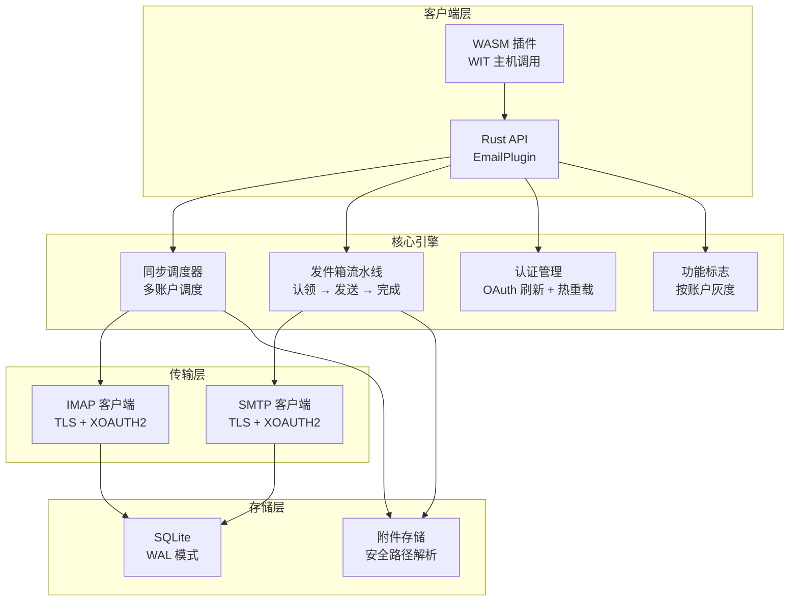

# PRX-Email

**PRX-Email** 是一款使用 Rust 编写的自托管邮件客户端插件，采用 SQLite 持久化和生产级加固原语。它提供 IMAP 收件箱同步、带原子发件箱流水线的 SMTP 发送、Gmail 和 Outlook 的 OAuth 2.0 认证、附件治理，以及用于集成 PRX 生态的 WASM 插件接口。

PRX-Email 专为需要可靠的、可嵌入邮件后端的开发者和团队设计——处理多账户同步调度、安全的发件箱投递（含重试和退避）、OAuth 令牌生命周期管理和功能标志灰度发布——而无需依赖第三方 SaaS 邮件 API。

## 为什么选择 PRX-Email？

大多数邮件集成依赖特定厂商的 API 或脆弱的 IMAP/SMTP 封装，忽视了重复发送、令牌过期和附件安全等生产环境问题。PRX-Email 采用了不同的方法：

- **生产级发件箱。** 原子"认领-发送-完成"状态机防止重复发送。指数退避和确定性 Message-ID 幂等键确保安全重试。
- **OAuth 优先认证。** IMAP 和 SMTP 均原生支持 XOAUTH2，具备令牌过期追踪、可插拔刷新提供者和环境变量热重载。
- **SQLite 原生存储。** WAL 模式、有界检查点和参数化查询提供快速可靠的本地持久化，零外部数据库依赖。
- **通过 WASM 扩展。** 插件编译为 WebAssembly，通过 WIT 主机调用暴露邮件操作，默认禁用真实 IMAP/SMTP 的网络安全开关。

## 核心功能

<div class="vp-features">

- **IMAP 收件箱同步** —— 通过 TLS 连接任意 IMAP 服务器。基于 UID 的增量拉取和游标持久化，支持多账户多文件夹同步。

- **SMTP 发件箱流水线** —— 原子"认领-发送-完成"工作流防止重复发送。失败消息以指数退避和可配置限制自动重试。

- **OAuth 2.0 认证** —— 支持 Gmail 和 Outlook 的 XOAUTH2。令牌过期追踪、可插拔刷新提供者，以及无需重启的环境变量热重载。

- **多账户同步调度器** —— 按账户和文件夹周期性轮询，可配置并发数、失败退避和单次运行上限。

- **SQLite 持久化** —— WAL 模式、NORMAL 同步、5秒忙等待超时。完整的 schema 包含账户、文件夹、消息、发件箱、同步状态和功能标志。

- **附件治理** —— 最大尺寸限制、MIME 白名单强制执行和目录遍历防护，防范超大或恶意附件。

- **功能标志灰度发布** —— 按账户的功能标志，支持百分比灰度发布。独立控制收件箱读取、搜索、发送、回复和重试功能。

- **WASM 插件接口** —— 编译为 WebAssembly 在 PRX 运行时中沙箱执行。主机调用提供 email.sync、list、get、search、send 和 reply 操作。

- **可观测性** —— 内存运行时指标（同步尝试/成功/失败、发送失败、重试次数）和结构化日志载荷，包含 account、folder、message_id、run_id 和 error_code。

</div>

## 架构



## 快速安装

克隆仓库并构建：

```bash
git clone https://github.com/openprx/prx_email.git
cd prx_email
cargo build --release
```

或在 `Cargo.toml` 中添加依赖：

```toml
[dependencies]
prx_email = { git = "https://github.com/openprx/prx_email.git" }
```

详见[安装指南](./getting-started/installation)获取完整的安装说明，包括 WASM 插件编译。

## 文档导航

| 章节 | 说明 |
|------|------|
| [安装](./getting-started/installation) | 安装 PRX-Email、配置依赖、构建 WASM 插件 |
| [快速上手](./getting-started/quickstart) | 5 分钟内设置第一个账户并发送邮件 |
| [账户管理](./accounts/) | 添加、配置和管理邮件账户 |
| [IMAP 配置](./accounts/imap) | IMAP 服务器设置、TLS 和文件夹同步 |
| [SMTP 配置](./accounts/smtp) | SMTP 服务器设置、TLS 和发送流水线 |
| [OAuth 认证](./accounts/oauth) | Gmail 和 Outlook 的 OAuth 2.0 设置 |
| [SQLite 存储](./storage/) | 数据库 schema、WAL 模式、性能调优和维护 |
| [WASM 插件](./plugins/) | 构建和部署带 WIT 主机调用的 WASM 插件 |
| [配置参考](./configuration/) | 所有环境变量、运行时设置和策略选项 |
| [故障排除](./troubleshooting/) | 常见问题和解决方案 |

## 项目信息

- **许可证：** MIT OR Apache-2.0
- **语言：** Rust（2024 edition）
- **仓库：** [github.com/openprx/prx_email](https://github.com/openprx/prx_email)
- **存储：** SQLite（rusqlite 的 bundled 特性）
- **IMAP：** `imap` crate 搭配 rustls TLS
- **SMTP：** `lettre` crate 搭配 rustls TLS
