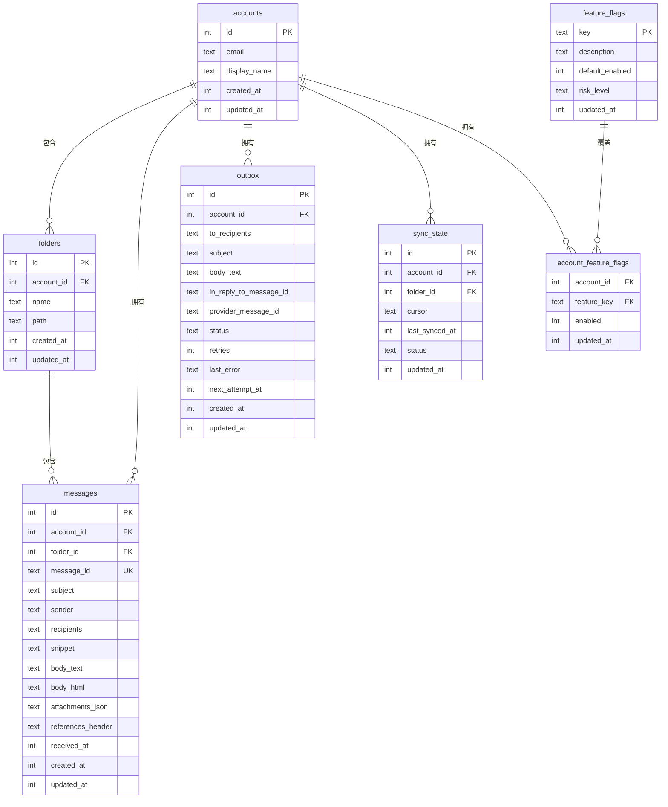

# SQLite 存储

PRX-Email 使用 SQLite 作为唯一的存储后端，通过 `rusqlite` crate 的内置 SQLite 编译访问。数据库运行在 WAL 模式下，启用外键约束，提供快速的并发读取和可靠的写隔离。

## 数据库配置

### 默认设置

| 设置 | 值 | 说明 |
|------|-----|------|
| `journal_mode` | WAL | 预写日志，支持并发读取 |
| `synchronous` | NORMAL | 平衡的持久性/性能 |
| `foreign_keys` | ON | 强制引用完整性 |
| `busy_timeout` | 5000ms | 数据库锁等待时间 |
| `wal_autocheckpoint` | 1000 页 | 自动 WAL 检查点阈值 |

### 自定义配置

```rust
use prx_email::db::{EmailStore, StoreConfig, SynchronousMode};

let config = StoreConfig {
    enable_wal: true,
    busy_timeout_ms: 5_000,
    wal_autocheckpoint_pages: 1_000,
    synchronous: SynchronousMode::Normal,
};

let store = EmailStore::open_with_config("./email.db", &config)?;
```

### 同步模式

| 模式 | 持久性 | 性能 | 适用场景 |
|------|--------|------|----------|
| `Full` | 最高 | 写入最慢 | 金融或合规工作负载 |
| `Normal` | 良好（默认） | 均衡 | 通用生产使用 |
| `Off` | 最低 | 写入最快 | 仅用于开发和测试 |

### 内存数据库

用于测试时使用内存数据库：

```rust
let store = EmailStore::open_in_memory()?;
store.migrate()?;
```

## Schema

数据库 schema 通过增量迁移应用。运行 `store.migrate()` 会应用所有待执行的迁移。

### 表结构



### 索引

| 表 | 索引 | 用途 |
|-----|------|------|
| `messages` | `(account_id)` | 按账户过滤消息 |
| `messages` | `(folder_id)` | 按文件夹过滤消息 |
| `messages` | `(subject)` | 主题 LIKE 搜索 |
| `messages` | `(account_id, message_id)` | UPSERT 的唯一约束 |
| `outbox` | `(account_id)` | 按账户过滤发件箱 |
| `outbox` | `(status, next_attempt_at)` | 认领符合条件的发件箱记录 |
| `sync_state` | `(account_id, folder_id)` | UPSERT 的唯一约束 |
| `account_feature_flags` | `(account_id)` | 功能标志查询 |

## 迁移

迁移嵌入在二进制中，按顺序应用：

| 迁移 | 说明 |
|------|------|
| `0001_init.sql` | 账户、文件夹、消息、同步状态表 |
| `0002_outbox.sql` | 发送流水线的发件箱表 |
| `0003_rollout.sql` | 功能标志和账户功能标志 |
| `0005_m41.sql` | M4.1 schema 优化 |
| `0006_m42_perf.sql` | M4.2 性能索引 |

额外的列（`body_html`、`attachments_json`、`references_header`）在不存在时通过 `ALTER TABLE` 添加。

## 性能调优

### 读密集型工作负载

对于读远多于写的应用（典型邮件客户端）：

```rust
let config = StoreConfig {
    enable_wal: true,                // 并发读取
    busy_timeout_ms: 10_000,         // 更高超时应对竞争
    wal_autocheckpoint_pages: 2_000, // 较少的检查点频率
    synchronous: SynchronousMode::Normal,
};
```

### 写密集型工作负载

对于大量同步操作：

```rust
let config = StoreConfig {
    enable_wal: true,
    busy_timeout_ms: 5_000,
    wal_autocheckpoint_pages: 500, // 更频繁的检查点
    synchronous: SynchronousMode::Normal,
};
```

## 容量规划

### 增长驱动因素

| 表 | 增长模式 | 保留策略 |
|-----|----------|----------|
| `messages` | 主要表；每次同步增长 | 定期清理旧消息 |
| `outbox` | 累积已发送和失败历史 | 删除旧的已发送记录 |
| WAL 文件 | 写入高峰期膨胀 | 自动检查点 |

## 数据维护

### 清理辅助方法

```rust
// 删除 30 天前的已发送发件箱记录
let cutoff = now - 30 * 86400;
let deleted = repo.delete_sent_outbox_before(cutoff)?;
println!("删除了 {} 条旧的已发送记录", deleted);

// 删除 90 天前的消息
let cutoff = now - 90 * 86400;
let deleted = repo.delete_old_messages_before(cutoff)?;
println!("删除了 {} 条旧消息", deleted);
```

### 维护 SQL

检查发件箱状态分布：

```sql
SELECT status, COUNT(*) FROM outbox GROUP BY status;
```

WAL 检查点和压缩：

```sql
PRAGMA wal_checkpoint(TRUNCATE);
VACUUM;
```

::: warning VACUUM
`VACUUM` 重建整个数据库文件，需要与数据库大小相同的空闲磁盘空间。在大量删除后的维护窗口中运行。
:::

## SQL 安全

所有数据库查询使用参数化语句防止 SQL 注入：

```rust
// 安全：参数化查询
conn.execute(
    "SELECT * FROM messages WHERE account_id = ?1 AND message_id = ?2",
    params![account_id, message_id],
)?;
```

动态标识符（表名、列名）在用于 SQL 字符串前验证是否匹配 `^[a-zA-Z_][a-zA-Z0-9_]{0,62}$`。

## 后续步骤

- [配置参考](../configuration/) —— 所有运行时设置
- [故障排除](../troubleshooting/) —— 数据库相关问题
- [IMAP 配置](../accounts/imap) —— 了解同步数据流
