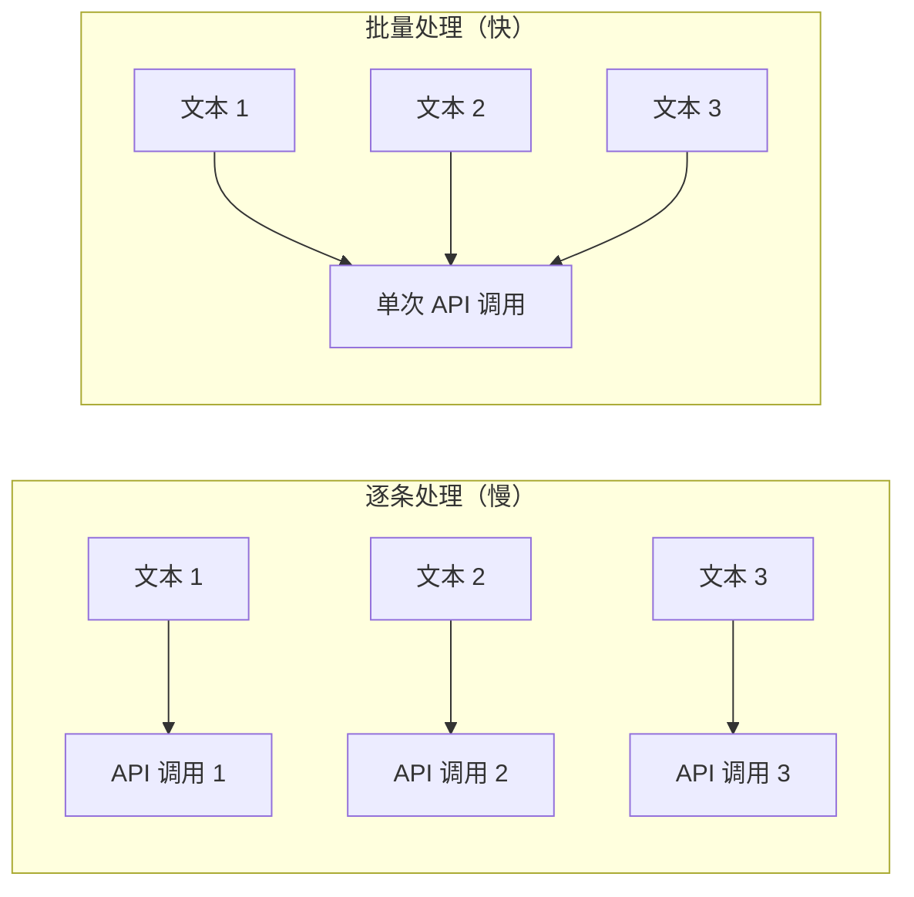

# 批量处理

处理大型记忆集时，逐条嵌入效率很低。PRX-Memory 支持批量嵌入以减少 API 往返次数并提高吞吐量。

## 批量嵌入的工作原理

批量处理不再为每条记忆单独发起 API 调用，而是将多个文本组合到单个请求中。大多数嵌入供应商支持每次调用 100--2048 条文本的批量大小。



## 使用场景

### 初始导入

导入大量现有知识时，使用 `memory_import` 加载记忆并触发批量嵌入：

```json
{
  "jsonrpc": "2.0",
  "id": 1,
  "method": "tools/call",
  "params": {
    "name": "memory_import",
    "arguments": {
      "data": "... 导出的记忆 JSON ..."
    }
  }
}
```

### 模型切换后重新嵌入

切换到新的嵌入模型时，`memory_reembed` 工具以批量方式处理所有存储的记忆：

```json
{
  "jsonrpc": "2.0",
  "id": 1,
  "method": "tools/call",
  "params": {
    "name": "memory_reembed",
    "arguments": {}
  }
}
```

### 存储压缩

`memory_compact` 工具优化存储，并可以为过时或缺失向量的条目触发重新嵌入：

```json
{
  "jsonrpc": "2.0",
  "id": 1,
  "method": "tools/call",
  "params": {
    "name": "memory_compact",
    "arguments": {}
  }
}
```

## 性能提示

| 提示 | 说明 |
|------|------|
| 使用支持批量的供应商 | Jina 和 OpenAI 兼容端点支持大批量大小 |
| 在低使用率时段调度 | 批量操作与实时查询竞争相同的 API 配额 |
| 通过指标监控 | 使用 `/metrics` 端点跟踪嵌入调用次数和延迟 |
| 选择高效模型 | 较小的模型（768 维）比较大的模型（3072 维）嵌入更快 |

## 速率限制

大多数嵌入供应商实施速率限制。PRX-Memory 通过自动退避处理速率限制响应（HTTP 429）。如果遇到持续的速率限制：

- 减少批量大小，每次处理更少的记忆。
- 使用具有更高速率限制的供应商。
- 将批量操作分散在更长的时间窗口内。

::: tip
对于大规模重新嵌入操作，考虑使用本地推理服务器以完全避免速率限制。设置 `PRX_EMBED_PROVIDER=openai-compatible` 并将 `PRX_EMBED_BASE_URL` 指向你的本地服务器。
:::

## 下一步

- [支持的模型](./models) -- 选择合适的嵌入模型
- [存储后端](../storage/) -- 向量存储的位置
- [配置参考](../configuration/) -- 所有环境变量
