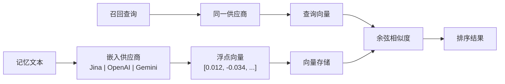

# 嵌入引擎

嵌入引擎是 PRX-Memory 语义检索能力的基础。它将文本记忆转换为高维向量以捕获语义，实现超越关键词匹配的相似度搜索。

## 工作原理

当启用嵌入功能存储记忆时，PRX-Memory：

1. 将记忆文本发送到配置的嵌入供应商。
2. 接收向量表示（通常 768--3072 维）。
3. 将向量与记忆元数据一起存储。
4. 在召回时使用向量进行余弦相似度搜索。



## 供应商架构

`prx-memory-embed` crate 定义了所有嵌入后端都实现的供应商 trait。这种设计允许在不更改应用代码的情况下切换供应商。

支持的供应商：

| 供应商 | 环境变量值 | 说明 |
|--------|-----------|------|
| OpenAI 兼容 | `PRX_EMBED_PROVIDER=openai-compatible` | 任何 OpenAI 兼容 API（OpenAI、Azure、本地服务器） |
| Jina | `PRX_EMBED_PROVIDER=jina` | Jina AI 嵌入模型 |
| Gemini | `PRX_EMBED_PROVIDER=gemini` | Google Gemini 嵌入模型 |

## 配置

通过环境变量设置供应商和凭证：

```bash
PRX_EMBED_PROVIDER=jina
PRX_EMBED_API_KEY=your_api_key
PRX_EMBED_MODEL=jina-embeddings-v3
PRX_EMBED_BASE_URL=https://api.jina.ai  # 可选，用于自定义端点
```

::: tip 供应商备用密钥
如果未设置 `PRX_EMBED_API_KEY`，系统会回退到供应商专用密钥：
- Jina：`JINA_API_KEY`
- Gemini：`GEMINI_API_KEY`
:::

## 何时启用嵌入

| 场景 | 是否需要嵌入？ |
|------|---------------|
| 小型记忆集（<100 条） | 可选——词法搜索可能已足够 |
| 大型记忆集（1000+ 条） | 推荐——向量相似度显著提高召回效果 |
| 自然语言查询 | 推荐——捕获语义含义 |
| 精确标签/作用域过滤 | 不需要——词法搜索即可处理 |
| 跨语言召回 | 推荐——多语言模型跨语言工作 |

## 性能特征

- **延迟：** 每次嵌入调用 50--200ms，取决于供应商和模型。
- **批量模式：** 将多个文本组合在单个 API 调用中以减少往返次数。
- **本地缓存：** 向量存储在本地并被复用；只有新增或更改的记忆需要嵌入调用。
- **100k 基准测试：** 在 100,000 条记忆上进行词法+重要性+时效性召回的 p95 延迟低于 123ms（不含网络调用）。

## 下一步

- [支持的模型](./models) -- 详细的模型对比
- [批量处理](./batch-processing) -- 高效的批量嵌入
- [重排序](../reranking/) -- 第二阶段重排序以提高精度
