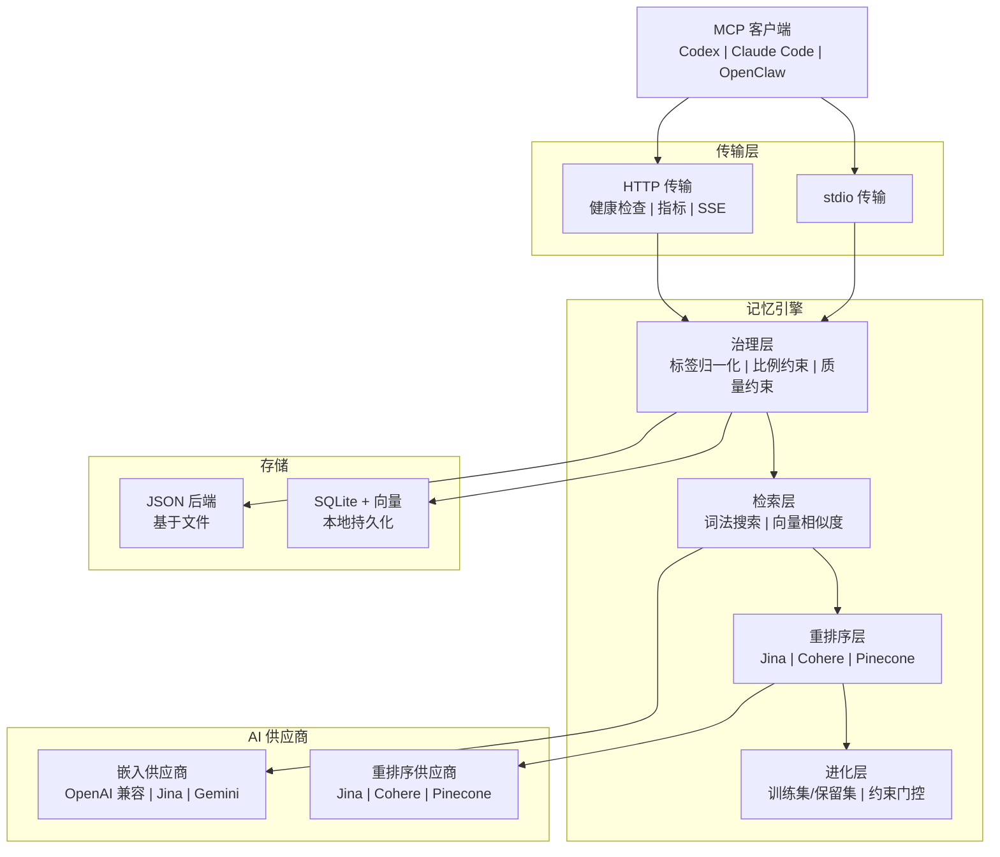

# PRX-Memory

**PRX-Memory** 是一个面向编程 Agent 的本地优先语义记忆引擎。它将基于嵌入的检索、重排序、治理控制和可度量的进化能力整合到一个 MCP 兼容组件中。PRX-Memory 以独立守护进程（`prx-memoryd`）的形式运行，通过 stdio 或 HTTP 通信，兼容 Codex、Claude Code、OpenClaw、OpenPRX 及其他任何 MCP 客户端。

PRX-Memory 聚焦于**可复用的工程知识**，而非原始日志。系统以结构化格式存储记忆条目（包含标签、作用域和重要性评分），然后通过词法搜索、向量相似度和可选重排序的组合进行检索——所有操作都受质量和安全约束的治理。

## 为什么选择 PRX-Memory？

大多数编程 Agent 将记忆视为附属功能——扁平文件、非结构化日志或厂商锁定的云服务。PRX-Memory 采用不同的方式：

- **本地优先。** 所有数据留在本机。无云依赖、无遥测、数据不会离开你的网络。
- **结构化治理。** 每条记忆遵循标准化格式，包含标签、作用域、分类和质量约束。标签归一化和比例约束防止漂移。
- **语义检索。** 结合词法匹配与向量相似度和可选重排序，为给定上下文找到最相关的记忆。
- **可度量进化。** `memory_evolve` 工具使用训练集/保留集分割和约束门控来接受或拒绝候选改进——无需猜测。
- **MCP 原生。** 通过 stdio 和 HTTP 传输对模型上下文协议（MCP）提供一流支持，包含资源模板、技能清单和流式会话。

## 核心特性

<div class="vp-features">

- **多供应商嵌入** -- 通过统一适配器接口支持 OpenAI 兼容、Jina 和 Gemini 嵌入供应商。更换供应商只需修改一个环境变量。

- **重排序管道** -- 可选的第二阶段重排序，使用 Jina、Cohere 或 Pinecone 重排器提高检索精度，超越原始向量相似度。

- **治理控制** -- 结构化记忆格式配合标签归一化、比例约束、定期维护和质量约束，确保记忆质量随时间保持高水平。

- **记忆进化** -- `memory_evolve` 工具使用训练集/保留集接受测试和约束门控评估候选变更，提供可度量的改进保证。

- **双传输 MCP 服务器** -- 以 stdio 服务器运行用于直接集成，或以 HTTP 服务器运行提供健康检查、Prometheus 指标和流式会话。

- **技能分发** -- 内置治理技能包，可通过 MCP 资源和工具协议发现，配合负载模板实现标准化记忆操作。

- **可观测性** -- Prometheus 指标端点、Grafana 仪表板模板、可配置告警阈值和基数控制，适用于生产部署。

</div>

## 架构



## 快速开始

构建并运行记忆守护进程：

```bash
cargo build -p prx-memory-mcp --bin prx-memoryd

PRX_MEMORYD_TRANSPORT=stdio \
PRX_MEMORY_DB=./data/memory-db.json \
./target/debug/prx-memoryd
```

或通过 Cargo 安装：

```bash
cargo install prx-memory-mcp
```

详见[安装指南](./getting-started/installation)了解所有方法和配置选项。

## 工作区 Crate

| Crate | 说明 |
|-------|------|
| `prx-memory-core` | 核心评分和进化领域原语 |
| `prx-memory-embed` | 嵌入供应商抽象和适配器 |
| `prx-memory-rerank` | 重排序供应商抽象和适配器 |
| `prx-memory-ai` | 嵌入和重排序的统一供应商抽象 |
| `prx-memory-skill` | 内置治理技能负载 |
| `prx-memory-storage` | 本地持久化存储引擎（JSON、SQLite、LanceDB） |
| `prx-memory-mcp` | 具有 stdio 和 HTTP 传输的 MCP 服务器表面 |

## 文档目录

| 章节 | 说明 |
|------|------|
| [安装](./getting-started/installation) | 从源码构建或通过 Cargo 安装 |
| [快速上手](./getting-started/quickstart) | 5 分钟内运行 PRX-Memory |
| [嵌入引擎](./embedding/) | 嵌入供应商和批量处理 |
| [支持的模型](./embedding/models) | OpenAI 兼容、Jina、Gemini 模型 |
| [重排序引擎](./reranking/) | 第二阶段重排序管道 |
| [存储后端](./storage/) | JSON、SQLite 和向量搜索 |
| [MCP 集成](./mcp/) | MCP 协议、工具、资源和模板 |
| [Rust API 参考](./api/) | 用于在 Rust 项目中嵌入 PRX-Memory 的库 API |
| [配置参考](./configuration/) | 所有环境变量和配置文件 |
| [故障排除](./troubleshooting/) | 常见问题和解决方案 |

## 项目信息

- **许可证：** MIT OR Apache-2.0
- **语言：** Rust（2024 edition）
- **仓库：** [github.com/openprx/prx-memory](https://github.com/openprx/prx-memory)
- **最低 Rust 版本：** stable 工具链
- **传输方式：** stdio、HTTP
