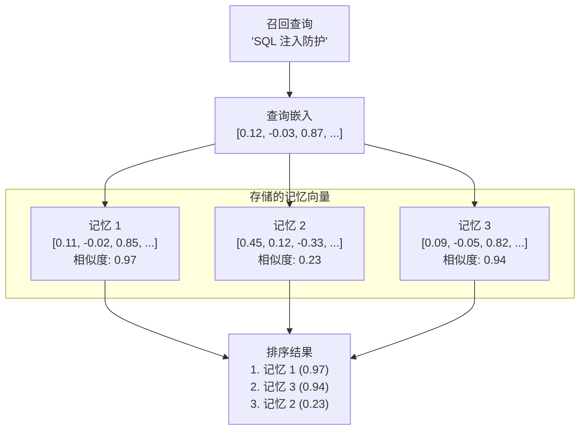

# 向量搜索

向量搜索是 PRX-Memory 实现语义记忆检索的核心机制。它不是匹配关键词，而是比较查询和记忆嵌入之间的数学相似度来找到概念相关的结果。

## 工作原理

1. **查询嵌入：** 召回查询被发送到配置的嵌入供应商，生成一个向量。
2. **相似度计算：** 查询向量使用余弦相似度与所有存储的记忆向量进行比较。
3. **评分：** 每条记忆获得一个 -1.0 到 1.0 之间的相似度分数（越高越相似）。
4. **排序：** 结果按分数排序，并与其他信号（词法匹配、重要性、时效性）结合。



## 余弦相似度

PRX-Memory 使用余弦相似度作为距离度量。余弦相似度测量两个向量之间的角度，忽略幅度：

```
similarity(A, B) = (A . B) / (|A| * |B|)
```

| 分数 | 含义 |
|------|------|
| 0.95--1.0 | 几乎相同的含义 |
| 0.80--0.95 | 高度相关 |
| 0.60--0.80 | 有一定相关性 |
| < 0.60 | 可能不相关 |

## 组合排序

向量相似度是 PRX-Memory 多信号排序中的一个信号。最终分数结合了：

| 信号 | 权重 | 说明 |
|------|------|------|
| 向量相似度 | 高 | 来自嵌入比较的语义相关性 |
| 词法匹配 | 中 | 查询和记忆文本之间的关键词重叠 |
| 重要性评分 | 中 | 用户分配或系统计算的重要性 |
| 时效性 | 低 | 更近的记忆获得小幅加成 |

确切的权重取决于召回配置以及是否启用了嵌入和重排序。

## 性能

100k 条目基准测试结果：

| 指标 | 值 |
|------|-----|
| 数据集大小 | 100,000 条 |
| p95 延迟 | 122.683ms |
| 阈值 | < 300ms |
| 方法 | 词法 + 重要性 + 时效性（不含网络调用） |

::: info
此基准测试仅衡量检索排序路径，不包含网络嵌入或重排序调用。端到端延迟取决于供应商响应时间。
:::

## 扩展考虑

| 数据集大小 | 推荐方式 |
|-----------|---------|
| < 10,000 | 暴力余弦相似度（JSON 或 SQLite 后端） |
| 10,000--100,000 | SQLite 配合内存向量扫描 |
| > 100,000 | LanceDB 配合 ANN 索引 |

对于超过 100,000 条的数据集，启用 LanceDB 后端进行近似最近邻（ANN）搜索，提供亚线性查询时间。

## 下一步

- [嵌入引擎](../embedding/) -- 向量是如何生成的
- [重排序](../reranking/) -- 第二阶段精度提升
- [存储后端](./index) -- 选择合适的存储后端
