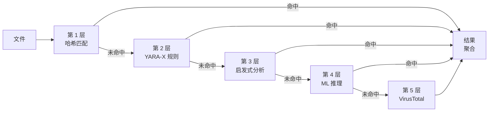

# 检测引擎

PRX-SD 采用多层检测流水线来识别恶意软件。每一层使用不同的技术，按照从最快到最全面的顺序依次执行。这种纵深防御方式确保了即使某一层漏检，后续层仍能捕获威胁。

## 流水线概览

检测流水线对每个文件最多经过五个层次的处理：



## 各层概览

| 层 | 引擎 | 速度 | 覆盖范围 | 是否必需 |
|----|------|------|----------|----------|
| **第 1 层** | LMDB 哈希匹配 | 每文件约 1 微秒 | 已知恶意软件（精确匹配） | 是（默认） |
| **第 2 层** | YARA-X 规则扫描 | 每文件约 0.3 毫秒 | 基于模式（38,800+ 规则） | 是（默认） |
| **第 3 层** | 启发式分析 | 每文件约 1-5 毫秒 | 按文件类型的行为指标 | 是（默认） |
| **第 4 层** | ONNX ML 推理 | 每文件约 10-50 毫秒 | 新型/多态恶意软件 | 可选（`--features ml`） |
| **第 5 层** | VirusTotal API | 每文件约 200-500 毫秒 | 70+ 厂商共识 | 可选（`--features virustotal`） |

## 第 1 层：哈希匹配

最快的检测层。PRX-SD 计算每个文件的 SHA-256 哈希值，并在包含已知恶意哈希的 LMDB 数据库中查找。LMDB 提供 O(1) 查找时间和内存映射 I/O，使得这一层的性能开销几乎为零。

**数据来源：**
- abuse.ch MalwareBazaar（最近 48 小时，每 5 分钟更新）
- abuse.ch URLhaus（每小时更新）
- abuse.ch Feodo Tracker（Emotet/Dridex/TrickBot，每 5 分钟更新）
- abuse.ch ThreatFox（IOC 共享平台）
- VirusShare（20M+ MD5 哈希，可选的 `--full` 更新）
- 内置黑名单（EICAR、WannaCry、NotPetya、Emotet 等）

哈希命中会立即产生 `MALICIOUS` 检测结论。该文件将跳过剩余检测层。

详情请参阅[哈希匹配](./hash-matching)。

## 第 2 层：YARA-X 规则

如果没有哈希匹配，文件将使用 YARA-X 引擎（YARA 的下一代 Rust 重写版本）与 38,800+ YARA 规则进行扫描。规则通过匹配文件内容中的字节模式、字符串和结构条件来检测恶意软件。

**规则来源：**
- 64 条内置规则（勒索软件、木马、后门、Rootkit、挖矿程序、Webshell）
- Yara-Rules/rules（社区维护，GitHub）
- Neo23x0/signature-base（高质量 APT 和通用恶意软件规则）
- ReversingLabs YARA（商业级开源规则）
- ESET IOC（高级持续性威胁追踪）
- InQuest（文档恶意软件：OLE、DDE、恶意宏）

YARA 规则命中会产生 `MALICIOUS` 检测结论，并在报告中附带规则名称。

详情请参阅 [YARA 规则](./yara-rules)。

## 第 3 层：启发式分析

通过哈希和 YARA 检查的文件将使用文件类型感知的启发式方法进行分析。PRX-SD 通过魔数检测识别文件类型，并执行有针对性的检查：

| 文件类型 | 启发式检查 |
|----------|-----------|
| PE（Windows） | 节熵值、可疑 API 导入、加壳检测、时间戳异常 |
| ELF（Linux） | 节熵值、LD_PRELOAD 引用、cron/systemd 持久化、SSH 后门模式 |
| Mach-O（macOS） | 节熵值、dylib 注入、LaunchAgent 持久化、Keychain 访问 |
| Office（docx/xlsx） | VBA 宏、DDE 字段、外部模板链接、自动执行触发器 |
| PDF | 嵌入式 JavaScript、Launch 操作、URI 操作、混淆流 |

每项检查会累加到一个综合评分：

| 评分 | 结论 |
|------|------|
| 0 - 29 | **Clean** |
| 30 - 59 | **Suspicious** —— 建议人工复查 |
| 60 - 100 | **Malicious** —— 高置信度威胁 |

详情请参阅[启发式分析](./heuristics)。

## 第 4 层：ML 推理（可选）

使用 `ml` 特性编译后，PRX-SD 可以通过基于数百万恶意软件样本训练的 ONNX 机器学习模型处理文件。这一层对于检测绕过签名检测的新型和多态恶意软件尤为有效。

```bash
# 构建带 ML 支持的版本
cargo build --release --features ml
```

ML 模型使用 ONNX Runtime 在本地运行，无需云连接。

::: tip 何时使用 ML
ML 推理会增加延迟（每文件约 10-50 毫秒）。建议在对可疑文件或目录进行针对性扫描时启用，而非全盘扫描——前三层已能提供足够的覆盖。
:::

## 第 5 层：VirusTotal（可选）

使用 `virustotal` 特性编译并配置 API 密钥后，PRX-SD 可以将文件哈希提交到 VirusTotal，获取 70+ 杀毒厂商的共识结果。

```bash
# 构建带 VirusTotal 支持的版本
cargo build --release --features virustotal

# 配置 API 密钥
sd config set virustotal.api_key "YOUR_API_KEY"
```

::: warning 频率限制
VirusTotal 免费 API 允许每分钟 4 次请求、每天 500 次。PRX-SD 会自动遵守这些限制。这一层最适合作为最终确认步骤，不适用于批量扫描。
:::

## 结果聚合

当一个文件经过多个检测层扫描时，最终结论取决于所有层中**最高的威胁等级**：

```
MALICIOUS > SUSPICIOUS > CLEAN
```

如果第 1 层返回 `MALICIOUS`，无论其他层如何判定，该文件都会被报告为恶意。如果第 3 层返回 `SUSPICIOUS` 且没有其他层返回 `MALICIOUS`，该文件将被报告为可疑。

扫描报告包含每个产生检测发现的层的详细信息，为分析人员提供完整上下文。

## 禁用检测层

对于特殊场景，可以禁用个别检测层：

```bash
# 仅哈希扫描（最快，仅针对已知威胁）
sd scan /path --no-yara --no-heuristics

# 跳过启发式分析（仅哈希 + YARA）
sd scan /path --no-heuristics
```

## 下一步

- [哈希匹配](./hash-matching) —— 深入了解 LMDB 哈希数据库
- [YARA 规则](./yara-rules) —— 规则来源和自定义规则管理
- [启发式分析](./heuristics) —— 文件类型感知的行为检查
- [支持的文件类型](./file-types) —— 文件格式矩阵和魔数检测
