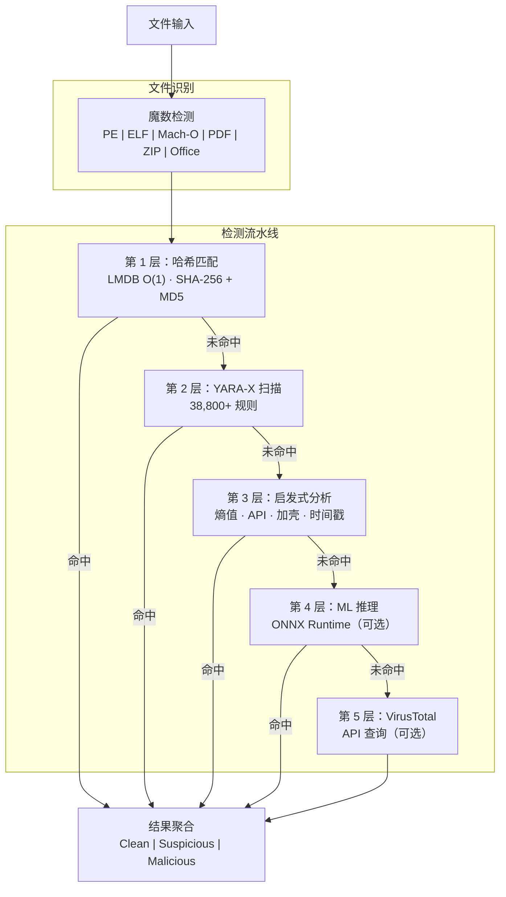

# PRX-SD

**PRX-SD** 是一款高性能的开源杀毒引擎，使用 Rust 编写。它将基于哈希的签名匹配、38,800+ YARA 规则、文件类型感知的启发式分析以及可选的 ML 推理整合到一条多层检测流水线中。PRX-SD 提供命令行工具 (`sd`)、系统守护进程（用于实时防护）以及 Tauri + Vue 3 桌面 GUI 三种使用方式。

PRX-SD 专为安全工程师、系统管理员和应急响应人员设计，为他们提供一款快速、透明且可扩展的恶意软件检测引擎——能够扫描数百万文件、实时监控目录、检测 Rootkit 并对接外部威胁情报源——而无需依赖不透明的商业黑盒产品。

## 为什么选择 PRX-SD？

传统杀毒产品往往闭源、资源消耗大且难以定制。PRX-SD 采用了截然不同的设计理念：

- **开放可审计。** 每一条检测规则、启发式检查和评分阈值都在源代码中清晰可见。没有隐藏的遥测，也不强制依赖云服务。
- **多层纵深防御。** 五个独立的检测层确保即使某一层漏检，下一层也能捕获威胁。
- **Rust 优先性能。** 零拷贝 I/O、LMDB O(1) 哈希查找和并行扫描，在普通硬件上即可达到媲美商业引擎的吞吐量。
- **可扩展设计。** WASM 插件、自定义 YARA 规则和模块化架构使 PRX-SD 易于适配特殊环境。

## 核心功能

<div class="vp-features">

- **多层检测流水线** —— 哈希匹配、YARA-X 规则、启发式分析、可选 ML 推理和可选 VirusTotal 集成依次执行，最大化检测率。

- **实时防护** —— `sd monitor` 守护进程使用 inotify（Linux）/ FSEvents（macOS）监控目录，并在文件创建或修改时立即扫描。

- **勒索软件防御** —— 专用 YARA 规则和启发式检测可识别勒索软件家族，包括 WannaCry、LockBit、Conti、REvil、BlackCat 等。

- **38,800+ YARA 规则** —— 聚合自 8 个社区和商业级来源：Yara-Rules、Neo23x0 signature-base、ReversingLabs、ESET IOC、InQuest 以及 64 条内置规则。

- **LMDB 哈希数据库** —— 来自 abuse.ch MalwareBazaar、URLhaus、Feodo Tracker、ThreatFox、VirusShare（20M+）和内置黑名单的 SHA-256 和 MD5 哈希存储在 LMDB 中，实现 O(1) 查找。

- **跨平台** —— 支持 Linux（x86_64、aarch64）、macOS（Apple Silicon、Intel）和 Windows（WSL2）。原生文件类型检测支持 PE、ELF、Mach-O、PDF、Office 和压缩格式。

- **WASM 插件系统** —— 通过 WebAssembly 插件扩展检测逻辑、添加自定义扫描器或集成专有威胁情报源。

</div>

## 架构



## 快速安装

```bash
curl -fsSL https://raw.githubusercontent.com/openprx/prx-sd/main/install.sh | bash
```

或通过 Cargo 安装：

```bash
cargo install prx-sd
```

然后更新签名数据库：

```bash
sd update
```

完整安装方法（包括 Docker 和源码构建）请参阅[安装指南](./getting-started/installation)。

## 文档目录

| 章节 | 说明 |
|------|------|
| [安装](./getting-started/installation) | 在 Linux、macOS 或 Windows WSL2 上安装 PRX-SD |
| [快速开始](./getting-started/quickstart) | 5 分钟内开始使用 PRX-SD 进行扫描 |
| [文件与目录扫描](./scanning/file-scan) | `sd scan` 命令完整参考 |
| [内存扫描](./scanning/memory-scan) | 扫描运行中进程的内存以发现威胁 |
| [Rootkit 检测](./scanning/rootkit) | 检测内核级和用户空间 Rootkit |
| [USB 扫描](./scanning/usb-scan) | 自动扫描可移动存储设备 |
| [检测引擎](./detection/) | 多层流水线的工作原理 |
| [哈希匹配](./detection/hash-matching) | LMDB 哈希数据库及数据来源 |
| [YARA 规则](./detection/yara-rules) | 来自 8 个来源的 38,800+ 规则 |
| [启发式分析](./detection/heuristics) | 文件类型感知的行为分析 |
| [支持的文件类型](./detection/file-types) | 文件格式矩阵与魔数检测 |

## 项目信息

- **许可证：** MIT OR Apache-2.0
- **语言：** Rust（2024 edition）
- **仓库：** [github.com/openprx/prx-sd](https://github.com/openprx/prx-sd)
- **最低 Rust 版本：** 1.85.0
- **GUI：** Tauri 2 + Vue 3
